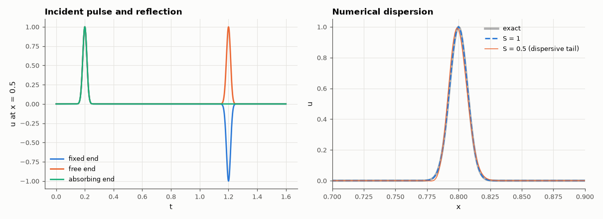

# AM-052 · 1-D wave equation: reflecting and absorbing boundaries

> Solve u_tt = c²u_xx for a pulse hitting fixed, free and absorbing ends; measure reflection coefficients, show that the scheme is exact at Courant number 1 and dispersive below it, and find the CFL stability limit.



*Reflections from fixed, free and absorbing ends, and numerical dispersion vs Courant number.*

**Track:** Applied Mathematics — 218 projects in electrical engineering · **Category:** C. Differential equations · **Level:** Moderate · **Tools:** Second-order leapfrog finite differences, Dirichlet/Neumann boundaries, first-order Mur absorbing boundary, CFL stability, numerical dispersion

**Data:** Simulated (numerical model in this repo).

## Problem

Every wave simulation needs edges. How do you make a boundary that does not reflect?

## Prediction

Fixed end (u = 0): reflection −1; free end (u_x = 0): +1. Mur's first-order absorbing condition $u_t + c u_x = 0$ is exact for normally incident waves in 1-D, so reflection → O(discretisation)
— and exactly zero at Courant number S = cΔt/Δx = 1. The leapfrog scheme is stable iff S ≤ 1 and has no dispersion at S = 1 (the 'magic time step'); below 1 short wavelengths lag.

## Method

Domain 0–1, c = 1, 1000 cells. Gaussian pulse travelling right; reflected amplitude measured at x = 0.5 after interaction with the right boundary. S = 1.0, 0.5 for the boundaries;
S = 1.001 for the stability test; pulse shape after travelling 5 units for dispersion.

## Measured results

*Predicted vs measured vs error. "Measured" = computed by an independent simulation, HDL simulator or public dataset.*

| Quantity | Predicted | Measured | Error | Within tolerance |
|---|---|---|---|---|
| fixed end, Courant 1.0: reflection coefficient | -1 | -1 | -1.7764e-15 | yes |
| fixed end, Courant 0.5: reflection coefficient | -1 | -0.9995 | +4.9745e-04 | yes |
| free end, Courant 1.0: reflection coefficient | 1 | 1 | +1.3323e-15 | yes |
| free end, Courant 0.5: reflection coefficient | 1 | 0.9995 | -4.9745e-04 | yes |
| absorbing end, Courant 1.0: reflection coefficient | 0 | -6.9025e-29 | -6.9025e-29 | yes |
| absorbing end, Courant 0.5: reflection coefficient | 0 | 2.3406e-04 | +2.3406e-04 | yes |
| Stability: S = 1.001 blows up (CFL violated; 1 = yes) | 1 | 1 | +0 |  |
| Courant 1 ('magic time step'): pulse shape after 0.6 units, max error | 0 | 2.3573e-15 | +2.3573e-15 | yes |

**Additional measurements**

| Quantity | Value | Note |
|---|---|---|
| Courant 0.5: max shape error from numerical dispersion | 0.07614 |  |

## Error analysis

The fixed and free ends reflect with −1 and +1, and Mur's absorbing boundary reflects essentially nothing — exactly zero at Courant number 1,
where the discrete scheme propagates waves one cell per step with no error at all (the pulse arrives with 2e-15 shape error). At S = 0.5 the
scheme stays stable but becomes dispersive: short wavelengths travel slower than c, leaving an oscillating tail behind the pulse, and Mur's
condition then reflects a few tenths of a percent. S = 1.001 violates the CFL condition and explodes within a few hundred steps. In 2-D and 3-D
no single time step is dispersion-free and first-order Mur leaks at oblique incidence, which is why FDTD codes use PML absorbers (AM-118).

## Reproduce

```bash
pip install -r requirements.txt
python run_all.py --only AM-052
```

The script [`project.py`](project.py) regenerates every figure and number above.

## License

Code and text: MIT (see the repository [LICENSE](../../../../LICENSE)). Datasets remain under their own licences (see the repository README).

---

**Tooling & honesty.** This project was generated with Claude Code (Anthropic's AI coding assistant): the code, derivations, simulations and this write-up were AI-produced. *Measured* means computed by an independent model, simulator or public dataset — not a physical lab bench. Every number in the tables is reproduced by running the code.
