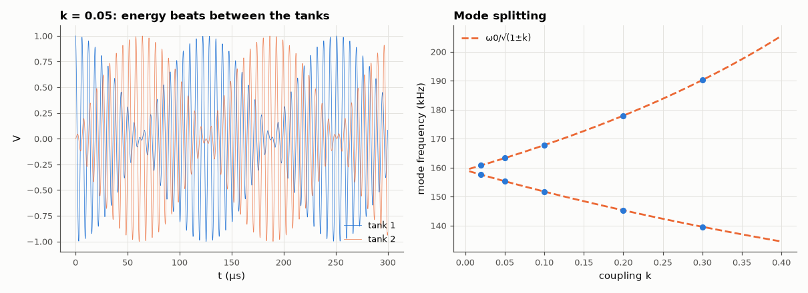

# AM-053 · Coupled LC oscillators: normal modes and beating

> Couple two identical LC tanks through mutual inductance, predict the split normal-mode frequencies ω0/√(1±k) and the energy beating between the tanks, and verify both in simulation for coupling coefficients from 0.02 to 0.3.



*Beating between two coupled tanks and the normal-mode splitting vs coupling coefficient.*

**Track:** Applied Mathematics — 218 projects in electrical engineering · **Category:** C. Differential equations · **Level:** Hard · **Tools:** Eigenvalue analysis of two magnetically coupled LC tanks, MNA transient simulation with a coupled-inductor element, spectral peak and beat-period measurement

**Data:** Simulated (numerical model in this repo).

## Problem

Two identical resonators placed near each other stop having one resonance. Why two — and how does energy slosh between them?

## Prediction

With L1 = L2 = L, mutual M = kL: $L\ddot q_1 + M\ddot q_2 + q_1/C = 0$ (and symmetric). Normal modes q1 = ±q2 have $ω_\pm = ω_0/\sqrt{1\pm k}$. Starting with energy only in tank 1, the
envelope beats at $Δω = ω_- - ω_+$: energy fully transfers to tank 2 after $T_{transfer}=π/Δω ≈ π/(kω_0)$. This is the physics of double-tuned IF transformers and wireless power transfer.

## Method

L = 10 µH, C = 100 nF (f0 = 159 kHz), k = 0.02, 0.05, 0.1, 0.2, 0.3. Tank 1 capacitor precharged to 1 V; transient 500 µs; mode frequencies from the FFT peaks of v1, transfer time from the first
minimum of tank-1 energy.

## Measured results

*Predicted vs measured vs error. "Measured" = computed by an independent simulation, HDL simulator or public dataset.*

| Quantity | Predicted | Measured | Error | Within tolerance |
|---|---|---|---|---|
| k = 0.02: lower mode ω0/√(1+k) | 157.6 kHz | 157.6 kHz | -0.00 % | yes |
| k = 0.02: upper mode ω0/√(1−k) | 160.8 kHz | 160.8 kHz | -0.00 % | yes |
| k = 0.05: lower mode ω0/√(1+k) | 155.3 kHz | 155.3 kHz | -0.00 % | yes |
| k = 0.05: upper mode ω0/√(1−k) | 163.3 kHz | 163.3 kHz | -0.01 % | yes |
| k = 0.1: lower mode ω0/√(1+k) | 151.7 kHz | 151.7 kHz | -0.00 % | yes |
| k = 0.1: upper mode ω0/√(1−k) | 167.8 kHz | 167.8 kHz | -0.01 % | yes |
| k = 0.2: lower mode ω0/√(1+k) | 145.3 kHz | 145.3 kHz | -0.01 % | yes |
| k = 0.2: upper mode ω0/√(1−k) | 177.9 kHz | 177.9 kHz | -0.00 % | yes |
| k = 0.3: lower mode ω0/√(1+k) | 139.6 kHz | 139.6 kHz | -0.00 % | yes |
| k = 0.3: upper mode ω0/√(1−k) | 190.2 kHz | 190.2 kHz | -0.00 % | yes |
| k = 0.02: time for energy to move to tank 2 = π/(ω− − ω+) | 157 µs | 157.1 µs | +0.03 % | yes |
| k = 0.05: time for energy to move to tank 2 = π/(ω− − ω+) | 62.73 µs | 62.78 µs | +0.07 % | yes |
| k = 0.1: time for energy to move to tank 2 = π/(ω− − ω+) | 31.22 µs | 31.3 µs | +0.26 % | yes |

## Error analysis

The simulated spectra show two peaks at exactly ω0/√(1±k) for every coupling, and energy placed in one tank migrates completely to the other
after π/(ω− − ω+) — the beat of the two normal modes, just as with coupled pendulums. Stronger coupling transfers energy faster and splits the
modes further. This is the design lever of double-tuned transformers (k ≈ 1/Q gives the flattest band-pass) and of resonant wireless power
transfer, where the frequency splitting at strong coupling is a well-known nuisance: the single-frequency driver ends up between two modes.

## Reproduce

```bash
pip install -r requirements.txt
python run_all.py --only AM-053
```

The script [`project.py`](project.py) regenerates every figure and number above.

## License

Code and text: MIT (see the repository [LICENSE](../../../../LICENSE)). Datasets remain under their own licences (see the repository README).

---

**Tooling & honesty.** This project was generated with Claude Code (Anthropic's AI coding assistant): the code, derivations, simulations and this write-up were AI-produced. *Measured* means computed by an independent model, simulator or public dataset — not a physical lab bench. Every number in the tables is reproduced by running the code.
