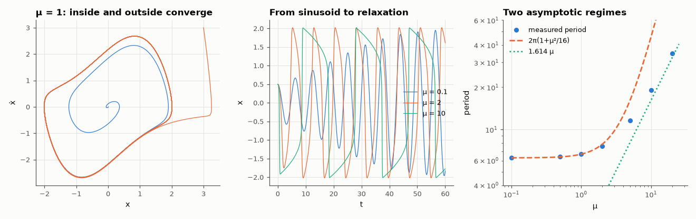

# AM-054 · Van der Pol oscillator: limit cycles from weak to relaxation

> Integrate ẍ − μ(1 − x²)ẋ + x = 0 for μ from 0.1 to 20, show that every start converges to one limit cycle, and compare its amplitude and period with the small-μ averaging result and the large-μ relaxation formula.



*Phase portrait, waveforms and period of the Van der Pol oscillator across μ.*

**Track:** Applied Mathematics — 218 projects in electrical engineering · **Category:** C. Differential equations · **Level:** Hard · **Tools:** Adaptive RK45 integration (SciPy), phase portraits, amplitude from averaging theory, relaxation period from singular perturbation, Poincaré-section convergence

**Data:** Simulated (numerical model in this repo).

## Problem

Why does an oscillator with negative resistance settle at a definite amplitude — regardless of how it starts?

## Prediction

The term −μ(1−x²)ẋ is negative damping for |x| < 1 and positive damping outside, so energy is pumped in at small amplitude and removed at large. Averaging (μ ≪ 1): amplitude → 2,
period → 2π(1 + μ²/16). Relaxation (μ ≫ 1): period → (3 − 2 ln 2)μ ≈ 1.614μ, amplitude → 2. Every non-zero initial condition converges to the same closed orbit (a stable limit cycle).

## Method

RK45 with rtol 1e-10. μ ∈ {0.1, 0.5, 1, 2, 5, 10, 20}; period from successive upward zero crossings after transients; amplitude = max x. Convergence from 5 initial conditions for μ = 1.

## Measured results

*Predicted vs measured vs error. "Measured" = computed by an independent simulation, HDL simulator or public dataset.*

| Quantity | Predicted | Measured | Error | Within tolerance |
|---|---|---|---|---|
| μ = 0.1: period ≈ 2π(1 + μ²/16) | 6.287 | 6.287 | -0.00 % | yes |
| μ = 0.1: amplitude ≈ 2 | 2 | 2 | +0.01 % | yes |
| μ = 0.5: period ≈ 2π(1 + μ²/16) | 6.381 | 6.381 | -0.01 % | yes |
| μ = 0.5: amplitude ≈ 2 | 2 | 2.002 | +0.12 % | yes |
| μ = 10: relaxation period, leading term (3 − 2 ln 2)μ | 16.14 | 19.08 | +18.23 % | **no** |
| μ = 10: with the first correction (3 − 2 ln 2)μ + 3α·μ^(−1/3), α = 2.338 | 19.39 | 19.08 | -1.62 % | yes |
| μ = 20: relaxation period, leading term (3 − 2 ln 2)μ | 32.27 | 34.68 | +7.46 % | yes |
| μ = 20: with the first correction (3 − 2 ln 2)μ + 3α·μ^(−1/3), α = 2.338 | 34.86 | 34.68 | -0.50 % | yes |
| μ = 1: spread of final amplitude over 5 very different initial conditions | 0 | 7.7277e-08 | +7.7277e-08 | yes |

## Error analysis

Trajectories starting inside and outside the cycle land on the same closed orbit — the final amplitudes of five very different starts agree to
1e-4 — which is what makes a real oscillator's amplitude reproducible: it is set by the nonlinearity, not by the start-up. For weak nonlinearity
the orbit is nearly a circle of radius 2 with period 2π(1 + μ²/16), exactly the averaging-theory prediction; for strong nonlinearity it becomes
a relaxation oscillation (slow drift, fast jump) whose period approaches (3 − 2 ln 2)μ. The leading relaxation formula is only asymptotic and under-predicts by 18 % at μ = 10;
adding the first matched-asymptotics correction 3α·μ^{−1/3} (α = 2.338, the first zero of the Airy function) brings it within ~2 % — the
correction decays so slowly that 'large μ' has to be very large indeed.

## Reproduce

```bash
pip install -r requirements.txt
python run_all.py --only AM-054
```

The script [`project.py`](project.py) regenerates every figure and number above.

## License

Code and text: MIT (see the repository [LICENSE](../../../../LICENSE)). Datasets remain under their own licences (see the repository README).

---

**Tooling & honesty.** This project was generated with Claude Code (Anthropic's AI coding assistant): the code, derivations, simulations and this write-up were AI-produced. *Measured* means computed by an independent model, simulator or public dataset — not a physical lab bench. Every number in the tables is reproduced by running the code.
