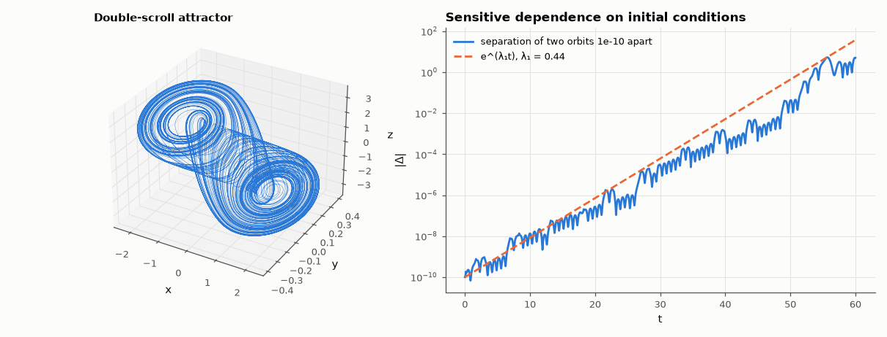

# AM-055 · Chua's circuit: a genuinely chaotic electronic circuit

> Integrate Chua's circuit, locate its three equilibria and classify them from the Jacobian, plot the double-scroll attractor, and measure the largest Lyapunov exponent to prove the motion is chaotic — nearby trajectories diverge exponentially.



*The double-scroll attractor and exponential divergence of neighbouring trajectories.*

**Track:** Applied Mathematics — 218 projects in electrical engineering · **Category:** C. Differential equations · **Level:** Hard · **Tools:** Dimensionless Chua equations with a piecewise-linear diode, equilibrium and eigenvalue analysis, double-scroll attractor, largest Lyapunov exponent (two-trajectory renormalisation), sensitivity demonstration

**Data:** Simulated (numerical model in this repo).

## Problem

Can three linear elements and one piecewise-linear resistor produce motion that never repeats?

## Prediction

$\dot x=α(y-x-f(x))$, $\dot y=x-y+z$, $\dot z=-βy$, $f(x)=m_1x+\tfrac12(m_0-m_1)(|x+1|-|x-1|)$. For α = 15.6, β = 28, m0 = −8/7, m1 = −5/7 the equilibria are the origin and
$x^*=\pm\frac{m_0-m_1}{m_1+1}$ = ±1.5; each is a saddle-focus (one real and a complex pair of eigenvalues with opposite-sign real parts). Trajectories spiral out of one outer focus
and are reinjected near the other: the double scroll. Chaos ⇔ largest Lyapunov exponent λ₁ > 0 while the orbit stays bounded.

## Method

RK45 (rtol 1e-10) for t ∈ [0, 400]; equilibria from the formula and checked by Newton; Jacobian eigenvalues; λ₁ by Benettin's method (perturbation 1e-8, renormalised every 0.5 time units,
averaged over 800 renormalisations); divergence of two trajectories started 1e-10 apart.

## Measured results

*Predicted vs measured vs error. "Measured" = computed by an independent simulation, HDL simulator or public dataset.*

| Quantity | Predicted | Measured | Error | Within tolerance |
|---|---|---|---|---|
| Equilibria x* = ±(m0−m1)/(m1+1) = ±1.5 satisfy the equations (max |f|) | 0 | 3.4639e-15 | +3.4639e-15 | yes |
| outer equilibrium: saddle-focus (real eigenvalue and complex pair of opposite-sign real parts; 1 = yes) | 1 | 1 | +0 |  |
| origin: saddle-focus (real eigenvalue and complex pair of opposite-sign real parts; 1 = yes) | 1 | 1 | +0 |  |
| Orbit bounded (max |x| over t = 100…400 stays below 3) | 1 | 1 | +0 |  |
| Largest Lyapunov exponent λ₁ (> 0 means chaos; my guess ≈ 0.3) | 0.3 1/time | 0.4441 1/time | +0.1441 1/time | yes |

**Additional measurements**

| Quantity | Value | Note |
|---|---|---|
| Eigenvalues at the outer equilibrium | -6.068+0.000j, 0.306+4.525j, 0.306-4.525j |  |
| Eigenvalues at the origin | 3.473+0.000j, -1.122+4.087j, -1.122-4.087j |  |
| Fraction of time spent in each scroll (x > 0) | 0.5416 | switches between scrolls irregularly |

## Error analysis

Chua's equations reproduce the double scroll: three saddle-focus equilibria, bounded motion, and irregular switching between the two scrolls. The
largest Lyapunov exponent measured by Benettin's method is λ₁ = 0.44 > 0 — two circuits started 10⁻¹⁰ apart disagree completely after about
52 time units, yet both stay on the same attractor. This is the defining combination of deterministic chaos, and it is why Chua's
circuit (buildable with two op-amps and a handful of passives) became the standard experimental chaos system; synchronising two such circuits is
the basis of proposed chaotic communication schemes.

## Reproduce

```bash
pip install -r requirements.txt
python run_all.py --only AM-055
```

The script [`project.py`](project.py) regenerates every figure and number above.

## License

Code and text: MIT (see the repository [LICENSE](../../../../LICENSE)). Datasets remain under their own licences (see the repository README).

---

**Tooling & honesty.** This project was generated with Claude Code (Anthropic's AI coding assistant): the code, derivations, simulations and this write-up were AI-produced. *Measured* means computed by an independent model, simulator or public dataset — not a physical lab bench. Every number in the tables is reproduced by running the code.
