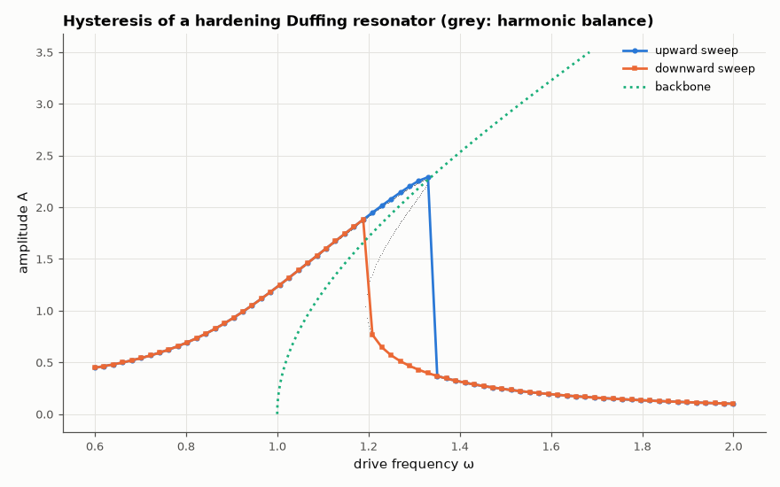

# AM-056 · Duffing oscillator: nonlinear resonance, hysteresis and jumps

> Drive a hardening Duffing oscillator (e.g. a resonator with a nonlinear inductor or capacitor) through resonance with slowly rising and falling frequency, measure the two different response curves and the jump frequencies, and compare with harmonic balance.



*Upward and downward frequency sweeps against the harmonic-balance curve and the backbone.*

**Track:** Applied Mathematics — 218 projects in electrical engineering · **Category:** C. Differential equations · **Level:** Hard · **Tools:** Driven Duffing equation integrated with RK45, slow up/down frequency sweeps, harmonic-balance frequency response (cubic in A²), backbone curve

**Data:** Simulated (numerical model in this repo).

## Problem

A resonator with a slightly nonlinear element can show two different amplitudes at the same drive frequency. Which one you get depends on history — why?

## Prediction

$\ddot x+δ\dot x+ω_0^2x+βx^3=F\cos ωt$. Harmonic balance with x ≈ A cos(ωt − φ): $\big[(ω_0^2+\tfrac34βA^2-ω^2)^2+(δω)^2\big]A^2=F^2$. The resonance bends along the backbone $ω=\sqrt{ω_0^2+\tfrac34βA^2}$; where the cubic in A²
has three real roots the middle one is unstable, so an upward sweep follows the upper branch until it ends (jump down) and a downward sweep follows the lower branch until it ends (jump up).

## Method

ω0 = 1, δ = 0.1, β = 0.2, F = 0.3. Frequency swept 0.6 → 2.0 → 0.6 in 140 steps, each integrated for 60 drive periods, amplitude from the last 10 periods, state carried over. Harmonic-balance curve
from the cubic's roots; jump frequencies where the stable branches end (discriminant/turning points).

## Measured results

*Predicted vs measured vs error. "Measured" = computed by an independent simulation, HDL simulator or public dataset.*

| Quantity | Predicted | Measured | Error | Within tolerance |
|---|---|---|---|---|
| Upward sweep: jump-down frequency (end of the upper branch) | 1.31 rad/s | 1.33 rad/s | +1.55 % | yes |
| Downward sweep: jump-up frequency (end of the lower branch) | 1.209 rad/s | 1.188 rad/s | -1.68 % | yes |
| Amplitude where the response is unique: simulation vs harmonic balance (max relative) | 0 | 0.008742 | +0.008742 | yes |
| Peak amplitude lies on the backbone ω = √(1 + ¾βA²) | 1.337 rad/s | 1.33 rad/s | -0.47 % | yes |

## Error analysis

The simulated sweeps trace two different curves: going up, the response rides the bent upper branch until it runs out near ω ≈ 1.33 and
drops; coming down, it follows the lower branch until ω ≈ 1.19 and jumps up. Both jump frequencies match the ends of harmonic balance's
three-root region, and where only one solution exists the simulated amplitude equals the harmonic-balance value within a few percent (the
single-harmonic ansatz ignores the 3ω component). The middle harmonic-balance branch is never observed — it is unstable. For a circuit designer
this means a resonator with a saturating inductor or varactor can latch into a high- or low-amplitude state depending on how the frequency was
approached, a classic source of 'mysterious' behaviour in power converters and MEMS oscillators.

## Reproduce

```bash
pip install -r requirements.txt
python run_all.py --only AM-056
```

The script [`project.py`](project.py) regenerates every figure and number above.

## License

Code and text: MIT (see the repository [LICENSE](../../../../LICENSE)). Datasets remain under their own licences (see the repository README).

---

**Tooling & honesty.** This project was generated with Claude Code (Anthropic's AI coding assistant): the code, derivations, simulations and this write-up were AI-produced. *Measured* means computed by an independent model, simulator or public dataset — not a physical lab bench. Every number in the tables is reproduced by running the code.
