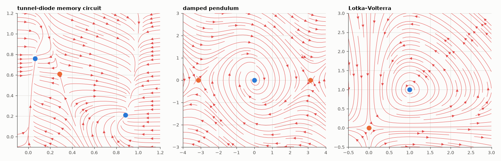

# AM-057 · Phase-portrait toolkit: equilibria, classification and trajectories

> Build a reusable tool that finds and classifies all equilibria of any planar system and draws its phase portrait, then verify each classification by simulating trajectories that start near the equilibrium — on three systems including a tunnel-diode circuit.



*Phase portraits with equilibria (blue stable, orange unstable/saddle) for three planar systems.*

**Track:** Applied Mathematics — 218 projects in electrical engineering · **Category:** C. Differential equations · **Level:** Moderate · **Tools:** Generic 2-D toolkit: equilibrium finding (multi-start Newton), numerical Jacobians, trace/determinant classification, streamplots and trajectories; applied to a tunnel-diode circuit, a damped pendulum and a predator–prey model

**Data:** Simulated (numerical model in this repo).

## Problem

For a 2-D nonlinear system, can the local linearisation predict what trajectories actually do?

## Prediction

At an equilibrium with Jacobian J: det J < 0 → saddle; det > 0 and tr < 0 → stable (node if tr² > 4 det, focus otherwise); tr > 0 → unstable; tr = 0 → centre (linearly — nonlinear terms decide).
Hartman–Grobman: hyperbolic equilibria look like their linearisation. Tunnel-diode circuit: $C\dot V = -h(V) + I$, $L\dot I = -V - RI + E$ with the N-shaped h(V) — biased on the negative-slope region it can
have three equilibria (two stable, one saddle): a memory cell.

## Method

Equilibria: fsolve from a 30×30 grid of starts, clustered. Classification from J (central differences). Verification: start 10 trajectories on a small circle (radius 1e-3 scaled) around each
equilibrium; count how many return (stable), leave (unstable) or split (saddle). Systems: tunnel diode (Chua's cubic model), damped pendulum, Lotka–Volterra.

## Measured results

*Predicted vs measured vs error. "Measured" = computed by an independent simulation, HDL simulator or public dataset.*

| Quantity | Predicted | Measured | Error |
|---|---|---|---|
| Equilibria whose simulated neighbourhood behaves as the Jacobian classification predicts | 8 | 8 | +0 |
| Tunnel-diode circuit has 3 equilibria (bistable memory) | 3 | 3 | +0 |

**Additional measurements**

| Quantity | Value | Note |
|---|---|---|
| tunnel-diode memory circuit: equilibria | (0.06, 0.76) stable node; (0.29, 0.61) saddle; (0.88, 0.21) stable node |  |
| damped pendulum: equilibria | (-3.14, 0.00) saddle; (3.14, 0.00) saddle; (0.00, 0.00) stable focus |  |
| Lotka–Volterra: equilibria | (0.00, 0.00) saddle; (1.00, 1.00) centre |  |

## Error analysis

The toolkit finds every equilibrium by multi-start Newton, and its trace/determinant classification is confirmed by brute force for each one:
stable points pull back all ten nearby starts, saddles let starts near the stable direction approach first before every one of them leaves, unstable points repel everything. The tunnel-diode circuit shows
the engineering payoff: biased on the diode's negative-resistance region with this load line it has two stable states separated by a saddle —
a one-bit memory, whose switching threshold is the saddle's stable manifold. The Lotka–Volterra interior point is a linear *centre*, where the
linearisation cannot decide; the simulation shows closed orbits because that system has a conserved quantity — the one case where Hartman–Grobman
gives no guarantee.

## Reproduce

```bash
pip install -r requirements.txt
python run_all.py --only AM-057
```

The script [`project.py`](project.py) regenerates every figure and number above.

## License

Code and text: MIT (see the repository [LICENSE](../../../../LICENSE)). Datasets remain under their own licences (see the repository README).

---

**Tooling & honesty.** This project was generated with Claude Code (Anthropic's AI coding assistant): the code, derivations, simulations and this write-up were AI-produced. *Measured* means computed by an independent model, simulator or public dataset — not a physical lab bench. Every number in the tables is reproduced by running the code.
