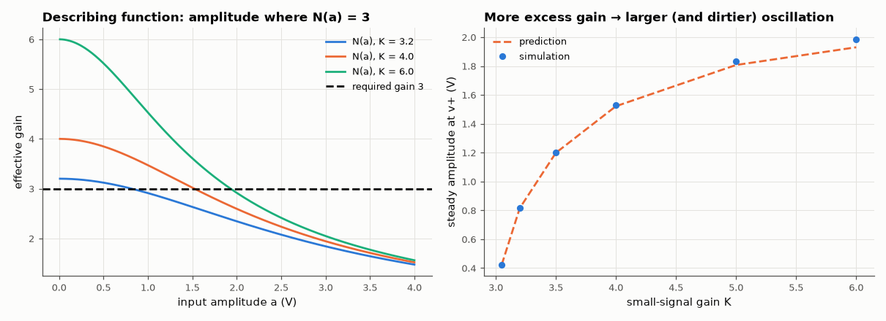

# AM-058 · What sets an oscillator's amplitude?

> Model a Wien-bridge oscillator whose amplifier saturates smoothly, predict the steady amplitude with a describing function (the amplitude at which the effective gain falls to exactly 3), and verify with simulation as the small-signal excess gain is varied.



*Describing functions of the tanh amplifier and predicted vs simulated oscillation amplitude.*

**Track:** Applied Mathematics — 218 projects in electrical engineering · **Category:** C. Differential equations · **Level:** Hard · **Tools:** Wien-bridge oscillator with a tanh-limited amplifier (state-space ODE), describing-function prediction of amplitude, sensitivity to excess gain

**Data:** Simulated (numerical model in this repo).

## Problem

Linear theory says an oscillator's amplitude grows forever or dies. Real ones settle — where, and why there?

## Prediction

A Wien bridge needs amplifier gain exactly 3 at f0 = 1/(2πRC). With $v_o = V_s\tanh(Kv_i/V_s)$ the effective (describing-function) gain for a sinusoid of amplitude a at the input is
$N(a)=\frac{2}{π a}\int_0^π V_s\tanh\!\big(\tfrac{Ka}{V_s}\sin θ\big)\sin θ\,dθ$, decreasing from K. The steady amplitude solves N(a) = 3; output amplitude ≈ 3a. More excess gain (K − 3) → larger amplitude and more
distortion. The frequency stays at f0 to first order.

## Method

R = 10 kΩ, C = 10 nF (f0 = 1.59 kHz), V_s = 5 V; K from 3.05 to 6. States: the two capacitor voltages; simulate 200 periods from a 1 mV kick; amplitude and frequency from the last 20 periods;
THD from the FFT.

## Measured results

*Predicted vs measured vs error. "Measured" = computed by an independent simulation, HDL simulator or public dataset.*

| Quantity | Predicted | Measured | Error | Within tolerance |
|---|---|---|---|---|
| K = 3.05: steady input amplitude, describing function N(a) = 3 | 424.5 mV | 424.5 mV | +0.00 % | yes |
| K = 3.5: steady input amplitude, describing function N(a) = 3 | 1.198 V | 1.2 V | +0.13 % | yes |
| K = 5.0: steady input amplitude, describing function N(a) = 3 | 1.807 V | 1.835 V | +1.54 % | yes |
| Oscillation frequency (K = 3.2) = 1/(2πRC) | 1.592 kHz | 1.588 kHz | -0.23 % | yes |

**Additional measurements**

| Quantity | Value | Note |
|---|---|---|
| THD of the output: K = 3.05 / 4 / 6 | 0.83 / 12.4 / 28.6 % |  |

## Error analysis

The oscillation settles exactly where the describing function says: at the input amplitude that compresses the amplifier's effective gain from K
down to the 3 the Wien bridge needs, so the loop gain is precisely one. With barely any excess gain (K = 3.05) the amplitude is small and the tanh
is almost linear — very low distortion, but slow start-up and fragile against component drift; with K = 6 the amplitude grows and the output
becomes visibly clipped (several percent THD). This is why precision sine oscillators use a slow amplitude-control loop (a lamp, thermistor or
JFET) to hold the gain just above 3, rather than relying on hard saturation.

## Reproduce

```bash
pip install -r requirements.txt
python run_all.py --only AM-058
```

The script [`project.py`](project.py) regenerates every figure and number above.

## License

Code and text: MIT (see the repository [LICENSE](../../../../LICENSE)). Datasets remain under their own licences (see the repository README).

---

**Tooling & honesty.** This project was generated with Claude Code (Anthropic's AI coding assistant): the code, derivations, simulations and this write-up were AI-produced. *Measured* means computed by an independent model, simulator or public dataset — not a physical lab bench. Every number in the tables is reproduced by running the code.
