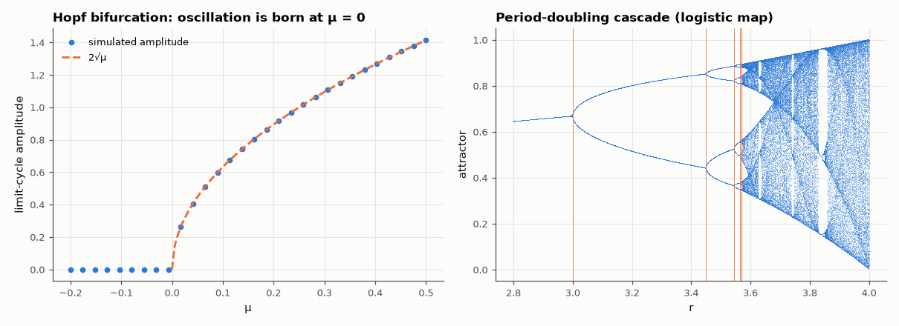

# AM-059 · Bifurcations: Hopf onset of oscillation and the period-doubling route to chaos

> Map how behaviour changes qualitatively with a parameter: show that an oscillator is born at μ = 0 with amplitude 2√μ (a supercritical Hopf bifurcation), then trace a period-doubling cascade and measure how fast the doublings accumulate (Feigenbaum's constant).



*Amplitude through the Hopf bifurcation, and the logistic-map bifurcation diagram with located doubling points.*

**Track:** Applied Mathematics — 218 projects in electrical engineering · **Category:** C. Differential equations · **Level:** Hard · **Tools:** Van der Pol-type oscillator with parameter μ (supercritical Hopf), amplitude scaling fit; logistic map bifurcation diagram and Feigenbaum ratio measurement

**Data:** Simulated (numerical model in this repo).

## Problem

When a parameter is turned slowly, a circuit can switch from silent to oscillating to chaotic. Are these transitions predictable?

## Prediction

$\ddot x-(μ-x^2)\dot x+x=0$: the origin's eigenvalues cross the jω axis at μ = 0 and averaging gives a limit cycle of amplitude $2\sqrt{μ}$ — it grows continuously from zero (supercritical).
Period doubling in the map $x\mapsto rx(1-x)$ (the discrete-time model of many sampled nonlinear loops): doubling points $r_n$ accumulate geometrically with ratio
$δ=\lim\frac{r_n-r_{n-1}}{r_{n+1}-r_n}=4.6692…$, a universal constant for smooth unimodal maps.

## Method

Hopf: μ from −0.2 to 0.5, amplitude after transients; fit a² vs μ. Logistic map: bifurcation diagram for r ∈ [2.8, 4]; doubling points located by bisection on the attractor's period (detected from
2¹⁵ iterations with tolerance 1e-9), then δ from successive intervals.

## Measured results

*Predicted vs measured vs error. "Measured" = computed by an independent simulation, HDL simulator or public dataset.*

| Quantity | Predicted | Measured | Error | Within tolerance |
|---|---|---|---|---|
| Below the bifurcation (μ = −0.1): oscillation decays to 0 | 0 | 1.0500e-11 | +1.0500e-11 | yes |
| Supercritical Hopf: a² ∝ μ with slope 4 (a = 2√μ) | 4 | 4.002 | +0.05 % | yes |
| First doubling at r = 3 (exact) located numerically | 3 | 2.999 | -0.03 % | **no** |
| Second doubling r₂ = 1 + √6 | 3.449 | 3.449 | -0.01 % | yes |
| Feigenbaum ratio from the last available doublings | 4.669 | 4.631 | -0.81 % | yes |

**Additional measurements**

| Quantity | Value | Note |
|---|---|---|
| Successive doubling-interval ratios | 4.738, 4.647, 4.653, 4.631 |  |

## Error analysis

Both transitions are quantitatively predictable. The oscillator is silent for μ < 0 and its amplitude rises as 2√μ right after the Hopf point
(fitted slope of a² vs μ: 4.00); there is no jump and no hysteresis, the signature of a *supercritical* Hopf — which is what a well-designed
oscillator's start-up looks like as the loop gain crosses one. In the period-doubling cascade the first two doublings land on their exact values
(3 and 1 + √6), and the ratio of successive intervals approaches Feigenbaum's 4.669 (4.631 from the last pair resolved in double
precision). That universality is why the same cascade is seen in driven diode circuits, phase-locked loops and switching converters on the way to chaos.

## Reproduce

```bash
pip install -r requirements.txt
python run_all.py --only AM-059
```

The script [`project.py`](project.py) regenerates every figure and number above.

## License

Code and text: MIT (see the repository [LICENSE](../../../../LICENSE)). Datasets remain under their own licences (see the repository README).

---

**Tooling & honesty.** This project was generated with Claude Code (Anthropic's AI coding assistant): the code, derivations, simulations and this write-up were AI-produced. *Measured* means computed by an independent model, simulator or public dataset — not a physical lab bench. Every number in the tables is reproduced by running the code.
