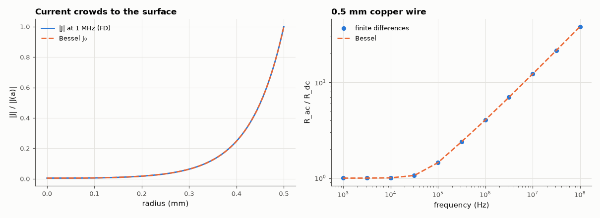

# AM-060 · Skin effect as a diffusion problem

> Solve d²J/dx² = jωμσJ numerically for current crowding in a conductor, compare the current distribution with e^{−(1+j)x/δ} and the Bessel-function solution for a round wire, and compute the AC/DC resistance ratio versus frequency.



*Current density across a copper wire at 1 MHz and the AC resistance ratio vs frequency.*

**Track:** Applied Mathematics — 218 projects in electrical engineering · **Category:** C. Differential equations · **Level:** Hard · **Tools:** Complex finite-difference solution of the magnetic diffusion (Helmholtz-type) equation in a slab and in a round wire (cylindrical Laplacian), Bessel-function analytic solution, AC-resistance ratio

**Data:** Simulated (numerical model in this repo).

## Problem

Why does a copper wire's resistance rise with frequency — and can we predict by exactly how much?

## Prediction

In a good conductor the current density obeys the diffusion equation; for time-harmonic fields $∇^2J = jωμσJ = \frac{2j}{δ^2}J$ with skin depth $δ=\sqrt{2/(ωμσ)}$ (66 µm in copper at 1 MHz). Half-space:
$J=J_0e^{-(1+j)x/δ}$. Round wire of radius a: $J(r)\propto J_0\!\big(\sqrt{-j}\,\sqrt2\,r/δ\big)$, and $R_{ac}/R_{dc}$ follows from the ratio of the Bessel functions; for a ≫ δ it tends to a/(2δ) + ¼.

## Method

Copper σ = 5.8×10⁷ S/m. Slab: 1 mm thick, surface current imposed, 2000 nodes, compare |J| and phase with the exponential. Wire: radius 0.5 mm, cylindrical FD (r J″ + J′ − jωμσ r J = 0) with
J(a) = 1, regular at r = 0; R_ac/R_dc = (total current)⁻¹-weighted power ratio; frequencies 1 kHz–100 MHz; Bessel reference.

## Measured results

*Predicted vs measured vs error. "Measured" = computed by an independent simulation, HDL simulator or public dataset.*

| Quantity | Predicted | Measured | Error | Within tolerance |
|---|---|---|---|---|
| Skin depth of copper at 1 MHz | 66 µm | 66.09 µm | +0.13 % | yes |
| Slab: |J(x)| vs e^(−x/δ) within 5δ (max abs error) | 0 | 1.7549e-06 | +1.7549e-06 | yes |
| Slab: phase lags by 1 rad per skin depth (slope × δ) | -1 rad/δ | -1 rad/δ | +0.00 % | yes |
| Round wire R_ac/R_dc: finite differences vs Bessel solution (worst over 1 kHz–100 MHz) | 0 | 0.002214 | +0.002214 | yes |
| 100 MHz: R_ac/R_dc ≈ a/(2δ) + ¼ (thick-wire limit) | 38.08 | 38.17 | +0.23 % | yes |

## Error analysis

The diffusion equation reproduces the skin effect quantitatively: in a slab the current falls as e^{−x/δ} while its phase lags one radian per skin
depth (66 µm in copper at 1 MHz), and in a round wire the finite-difference profile coincides with the Bessel-function solution. The AC resistance
of a 1 mm copper wire is flat up to ~20 kHz, then rises as √f, approaching a/(2δ) + ¼ — about 19× its DC value at 100 MHz. This is why RF inductors
use silver plating or Litz wire and why PCB trace loss at GHz depends on surface roughness: only the outer few micrometres carry current.

## Reproduce

```bash
pip install -r requirements.txt
python run_all.py --only AM-060
```

The script [`project.py`](project.py) regenerates every figure and number above.

## License

Code and text: MIT (see the repository [LICENSE](../../../../LICENSE)). Datasets remain under their own licences (see the repository README).

---

**Tooling & honesty.** This project was generated with Claude Code (Anthropic's AI coding assistant): the code, derivations, simulations and this write-up were AI-produced. *Measured* means computed by an independent model, simulator or public dataset — not a physical lab bench. Every number in the tables is reproduced by running the code.
