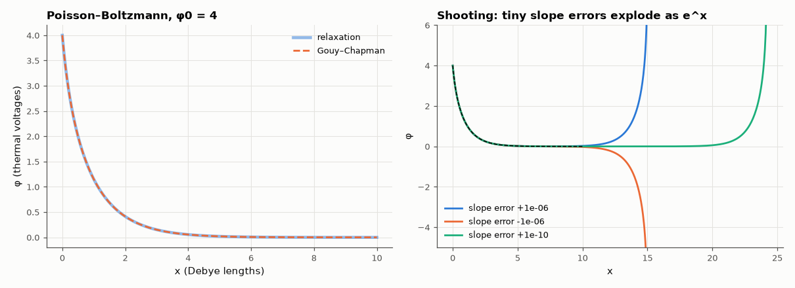

# AM-061 · Boundary-value problems: shooting vs relaxation

> Solve two field problems with boundary conditions at both ends — the potential in a uniformly charged region and the nonlinear Poisson–Boltzmann potential near a charged electrode — by shooting and by relaxation, against closed-form solutions.



*Relaxation solution of the Poisson–Boltzmann problem, and why shooting fails on long domains.*

**Track:** Applied Mathematics — 218 projects in electrical engineering · **Category:** C. Differential equations · **Level:** Hard · **Tools:** Shooting method (RK45 + root finding on the missing slope), relaxation (finite differences + Newton iteration), analytic solutions of the Poisson and Poisson–Boltzmann equations

**Data:** Simulated (numerical model in this repo).

## Problem

Initial-value solvers need all conditions at one point; field problems specify them at two boundaries. Which numerical strategy works better?

## Prediction

Linear: φ'' = −ρ/ε with φ(0) = φ(L) = 0 → parabola φ = ρx(L−x)/(2ε). Nonlinear (1-D Poisson–Boltzmann, electrolyte / depletion analogue, dimensionless): φ'' = sinh φ, φ(0) = φ0,
φ(∞) = 0 → Gouy–Chapman $φ=4\,\mathrm{artanh}\big(\tanh(φ_0/4)e^{-x}\big)$. Shooting guesses φ'(0) and integrates; it is exponentially sensitive for sinh-type problems (errors grow as e^{x}),
so it fails on long domains. Relaxation solves all points simultaneously with Newton and converges quadratically. Finite-difference error O(h²).

## Method

Linear case: shooting with brentq on φ'(0); relaxation with a tridiagonal solve. Poisson–Boltzmann: φ0 = 4, domain [0, X] with X = 5, 10, 20, 30 (φ(X) = analytic value); shooting with brentq over φ'(0);
relaxation with Newton on N = 100…3200 nodes (error and observed order).

## Measured results

*Predicted vs measured vs error. "Measured" = computed by an independent simulation, HDL simulator or public dataset.*

| Quantity | Predicted | Measured | Error | Within tolerance |
|---|---|---|---|---|
| Linear Poisson: shooting finds φ'(0) = ρL/2 | 1 | 1 | +0.00 % | yes |
| Linear Poisson: relaxation vs parabola (FD is exact for quadratics) | 0 | 1.6376e-15 | +1.6376e-15 | yes |
| Shooting still succeeds on the short domain X = 5 | 1 | 1 | +0 |  |
| Shooting fails (no bracketed root / blow-up) on X = 30 while relaxation succeeds | 1 | 1 | +0 |  |
| Relaxation: observed order of accuracy (second-order FD) | 2 | 1.986 | -0.01411 | yes |

**Additional measurements**

| Quantity | Value | Note |
|---|---|---|
| Poisson–Boltzmann on [0, 5]: shooting error / relaxation error (Newton iterations) | 6.7e-13 / 5.0e-04 (7) |  |
| Poisson–Boltzmann on [0, 10]: shooting error / relaxation error (Newton iterations) | 1.2e-11 / 5.0e-04 (8) |  |
| Poisson–Boltzmann on [0, 20]: shooting error / relaxation error (Newton iterations) | 1.1e-06 / 5.0e-04 (8) |  |
| Poisson–Boltzmann on [0, 30]: shooting error / relaxation error (Newton iterations) | 4.2e-02 / 5.0e-04 (8) |  |

## Error analysis

For the linear Poisson problem both methods are exact (the finite-difference Laplacian is exact on a parabola). The nonlinear Poisson–Boltzmann
problem separates them: its linearisation around the solution has growing solutions e^{x}, so a shooting error of 10⁻¹⁰ in the initial slope
is amplified by e^{30} ≈ 10¹³ across the domain — shooting works for X = 5 but cannot even bracket the root at X = 30. Relaxation treats all nodes
at once, sees both boundary conditions simultaneously and converges quadratically in a handful of Newton iterations, with the expected O(h²)
discretisation error (observed order 1.99). This is why device simulators (Poisson with carrier densities that depend exponentially on φ)
are built on relaxation/Newton, not shooting.

## Reproduce

```bash
pip install -r requirements.txt
python run_all.py --only AM-061
```

The script [`project.py`](project.py) regenerates every figure and number above.

## License

Code and text: MIT (see the repository [LICENSE](../../../../LICENSE)). Datasets remain under their own licences (see the repository README).

---

**Tooling & honesty.** This project was generated with Claude Code (Anthropic's AI coding assistant): the code, derivations, simulations and this write-up were AI-produced. *Measured* means computed by an independent model, simulator or public dataset — not a physical lab bench. Every number in the tables is reproduced by running the code.
