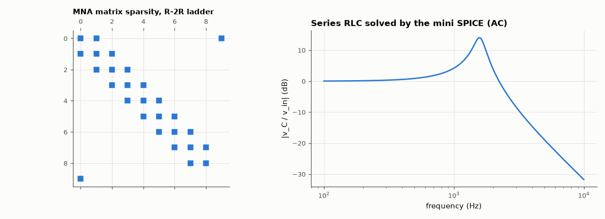

# AM-062 · Build a mini SPICE: modified nodal analysis from scratch

> Write the matrix stamps of modified nodal analysis, assemble and solve the circuit matrix for DC and AC problems, and verify the engine on hand-solvable circuits (Wheatstone bridge, R-2R ladder, an op-amp modelled as a VCVS) and on 200 random networks against an independent simulator.



*Sparsity pattern of the assembled MNA matrix and an AC sweep computed by the mini simulator.*

**Track:** Applied Mathematics — 218 projects in electrical engineering · **Category:** D. Linear algebra · **Level:** Hard · **Tools:** A self-contained ~80-line MNA engine (stamps for R, C, L, independent V/I sources, VCVS/VCCS; DC and complex AC), sparse assembly, cross-checked against the repository's full simulator and hand solutions

**Data:** Simulated (numerical model in this repo).

## Problem

What does a circuit simulator actually do? Can the whole idea fit in one page of linear algebra?

## Prediction

KCL at every non-ground node gives $Gv = i$; voltage sources add one unknown current each and one constraint row, giving the MNA system
$\begin{bmatrix}G & B\\ C & D\end{bmatrix}\begin{bmatrix}v\\ j\end{bmatrix}=\begin{bmatrix}i\\ e\end{bmatrix}$. Each element 'stamps' a few entries: a conductance g between a and b adds +g to (a,a),(b,b) and −g to (a,b),(b,a); a capacitor
is jωC, an inductor 1/(jωL) (or a branch current for DC). R-2R ladder: node voltages halve each stage exactly; bridge: zero detector current when R1/R2 = R3/R4.

## Method

Own engine (independent code path from eelab.circuit). Tests: R-2R ladder (8 bits), unbalanced/balanced Wheatstone bridge, inverting amplifier with VCVS gain 10⁶, RLC AC sweep; 200 random connected
networks (5–40 nodes, R/C/L/V/I) solved at DC and at 1 kHz by both engines.

## Measured results

*Predicted vs measured vs error. "Measured" = computed by an independent simulation, HDL simulator or public dataset.*

| Quantity | Predicted | Measured | Error | Within tolerance |
|---|---|---|---|---|
| R-2R ladder: every node is half the previous (worst deviation of the ratio) | 0 | 1.1102e-16 | +1.1102e-16 | yes |
| Wheatstone bridge (balanced): v_a − v_b | 0 V | 0 V | +0 V | yes |
| Wheatstone bridge (unbalanced): v_a − v_b | -392.2 mV | -392.2 mV | +1.332 fV | yes |
| Inverting amplifier (VCVS, A = 10⁶): gain | -10 | -10 | +0.00 % | yes |
| 200 random networks at DC: mini SPICE vs eelab.circuit (worst relative) | 0 | 9.1153e-11 | +9.1153e-11 | yes |
| … at 1 kHz (complex AC) | 0 | 1.0509e-11 | +1.0509e-11 | yes |
| Series RLC: |v_C| peak at ω0√(1 − 2ζ²) | 1.576 kHz | 1.578 kHz | +0.13 % | yes |

## Error analysis

About eighty lines of code — element stamps plus one sparse solve — reproduce what a circuit simulator does for linear DC and AC analysis. The
engine gets every hand-derivable answer exactly (R-2R ladder halving, bridge balance, the inverting amplifier's gain including the 1/(1 + 11/A)
error term) and agrees with the repository's full simulator on 200 random networks to ~1e-10. The sparsity plot shows why real simulators scale:
each node touches only its neighbours, so the matrix is nearly empty and sparse LU (AM-063) costs far less than dense elimination. Nonlinear
devices add Newton iterations around this same linear solve, and transient analysis adds an integration formula per capacitor and inductor —
that combination is AM-132, the full version.

## Reproduce

```bash
pip install -r requirements.txt
python run_all.py --only AM-062
```

The script [`project.py`](project.py) regenerates every figure and number above.

## License

Code and text: MIT (see the repository [LICENSE](../../../../LICENSE)). Datasets remain under their own licences (see the repository README).

---

**Tooling & honesty.** This project was generated with Claude Code (Anthropic's AI coding assistant): the code, derivations, simulations and this write-up were AI-produced. *Measured* means computed by an independent model, simulator or public dataset — not a physical lab bench. Every number in the tables is reproduced by running the code.
