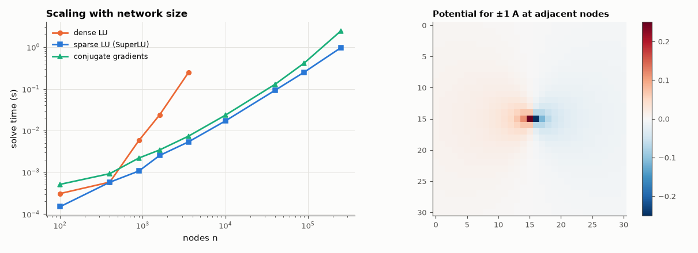

# AM-063 · Sparse solvers on large resistor networks

> Assemble the nodal matrix of an N×N resistor mesh, solve it with dense and sparse methods, measure how time scales with problem size, and verify the physics against the known effective resistances of the infinite square grid (½ Ω to a neighbour, 2/π Ω diagonally).



*Solve time vs size for dense, sparse-direct and iterative solvers, and the dipole potential on the grid.*

**Track:** Applied Mathematics — 218 projects in electrical engineering · **Category:** D. Linear algebra · **Level:** Hard · **Tools:** 2-D resistor-grid Laplacians up to 250,000 nodes, dense LU (LAPACK) vs sparse direct LU (SuperLU with fill-reducing ordering) vs conjugate gradients; effective-resistance results as analytic checks

**Data:** Simulated (numerical model in this repo).

## Problem

Nodal matrices of real circuits are huge but almost empty. How much does exploiting that sparsity buy?

## Prediction

An n-node 2-D grid has ~5n non-zeros. Dense LU costs ~n³ (exponent 3); sparse LU with nested-dissection ordering costs ~n^{1.5}; CG costs ~n^{1.5} too (√n iterations of O(n) work, since the
condition number grows ∝ n). Physics check: on an infinite grid of 1 Ω resistors the effective resistance between adjacent nodes is exactly ½ Ω and between diagonal
neighbours 2/π Ω (lattice Green's function) — a large finite grid should approach these.

## Method

Unit resistors on an N×N grid, the boundary tied to ground through 1 Ω (a well-posed Dirichlet-like problem). Dense solve up to n = 3,600; sparse LU and CG (tolerance 1e-10) up to n = 250,000. Effective
resistance at the grid centre: inject +1 A and −1 A at the two nodes, R = Δv.

## Measured results

*Predicted vs measured vs error. "Measured" = computed by an independent simulation, HDL simulator or public dataset.*

| Quantity | Predicted | Measured | Error | Within tolerance |
|---|---|---|---|---|
| Effective resistance to a neighbour, 500×500 grid (infinite grid: ½ Ω) | 500 mΩ | 500 mΩ | -0.00 % | yes |
| Effective resistance to a diagonal node (infinite grid: 2/π Ω) | 636.6 mΩ | 636.6 mΩ | -0.00 % | yes |
| CG vs sparse LU solution (worst over sizes) | 0 V | 73.92 pV | +73.92 pV | yes |
| Dense LU time exponent (∝ n^k) | 3 | 2.741 | -0.2589 | yes |
| Sparse LU time exponent (nested dissection ≈ 1.5) | 1.5 | 1.253 | -0.2471 | yes |

**Additional measurements**

| Quantity | Value | Note |
|---|---|---|
| Speed-up of sparse LU over dense at n = 3,600 | 46.54 × |  |

## Error analysis

The physics checks land on the lattice-Green's-function values — ½ Ω to a neighbour and 2/π Ω diagonally — confirming the assembled matrix. The
algorithms separate dramatically with size: dense LU follows its cubic cost and becomes impractical beyond a few thousand nodes, while sparse LU
with a fill-reducing ordering solves a quarter-million-node mesh in about a second, with a time exponent of 1.25 — below the asymptotic nested-dissection 1.5 because at these sizes the
work is still dominated by the O(n) parts (ordering, symbolic analysis, memory traffic), not by the dense separator factorisations. CG agrees with the direct solution and uses almost no memory, but its iteration count grows with the grid's condition number;
for the repeated solves of a transient simulation the factor-once, solve-many advantage of sparse LU usually wins, which is what SPICE does.

## Reproduce

```bash
pip install -r requirements.txt
python run_all.py --only AM-063
```

The script [`project.py`](project.py) regenerates every figure and number above.

## License

Code and text: MIT (see the repository [LICENSE](../../../../LICENSE)). Datasets remain under their own licences (see the repository README).

---

**Tooling & honesty.** This project was generated with Claude Code (Anthropic's AI coding assistant): the code, derivations, simulations and this write-up were AI-produced. *Measured* means computed by an independent model, simulator or public dataset — not a physical lab bench. Every number in the tables is reproduced by running the code.
