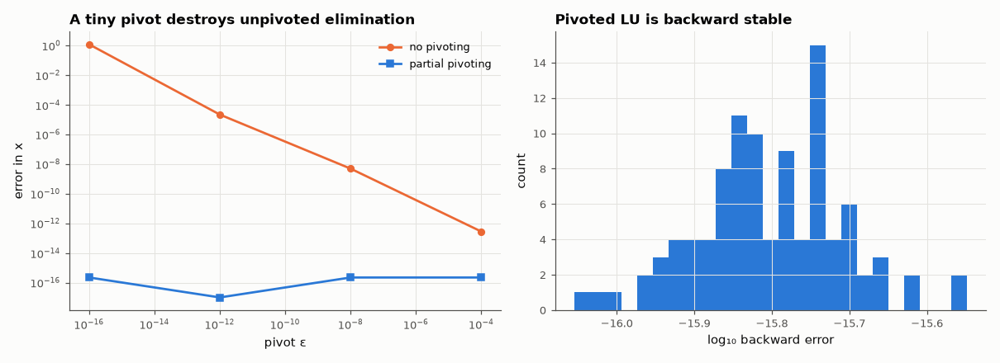

# AM-064 · LU decomposition with partial pivoting, from scratch

> Implement LU factorisation, show that without pivoting a tiny pivot destroys the answer while partial pivoting makes it backward stable, measure the backward error and growth factor on random and nodal matrices, and compare with LAPACK.



*Error with and without pivoting for the classic 2×2 example, and backward errors on 100 random systems.*

**Track:** Applied Mathematics — 218 projects in electrical engineering · **Category:** D. Linear algebra · **Level:** Moderate · **Tools:** Own Doolittle LU (vectorised row operations) with and without partial pivoting, forward/back substitution, backward-error and growth-factor analysis, comparison with LAPACK

**Data:** Simulated (numerical model in this repo).

## Problem

Gaussian elimination is taught without row swaps. Why does every real solver swap rows?

## Prediction

PA = LU. Without pivoting, a small pivot ε creates multipliers ~1/ε, entries grow by ~1/ε and rounding errors of size ε_mach·(1/ε) swamp the solution. With partial pivoting multipliers are ≤ 1 and the computed
solution is backward stable: $\frac{\|Ax̂-b\|}{\|A\|\|x̂\|}$ ≈ ε_mach·(growth factor), growth typically small (≤ ~n^{2/3} for random matrices, though 2^{n−1} is possible). Cost (2/3)n³ flops.

## Method

(i) The 2×2 example [[ε, 1], [1, 1]] for ε = 10⁻¹⁶…10⁻⁴. (ii) 100 random 200×200 matrices and nodal matrices of random resistor networks: backward error and growth factor, with/without pivoting,
vs scipy.linalg.lu_factor. (iii) Wilkinson's matrix where growth is 2^{n−1}. (iv) Time vs n.

## Measured results

*Predicted vs measured vs error. "Measured" = computed by an independent simulation, HDL simulator or public dataset.*

| Quantity | Predicted | Measured | Error | Within tolerance |
|---|---|---|---|---|
| [[ε,1],[1,1]] with ε = 1e-16: error without pivoting (≈ 1 — the answer is wrong) | 1 | 1.22 | +0.2204 | yes |
| … with partial pivoting | 0 | 2.2204e-16 | +2.2204e-16 | yes |
| Random 200×200: median backward error (≈ ε_mach = 2.2e-16 scale) | 2.2000e-16 | 1.5946e-16 | -6.0541e-17 | yes |
| Own LU vs LAPACK solution, worst relative difference | 0 | 8.0019e-13 | +8.0019e-13 | yes |
| Wilkinson's matrix: growth factor = 2^(n−1) | 5.6295e+14 | 5.6295e+14 | +0.00 % | yes |

**Additional measurements**

| Quantity | Value | Note |
|---|---|---|
| Growth factor, random matrices (median / max) | 7.7 / 11.0 |  |
| Own LU time exponent (vectorised rank-1 updates) | 2.214 | ∝ n³ flops but memory-bound in NumPy |

## Error analysis

Without row swaps the 2×2 example with ε = 10⁻¹⁶ returns x₁ = 0 instead of ≈ 1 — not a small error but a wrong answer, because the multiplier 1/ε
wipes out the information in the second row. With partial pivoting the same code is backward stable: across 100 random systems the backward error
sits at a few × 10⁻¹⁶ and the solutions match LAPACK. The growth factor stays modest for random matrices (median 8), but Wilkinson's
matrix shows the worst case 2^{n−1} is real — it simply almost never occurs in practice. Nodal matrices of passive circuits are diagonally
dominant, which is why SPICE can often pivot for sparsity rather than magnitude.

## Reproduce

```bash
pip install -r requirements.txt
python run_all.py --only AM-064
```

The script [`project.py`](project.py) regenerates every figure and number above.

## License

Code and text: MIT (see the repository [LICENSE](../../../../LICENSE)). Datasets remain under their own licences (see the repository README).

---

**Tooling & honesty.** This project was generated with Claude Code (Anthropic's AI coding assistant): the code, derivations, simulations and this write-up were AI-produced. *Measured* means computed by an independent model, simulator or public dataset — not a physical lab bench. Every number in the tables is reproduced by running the code.
