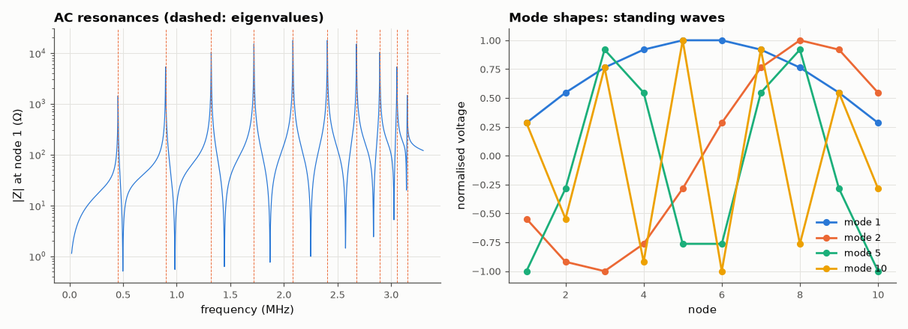

# AM-065 · Eigenvalues as natural frequencies of an LC ladder

> Write the LC ladder's equations as a mass-spring-like matrix problem, predict all N natural frequencies analytically, confirm them as eigenvalues and as resonance peaks in a circuit simulation, and show the standing-wave mode shapes.



*Resonances of the 10-section LC ladder from AC analysis and from eigenvalues, and four mode shapes.*

**Track:** Applied Mathematics — 218 projects in electrical engineering · **Category:** D. Linear algebra · **Level:** Hard · **Tools:** Generalised eigenproblem K v = ω² M v for an N-section LC ladder, analytic dispersion ω_k = 2ω0 sin(kπ/(2(N+1))), MNA AC resonance search, mode shapes

**Data:** Simulated (numerical model in this repo).

## Problem

A ladder of N identical LC sections has N resonances. Where are they, and what do they look like?

## Prediction

With node voltages v_i and all capacitors C to ground, series inductors L between nodes (ends grounded through L): $C\ddot v = -L^{-1}Kv$ where K is the tridiagonal (2, −1) matrix. Eigenvalues of K
are $4\sin^2\frac{kπ}{2(N+1)}$, so $ω_k = \frac{2}{\sqrt{LC}}\sin\frac{kπ}{2(N+1)}$, k = 1…N: a discrete dispersion relation with a cutoff at 2/√(LC). Mode k is a sampled sine $\sin\frac{ikπ}{N+1}$ — a standing wave.

## Method

N = 10 sections, L = 10 µH, C = 1 nF (2/√LC → 3.18 MHz). Eigenvalues of M⁻¹K (scipy.linalg.eigh generalised); resonances from peaks of the impedance seen by a 1 A test source at node 1 in an AC sweep
(with 0.1 Ω series loss for finite peaks).

## Measured results

*Predicted vs measured vs error. "Measured" = computed by an independent simulation, HDL simulator or public dataset.*

| Quantity | Predicted | Measured | Error | Within tolerance |
|---|---|---|---|---|
| Eigenvalue frequencies vs 2/√(LC)·sin(kπ/2(N+1)) (worst relative) | 0 | 4.2188e-15 | +4.2188e-15 | yes |
| Mode shapes are sampled sines (min |cos angle| between eigvec and sine) | 1 | 1 | -0.00 % | yes |
| Resonance peaks found in the AC sweep | 10 | 10 | +0 |  |
| AC resonances vs eigenvalues (worst relative) | 0 | 7.7226e-05 | +7.7226e-05 | yes |

## Error analysis

The generalised eigenproblem gives exactly the analytic frequencies ω_k = (2/√LC) sin(kπ/2(N+1)), its eigenvectors are sampled sine waves, and
the circuit simulator's impedance sweep shows ten resonance peaks at the same frequencies. The matrix view explains two practical facts: the modes
bunch up toward the cutoff 2/√(LC) (the discrete dispersion relation of a lumped line — above it nothing propagates, which is why an LC ladder is a
low-pass filter and an artificial transmission line), and the lowest mode's frequency falls as 1/N, approaching the continuous line's λ/2
resonance. The same eigen-analysis applies to mechanical chains and to crystal phonons.

## Reproduce

```bash
pip install -r requirements.txt
python run_all.py --only AM-065
```

The script [`project.py`](project.py) regenerates every figure and number above.

## License

Code and text: MIT (see the repository [LICENSE](../../../../LICENSE)). Datasets remain under their own licences (see the repository README).

---

**Tooling & honesty.** This project was generated with Claude Code (Anthropic's AI coding assistant): the code, derivations, simulations and this write-up were AI-produced. *Measured* means computed by an independent model, simulator or public dataset — not a physical lab bench. Every number in the tables is reproduced by running the code.
