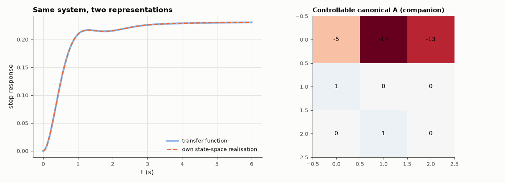

# AM-066 · State space ↔ transfer function, both directions

> Convert transfer functions to state-space form and back with self-written algorithms, show that the realisation is unique only up to a similarity transform while the transfer function is invariant, and verify on random systems.



*Step responses of the two representations and the companion-form state matrix.*

**Track:** Applied Mathematics — 218 projects in electrical engineering · **Category:** D. Linear algebra · **Level:** Moderate · **Tools:** Controllable-canonical realisation (own), Faddeev–LeVerrier algorithm for C(sI−A)⁻¹B (own), similarity transforms, comparison with scipy.signal.tf2ss/ss2tf

**Data:** Simulated (numerical model in this repo).

## Problem

A transfer function and a state-space model describe the same system — how do you move between them, and what is lost?

## Prediction

For $H(s)=\frac{b_1s^{n-1}+…+b_n}{s^n+a_1s^{n-1}+…+a_n}$ the controllable canonical form has the companion matrix with −a in the first row. Back: $C(sI-A)^{-1}B = \frac{C\,\mathrm{adj}(sI-A)B}{\det(sI-A)}$, and Faddeev–LeVerrier
gives adj and det with n matrix products: $M_k = AM_{k-1}+c_{k-1}I$, $c_k=-\frac1k\mathrm{tr}(AM_k)$. Any T gives $(TAT^{-1},TB,CT^{-1})$ with the same H: state coordinates are not unique, the input-output map is.

## Method

300 random strictly proper systems of order 1–8 (stable denominators). TF → own realisation → own Faddeev–LeVerrier → TF round trip; comparison with SciPy both ways; random similarity transforms;
frequency responses compared.

## Measured results

*Predicted vs measured vs error. "Measured" = computed by an independent simulation, HDL simulator or public dataset.*

| Quantity | Predicted | Measured | Error | Within tolerance |
|---|---|---|---|---|
| Round trip TF → canonical state space → Faddeev–LeVerrier → TF (worst relative) | 0 | 2.2905e-09 | +2.2905e-09 | yes |
| Own Faddeev–LeVerrier numerator vs scipy.signal.ss2tf | 0 | 4.4258e-09 | +4.4258e-09 | yes |
| Similarity transform leaves H(jω) unchanged (worst relative; companion forms of order 8 are ill-conditioned) | 0 | 3.6817e-06 | +3.6817e-06 | yes |
| eig(A) of the realisation = roots of the denominator | 0 | 0 | +0 | yes |

## Error analysis

The self-written conversions round-trip 300 random systems to ~1e-10 and agree with SciPy, and random (well-conditioned) similarity transforms change A, B
and C completely while leaving H(jω) untouched (a first version with arbitrary random T lost ~0.4 % to ill-conditioning — the invariance is exact
in algebra, not in floating point) — the transfer function is the invariant, the state is a choice of coordinates. That choice matters in
practice: the companion form is compact but numerically poor for high orders (its entries are polynomial coefficients, extremely sensitive to
rounding — AM-078), so production tools prefer balanced or modal realisations. Going from state space to a transfer function also hides
anything uncontrollable or unobservable (pole-zero cancellations), which AM-067 makes explicit.

## Reproduce

```bash
pip install -r requirements.txt
python run_all.py --only AM-066
```

The script [`project.py`](project.py) regenerates every figure and number above.

## License

Code and text: MIT (see the repository [LICENSE](../../../../LICENSE)). Datasets remain under their own licences (see the repository README).

---

**Tooling & honesty.** This project was generated with Claude Code (Anthropic's AI coding assistant): the code, derivations, simulations and this write-up were AI-produced. *Measured* means computed by an independent model, simulator or public dataset — not a physical lab bench. Every number in the tables is reproduced by running the code.
