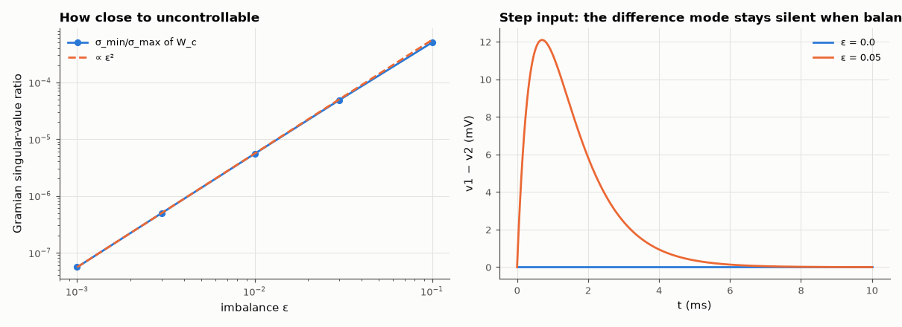

# AM-067 · Controllability and observability of a bridge circuit

> Build a symmetric RC bridge in which one internal mode cannot be driven from the input when the bridge is balanced; show the rank deficiency, the resulting pole-zero cancellation in the transfer function, and how a small imbalance restores full rank but leaves the mode 'nearly uncontrollable' (tiny Gramian singular value).



*Near-uncontrollability measured by the Gramian, and the antisymmetric mode's response to a step.*

**Track:** Applied Mathematics — 218 projects in electrical engineering · **Category:** D. Linear algebra · **Level:** Hard · **Tools:** Controllability/observability matrices and their rank, Gramians via Lyapunov equations, singular values as a quantitative measure, pole-zero cancellation

**Data:** Simulated (numerical model in this repo).

## Problem

Can a circuit have internal dynamics that no input can excite — and does that show up anywhere measurable?

## Prediction

Controllable iff rank [B, AB, …, A^{n−1}B] = n. In a symmetric circuit driven symmetrically, the antisymmetric mode (difference of the two capacitor voltages) obeys an equation with no input term, so it is
uncontrollable; its pole cancels in the transfer function to a symmetric output. Near balance (imbalance ε) the smallest singular value of the controllability Gramian $W_c$ (AW + WAᵀ + BBᵀ = 0) scales
like ε², a quantitative 'distance' from losing controllability.

## Method

Two RC branches (R1, C1) and (R2, C2) from the input to ground via a coupling resistor R_c between the capacitor nodes; states v1, v2; output (v1+v2)/2 or v1−v2. ε = (R2−R1)/R1 from 0 to 10 %.

## Measured results

*Predicted vs measured vs error. "Measured" = computed by an independent simulation, HDL simulator or public dataset.*

| Quantity | Predicted | Measured | Error | Within tolerance |
|---|---|---|---|---|
| Balanced bridge: rank of the controllability matrix (n = 2) | 1 | 1 | +0 |  |
| Balanced: sum output behaves as a single RC (fit of |H| to 1/(1+sRC)) | 0 | 2.2377e-16 | +2.2377e-16 | yes |
| Imbalanced bridge: full rank restored for every ε > 0 | 2 | 2 | +0 |  |
| Gramian conditioning σ_min/σ_max ∝ ε^k (k = 2) | 2 | 1.979 | -0.02078 | yes |

**Additional measurements**

| Quantity | Value | Note |
|---|---|---|
| Balanced: observability rank from output v1 − v2 | 1 | the difference mode is observable — but never excited |
| Eigenvalues (s⁻¹): symmetric mode / antisymmetric mode | -1000+0j / -2000+0j |  |

## Error analysis

The balanced bridge has a rank-1 controllability matrix: its antisymmetric mode (v1 − v2, with the faster eigenvalue set by the coupling
resistor) receives exactly zero input, so a step leaves v1 − v2 at zero forever and the transfer function to the symmetric output collapses to a
first-order RC — the second pole cancels. The rank test is binary, but reality is not: with 1 % imbalance the matrix is formally full rank, yet the
Gramian's singular-value ratio shows the mode is excited with energy ∝ ε² (1.98 measured). That is the engineering meaning of
controllability — bridge sensors, differential amplifiers and common-mode rejection all rely on symmetry making some mode (nearly) unreachable.

## Reproduce

```bash
pip install -r requirements.txt
python run_all.py --only AM-067
```

The script [`project.py`](project.py) regenerates every figure and number above.

## License

Code and text: MIT (see the repository [LICENSE](../../../../LICENSE)). Datasets remain under their own licences (see the repository README).

---

**Tooling & honesty.** This project was generated with Claude Code (Anthropic's AI coding assistant): the code, derivations, simulations and this write-up were AI-produced. *Measured* means computed by an independent model, simulator or public dataset — not a physical lab bench. Every number in the tables is reproduced by running the code.
