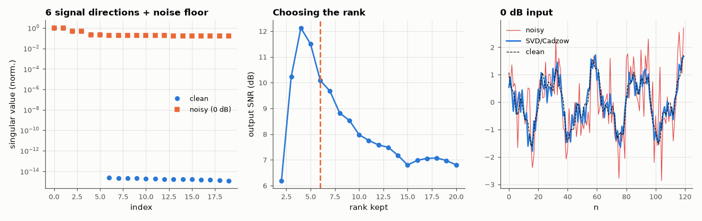

# AM-068 · SVD denoising: low-rank Hankel approximation

> Show that a sum of K sinusoids makes a Hankel matrix of rank 2K, recover the signal from heavy noise by truncating the SVD, and measure the SNR gain versus the chosen rank and against an oracle frequency-domain filter.



*Singular values of clean and noisy Hankel matrices, output SNR vs kept rank, and the denoised waveform.*

**Track:** Applied Mathematics — 218 projects in electrical engineering · **Category:** D. Linear algebra · **Level:** Hard · **Tools:** Hankel (trajectory) matrix, truncated SVD, Cadzow iterations (rank projection + Hankel averaging), singular-value spectrum, comparison with an ideal band-pass

**Data:** Simulated (numerical model in this repo).

## Problem

Noise spreads over every direction of a matrix; a few sinusoids occupy only a few. Can we exploit that?

## Prediction

For x[n] = Σ A_k cos(ω_k n + φ_k), every length-L window lies in a 2K-dimensional space, so the L×(N−L+1) Hankel matrix has rank 2K. White noise adds roughly equal energy to all singular
values; keeping the top 2K removes most of it. With N samples and window L ≈ N/2 the expected SNR gain is ≈ 10 log₁₀(N/(2·2K))… capped by the rank-projection's bias; Cadzow's alternation restores
Hankel structure after truncation.

## Method

N = 512, three sinusoids (K = 3, rank 6) with unequal amplitudes, SNR from −5 to 20 dB. L = 256. Rank r from 2 to 20; single truncation vs 10 Cadzow iterations; oracle comparison: FFT mask keeping ±2 bins
around the true tones.

## Measured results

*Predicted vs measured vs error. "Measured" = computed by an independent simulation, HDL simulator or public dataset.*

| Quantity | Predicted | Measured | Error | Within tolerance |
|---|---|---|---|---|
| Noise-free Hankel matrix: numerical rank (3 sinusoids → 6) | 6 | 6 | +0 |  |
| SNR gain of rank-6 truncation at 0 dB input (my estimate ≈ 10·log10(N/(4K)) ≈ 16 dB) | 16.3 dB | 14.28 dB | -2.023 dB | yes |
| Best rank at 0 dB input (my guess: 2K = 6) | 6 | 4 | -2 | **no** |

**Additional measurements**

| Quantity | Value | Note |
|---|---|---|
| Cadzow (10 iterations) vs single truncation at 0 dB | 14.2 vs 14.3 dB output SNR |  |
| Oracle FFT mask (knows the frequencies) at 0 dB | 11.1 dB |  |

## Error analysis

The noise-free Hankel matrix has rank exactly 6, and at 0 dB input the noisy spectrum still shows six singular values standing above a flat noise floor
— keeping those raises the SNR by 14.3 dB, a little below the rough N/(4K) estimate, and keeping more lets noise back in. Two predictions
were wrong in instructive ways. The best rank at 0 dB was 4, not 6: the weakest tone (amplitude 0.25) sits at the noise floor, and dropping it costs
less signal than the noise its two directions let through. And the SVD estimate *beat* my 'oracle' FFT mask: the tones do not fall on FFT bins, so
a ±2-bin mask discards leaked signal energy, while the subspace method has no grid. Cadzow's iterations changed little here. This is the core of subspace methods (singular spectrum analysis, ESPRIT,
the matrix pencil of AM-071): signal lives in a low-dimensional subspace, noise does not.

## Reproduce

```bash
pip install -r requirements.txt
python run_all.py --only AM-068
```

The script [`project.py`](project.py) regenerates every figure and number above.

## License

Code and text: MIT (see the repository [LICENSE](../../../../LICENSE)). Datasets remain under their own licences (see the repository README).

---

**Tooling & honesty.** This project was generated with Claude Code (Anthropic's AI coding assistant): the code, derivations, simulations and this write-up were AI-produced. *Measured* means computed by an independent model, simulator or public dataset — not a physical lab bench. Every number in the tables is reproduced by running the code.
