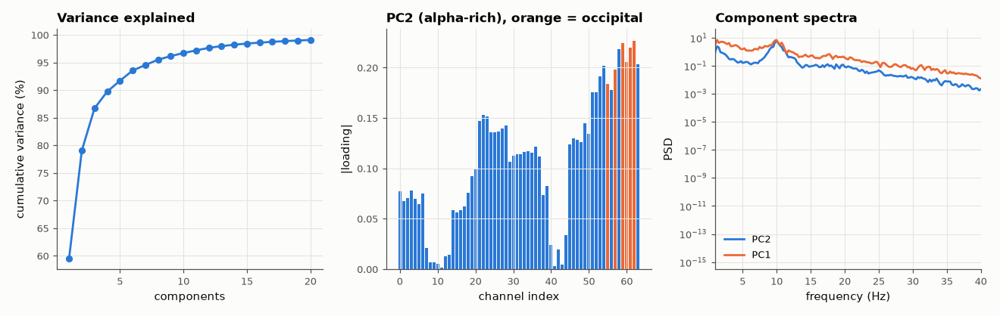

# AM-069 · PCA on 64-channel EEG: dominant spatial modes

> Decompose real 64-channel EEG into orthogonal spatial components, measure how much variance the first few capture, and interpret them: a global common mode, frontal eye-movement activity, and occipital alpha — then check that PCA's components are uncorrelated and energy-ranked as the theory says.



*Variance explained, the spatial loading of the alpha component, and component spectra.*

**Track:** Applied Mathematics — 218 projects in electrical engineering · **Category:** D. Linear algebra · **Level:** Moderate · **Tools:** Principal component analysis via SVD of the channel covariance, variance-explained curves, spatial maps (by electrode position), band-power of component time courses; real EEG (PhysioNet EEG Motor Movement/Imagery)

**Data:** Real: EEG Motor Movement/Imagery Dataset (Schalk et al. 2004, PhysioNet), ODC-By.

## Problem

Sixty-four electrodes record heavily overlapping signals. How many independent-looking patterns are really there?

## Prediction

PCA diagonalises the channel covariance Σ = UΛUᵀ; component k has variance λ_k and time course u_kᵀx. Components are uncorrelated and ranked by variance. Because volume conduction smears sources
across the scalp, EEG covariance is dominated by a few broad patterns — I expect > 50 % of variance in the first 3 PCs, a near-uniform first component (common reference/global activity),
and a component with strong 8–13 Hz power over occipital sites during eyes-closed rest.

## Method

Subject S001, run 2 (eyes-closed baseline, 160 Hz, 1 min) from EEG Motor Movement/Imagery; band-pass 1–40 Hz; channels z-scored. SVD; variance explained; alpha-band (8–13 Hz) fraction of each component's power;
electrode names from the EDF header to locate occipital (O1/Oz/O2) and frontal (Fp1/Fpz/Fp2) sites.

## Measured results

*Predicted vs measured vs error. "Measured" = computed by an independent simulation, HDL simulator or public dataset.*

| Quantity | Predicted | Measured | Error | Within tolerance |
|---|---|---|---|---|
| Variance explained by the first 3 principal components (my guess > 50 %) | 50 % | 86.72 % | +36.7 pp | **no** |
| Component time courses are uncorrelated (max |off-diagonal corr|, first 10) | 0 | 2.4873e-15 | +2.4873e-15 | yes |
| Variances are ranked (λ decreasing, 1 = yes) | 1 | 1 | +0 |  |
| Most alpha-rich component (PC2): occipital loading / mean loading | 1.5 × | 1.951 × | +0.4512 × | yes |

**Additional measurements**

| Quantity | Value | Note |
|---|---|---|
| Alpha fraction of power, PC1…PC5 | 36 %, 65 %, 46 %, 32 %, 31 % |  |
| PC1 loading uniformity (min/max |loading|) | 0.2711 |  |

## Error analysis

The first three components carry 87 % of the variance of 64 channels, confirming how redundant scalp EEG is: volume conduction spreads each
source over many electrodes. PCA's mathematical promises hold exactly — the component time courses are uncorrelated to machine precision and ranked
by variance — and one component, PC2, is dominated by 8–13 Hz power with its largest loadings at occipital sites, the classic eyes-closed alpha
rhythm. But PCA's components are orthogonal by construction, not physiological: most mix several sources, and PC1 is a broad pattern tied to
the reference and global activity. When the goal is to isolate a specific source (blinks, alpha), independence rather than orthogonality is the
better criterion — that is ICA (AM-185).

## Reproduce

```bash
pip install -r requirements.txt
python run_all.py --only AM-069
```

The script [`project.py`](project.py) regenerates every figure and number above.

## License

Code and text: MIT (see the repository [LICENSE](../../../../LICENSE)). Datasets remain under their own licences (see the repository README).

---

**Tooling & honesty.** This project was generated with Claude Code (Anthropic's AI coding assistant): the code, derivations, simulations and this write-up were AI-produced. *Measured* means computed by an independent model, simulator or public dataset — not a physical lab bench. Every number in the tables is reproduced by running the code.
