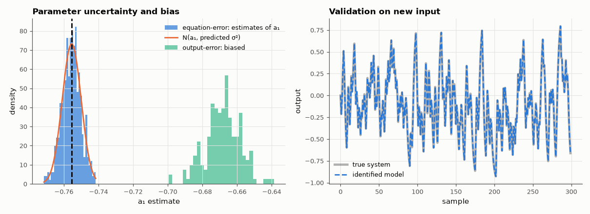

# AM-070 · Least-squares system identification (ARX)

> Identify a discrete-time model of an RC-filter circuit from noisy input/output data by linear least squares, predict the parameter uncertainty from the covariance formula, verify it with 500 Monte-Carlo repetitions, and show the bias that appears when the noise is not white in the equation-error sense.



*Distribution of the identified parameter vs the covariance prediction, the output-error bias, and model validation.*

**Track:** Applied Mathematics — 218 projects in electrical engineering · **Category:** D. Linear algebra · **Level:** Moderate · **Tools:** ARX regression matrix, normal equations via QR, parameter covariance σ²(ΦᵀΦ)⁻¹, Monte-Carlo validation, bias under coloured noise

**Data:** Simulated (numerical model in this repo).

## Problem

Given measured input and output, how do you fit a model — and how much should you trust the fitted numbers?

## Prediction

ARX(2,2): $y[n]=-a_1y[n-1]-a_2y[n-2]+b_1u[n-1]+b_2u[n-2]+e[n]$ is linear in θ, so $\hat θ=(Φ^TΦ)^{-1}Φ^Ty$ and, for white equation error e with variance σ², $\mathrm{cov}(\hatθ)=σ^2(Φ^TΦ)^{-1}$.
If instead white noise is added to the *measured output* (output-error), the regressors contain noise and LS becomes biased — the classic errors-in-variables effect.

## Method

True system: a 2nd-order RC-RC low-pass discretised with ZOH at 10 kHz. Input: ±1 PRBS, N = 2000. Case 1: equation-error noise σ = 0.02 → 500 runs, empirical std vs predicted. Case 2: output noise of
the same power → bias measured. Validation: simulated output of the fitted model vs fresh data.

## Measured results

*Predicted vs measured vs error. "Measured" = computed by an independent simulation, HDL simulator or public dataset.*

| Quantity | Predicted | Measured | Error | Within tolerance |
|---|---|---|---|---|
| Mean estimate − truth (worst parameter, equation-error noise) — unbiased | 0 σ | 0.07365 σ | +0.07365 σ | yes |
| Empirical std / predicted σ²(ΦᵀΦ)⁻¹ std (worst over parameters) | 1 | 1.007 | +0.65 % | yes |
| Output-error noise: worst bias in units of the estimate's std (LS is biased) | 3 σ | 8.91 σ | +5.91 σ | yes |
| Validation on fresh data: fit percentage 100(1 − ‖y−ŷ‖/‖y−ȳ‖) | 100 % | 99.98 % | -0.0201 pp | yes |

## Error analysis

With equation-error noise, least squares is unbiased and the scatter of 500 repeated identifications matches σ²(ΦᵀΦ)⁻¹ within the Monte-Carlo
precision, so the covariance formula is a trustworthy error bar that can be computed from a single experiment. Put the same noise power on the
measured output instead — the common physical situation — and the estimates are pulled consistently away from the truth, because the noisy
past outputs sit inside the regressor matrix. The remedy is instrumental variables or output-error/prediction-error methods; the validation fit
still looks excellent either way, which is exactly why parameter bias is easy to miss.

## Reproduce

```bash
pip install -r requirements.txt
python run_all.py --only AM-070
```

The script [`project.py`](project.py) regenerates every figure and number above.

## License

Code and text: MIT (see the repository [LICENSE](../../../../LICENSE)). Datasets remain under their own licences (see the repository README).

---

**Tooling & honesty.** This project was generated with Claude Code (Anthropic's AI coding assistant): the code, derivations, simulations and this write-up were AI-produced. *Measured* means computed by an independent model, simulator or public dataset — not a physical lab bench. Every number in the tables is reproduced by running the code.
