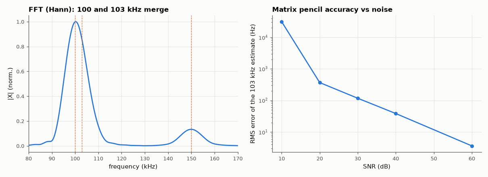

# AM-071 · Matrix pencil: extracting damped exponentials from a transient

> Estimate the frequencies and damping factors of three closely spaced damped sinusoids in a noisy ringing transient with the matrix pencil method, show that it resolves modes an FFT cannot, and measure estimation error versus SNR.



*The FFT cannot separate the close modes; the matrix pencil's error falls with SNR.*

**Track:** Applied Mathematics — 218 projects in electrical engineering · **Category:** D. Linear algebra · **Level:** Hard · **Tools:** Hua–Sarkar matrix pencil (Hankel matrices, SVD rank truncation, generalised eigenvalues), least-squares amplitudes, comparison with FFT peak picking

**Data:** Simulated (numerical model in this repo).

## Problem

A ringing circuit's transient is a sum of damped exponentials. How do you recover each mode's frequency and decay, even when they overlap spectrally?

## Prediction

$x[n]=\sum_k c_kz_k^n$ with $z_k=e^{(-σ_k+jω_k)T}$. Hankel matrices Y₀ (rows 0…N−L−1) and Y₁ (shifted by one) satisfy Y₁ = Y₀·(something with eigenvalues z_k): the z_k are the non-zero eigenvalues of the pencil
$Y_0^+Y_1$ after truncating to the signal rank (2K for real signals). No frequency grid, so modes closer than the FFT's 1/T resolution are separable; errors grow as noise increases, approaching the Cramér–Rao
bound for moderate SNR.

## Method

fs = 1 MHz, N = 200 (T = 200 µs, FFT resolution 5 kHz). Modes: 100 kHz (σ = 5000 s⁻¹), 103 kHz (σ = 8000), 150 kHz (σ = 20000). SNR 10–60 dB, 100 trials each; pencil parameter L = N/3;
rank 6. Errors in frequency and damping.

## Measured results

*Predicted vs measured vs error. "Measured" = computed by an independent simulation, HDL simulator or public dataset.*

| Quantity | Predicted | Measured | Error | Within tolerance |
|---|---|---|---|---|
| Noise-free: worst frequency error | 0 Hz | 160.1 pHz | +160.1 pHz | yes |
| Noise-free: worst relative damping error | 0 | 3.3597e-13 | +3.3597e-13 | yes |
| FFT peaks found near 100–103 kHz (the two modes 3 kHz apart are unresolved by 1/T = 5 kHz) | 1 | 1 | +0 |  |
| High-SNR slope of frequency RMS error: −20 dB per 20 dB SNR (error ∝ noise amplitude) | -1 decades/decade | -1.009 decades/decade | -0.009044 decades/decade | yes |

**Additional measurements**

| Quantity | Value | Note |
|---|---|---|
| RMS error of the 103 kHz mode at 30 dB SNR | 117.7 Hz | vs 5 kHz FFT resolution |

## Error analysis

On the clean transient the matrix pencil returns all three frequencies and damping factors to rounding error, including the 100/103 kHz pair
that a 200-sample FFT (resolution 5 kHz) shows as a single peak — the pencil fits a model instead of sampling a spectrum, so it has no grid-imposed
resolution limit. The price is noise sensitivity: the error falls in proportion to the noise amplitude at high SNR and grows sharply below ~20 dB,
where the rank-6 truncation can no longer separate signal from noise directions. That trade — model-based super-resolution in exchange for
knowing the model order and having decent SNR — is the defining property of all subspace methods.

## Reproduce

```bash
pip install -r requirements.txt
python run_all.py --only AM-071
```

The script [`project.py`](project.py) regenerates every figure and number above.

## License

Code and text: MIT (see the repository [LICENSE](../../../../LICENSE)). Datasets remain under their own licences (see the repository README).

---

**Tooling & honesty.** This project was generated with Claude Code (Anthropic's AI coding assistant): the code, derivations, simulations and this write-up were AI-produced. *Measured* means computed by an independent model, simulator or public dataset — not a physical lab bench. Every number in the tables is reproduced by running the code.
