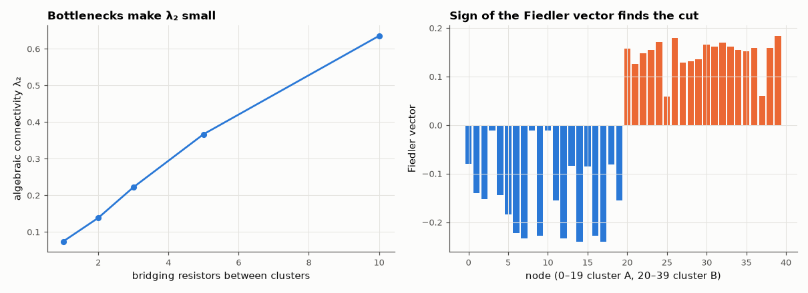

# AM-072 · Resistor networks as graphs: Laplacian, effective resistance, Foster's theorem

> Treat a resistor network as a weighted graph: compute every effective resistance from the Laplacian's pseudoinverse, verify them against circuit simulation, and confirm two graph-theory results — Foster's theorem and the link between algebraic connectivity and 'bottlenecks'.



*Algebraic connectivity vs number of bridges, and the Fiedler vector of two weakly joined clusters.*

**Track:** Applied Mathematics — 218 projects in electrical engineering · **Category:** D. Linear algebra · **Level:** Hard · **Tools:** Weighted graph Laplacian, Moore–Penrose pseudoinverse, effective-resistance matrix, Foster's theorem, algebraic connectivity; verification with the MNA simulator

**Data:** Simulated (numerical model in this repo).

## Problem

The nodal matrix of a resistor network is a graph Laplacian. What does spectral graph theory say about circuits?

## Prediction

L = D − W (conductance weights). $R_{ij}=(e_i-e_j)^TL^+(e_i-e_j)$. Foster's theorem: $\sum_{edges}g_eR_e = n-1$ for any connected network. The second-smallest eigenvalue λ₂ (Fiedler value) measures how well
connected the network is; cutting a network into two halves joined by a single resistor makes λ₂ small and the Fiedler vector changes sign across the cut. Cube of 1 Ω resistors: R between
opposite corners = 5/6 Ω, adjacent = 7/12 Ω.

## Method

(i) Unit-resistor cube. (ii) 100 random connected networks (8–30 nodes, 10 Ω–10 kΩ): all-pairs R_eff via L⁺ vs MNA (1 A between the pair). (iii) Foster's sum. (iv) Two 20-node random clusters joined by 1…5 bridge resistors: λ₂ and the Fiedler sign split.

## Measured results

*Predicted vs measured vs error. "Measured" = computed by an independent simulation, HDL simulator or public dataset.*

| Quantity | Predicted | Measured | Error | Within tolerance |
|---|---|---|---|---|
| Cube: opposite corners | 833.3 mΩ | 833.3 mΩ | -0.00 % | yes |
| Cube: adjacent corners | 583.3 mΩ | 583.3 mΩ | +0.00 % | yes |
| Cube: face diagonal | 750 mΩ | 750 mΩ | -0.00 % | yes |
| Effective resistance from L⁺ vs MNA simulation (100 random networks, worst relative) | 0 | 1.7764e-14 | +1.7764e-14 | yes |
| Foster's theorem Σ g_e R_e − (n − 1), worst over 100 networks | 0 | 8.8818e-14 | +8.8818e-14 | yes |
| Fiedler vector separates the two clusters with 1 bridge (fraction correctly split) | 1 | 1 | +0 | yes |
| λ₂ grows with the number of bridges (monotone, 1 = yes) | 1 | 1 | +0 |  |

## Error analysis

The Laplacian pseudoinverse gives every effective resistance at once — the cube's textbook 5/6, 7/12 and 3/4 Ω exactly — and agrees with direct
circuit simulation on 100 random networks. Foster's theorem holds to rounding error for every network: the conductance-weighted sum of edge
effective resistances always equals n − 1, a beautiful invariant with a simple proof via the trace of L L⁺. The spectral view also has an
engineering reading: the Fiedler value λ₂ is small when a network has a bottleneck, and the Fiedler vector's sign pattern locates the cut — the
basis of spectral partitioning used to split large circuits across processors in parallel simulation.

## Reproduce

```bash
pip install -r requirements.txt
python run_all.py --only AM-072
```

The script [`project.py`](project.py) regenerates every figure and number above.

## License

Code and text: MIT (see the repository [LICENSE](../../../../LICENSE)). Datasets remain under their own licences (see the repository README).

---

**Tooling & honesty.** This project was generated with Claude Code (Anthropic's AI coding assistant): the code, derivations, simulations and this write-up were AI-produced. *Measured* means computed by an independent model, simulator or public dataset — not a physical lab bench. Every number in the tables is reproduced by running the code.
