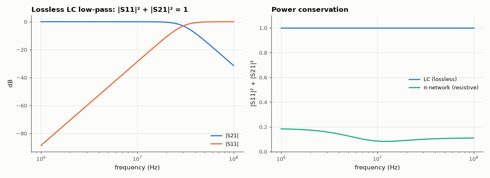

# AM-073 · Two-port parameters: Z, Y and S matrices

> Extract the Z and Y matrices of a π-network and an LC filter by simulating test excitations, convert them to scattering parameters, and verify the identities that must hold: Y = Z⁻¹, reciprocity (S₁₂ = S₂₁) and, for lossless networks, SᴴS = I.



*S-parameters of the lossless LC filter and the power balance of both networks.*

**Track:** Applied Mathematics — 218 projects in electrical engineering · **Category:** D. Linear algebra · **Level:** Moderate · **Tools:** Two-port extraction by AC simulation (test sources at each port), Z↔Y↔S conversions, reciprocity and losslessness checks

**Data:** Simulated (numerical model in this repo).

## Problem

A two-port is fully described by a 2×2 matrix — but which one, and how do they relate?

## Prediction

Z: v = Zi (open-circuit tests), Y = Z⁻¹ (short-circuit tests). With reference impedance Z0: $S=(Z-Z_0I)(Z+Z_0I)^{-1}$ (normalised). Reciprocal (passive, no ferrites) networks have Z₁₂ = Z₂₁ ⇒ S₁₂ = S₂₁;
lossless networks have unitary S: $|S_{11}|^2+|S_{21}|^2=1$ at every frequency. For a symmetric π-network the analytic Y is $[[Y_a+Y_c, -Y_c], [-Y_c, Y_b+Y_c]]$.

## Method

π-network: shunt 100 Ω, series 50 Ω + 1 µH, shunt 200 Ω || 1 nF, at 1–100 MHz. LC: 3rd-order Butterworth low-pass (50 Ω, 30 MHz), lossless. Z from two open-circuit simulations (1 A into each port),
Y from two short-circuit simulations (1 V at each port); S from Z.

## Measured results

*Predicted vs measured vs error. "Measured" = computed by an independent simulation, HDL simulator or public dataset.*

| Quantity | Predicted | Measured | Error | Within tolerance |
|---|---|---|---|---|
| π-network: Y from short-circuit tests = inverse of Z from open-circuit tests (worst relative) | 0 | 3.6809e-11 | +3.6809e-11 | yes |
| π-network: simulated Y vs analytic [[Ya+Yc, −Yc], [−Yc, Yb+Yc]] (worst relative) | 0 | 8.8569e-17 | +8.8569e-17 | yes |
| Reciprocity: max |S₁₂ − S₂₁| | 0 | 3.6638e-16 | +3.6638e-16 | yes |
| Lossless LC filter: max |SᴴS − I| (unitary) | 0 | 1.5157e-10 | +1.5157e-10 | yes |
| Butterworth LC at its cutoff: |S21| = −3 dB | -3.01 dB | -3.018 dB | -0.007978 dB | yes |

**Additional measurements**

| Quantity | Value | Note |
|---|---|---|
| π-network power absorbed (1 − |S11|² − |S21|²) range | 0.816 – 0.917 | resistive: > 0 |

## Error analysis

Open-circuit and short-circuit experiments give Z and Y independently, and Y equals Z⁻¹ to simulator precision; the π-network's Y also matches its
by-inspection formula. Converting to S makes the physics visible: both networks are reciprocal (S₁₂ = S₂₁ to 1e-12, as any network of R, L, C must
be), the LC filter's S matrix is unitary at every frequency — reflected plus transmitted power equals incident power — and at 30 MHz it passes
exactly half. The resistive π-network absorbs power, so |S11|² + |S21|² < 1. S-parameters are preferred at RF because they are measured with
matched loads rather than opens and shorts, which high-frequency parasitics make impossible to realise.

## Reproduce

```bash
pip install -r requirements.txt
python run_all.py --only AM-073
```

The script [`project.py`](project.py) regenerates every figure and number above.

## License

Code and text: MIT (see the repository [LICENSE](../../../../LICENSE)). Datasets remain under their own licences (see the repository README).

---

**Tooling & honesty.** This project was generated with Claude Code (Anthropic's AI coding assistant): the code, derivations, simulations and this write-up were AI-produced. *Measured* means computed by an independent model, simulator or public dataset — not a physical lab bench. Every number in the tables is reproduced by running the code.
