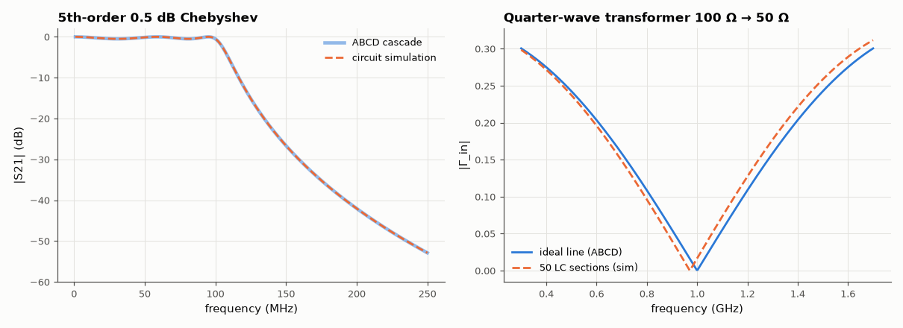

# AM-074 · Chaining filter stages with ABCD matrices

> Model a multi-section LC filter and a transmission-line matching section as products of 2×2 ABCD matrices, compute their insertion loss by one matrix product per frequency, and verify against simulating the whole circuit.



*ABCD cascade vs full simulation for a Chebyshev filter, and a quarter-wave matching section.*

**Track:** Applied Mathematics — 218 projects in electrical engineering · **Category:** D. Linear algebra · **Level:** Moderate · **Tools:** ABCD (transmission) matrices for series/shunt elements and transmission-line sections, cascade by matrix multiplication, comparison with full-circuit AC simulation

**Data:** Simulated (numerical model in this repo).

## Problem

Cascaded two-ports are easy to analyse if each is a matrix. Why does multiplication work, and how accurate is it?

## Prediction

$\begin{bmatrix}V_1\\I_1\end{bmatrix}=\begin{bmatrix}A&B\\C&D\end{bmatrix}\begin{bmatrix}V_2\\I_2\end{bmatrix}$ with output current leaving port 2, so cascades multiply. Series Z: [[1, Z],[0, 1]]; shunt Y: [[1, 0],[Y, 1]]; line of length ℓ:
[[cos βℓ, jZ0 sin βℓ], [j sin βℓ / Z0, cos βℓ]]. With source and load R0: $S_{21}=\frac{2}{A+B/R_0+CR_0+D}$. Reciprocity ⇔ AD − BC = 1. A quarter-wave line transforms R_L into Z0²/R_L.

## Method

5th-order Chebyshev 0.5 dB low-pass (50 Ω, 100 MHz) as 5 ABCD factors; same circuit in the MNA simulator with 50 Ω source/load; quarter-wave 70.7 Ω line matching 100 Ω to 50 Ω (as an LC-ladder line
approximation in the simulator with 50 sections).

## Measured results

*Predicted vs measured vs error. "Measured" = computed by an independent simulation, HDL simulator or public dataset.*

| Quantity | Predicted | Measured | Error | Within tolerance |
|---|---|---|---|---|
| Cascade of ABCD matrices vs full-circuit simulation, max |ΔS21| | 0 | 7.7914e-16 | +7.7914e-16 | yes |
| Reciprocity: det(ABCD) = AD − BC = 1 (worst) | 0 | 1.3198e-11 | +1.3198e-11 | yes |
| Passband ripple of the 0.5 dB Chebyshev | 0.5 dB | 0.5001 dB | +8.1865e-05 dB | yes |
| Quarter-wave transformer (70.7 Ω line): |Γ| at 1 GHz | 0 | 9.7431e-04 | +9.7431e-04 | yes |
| Line built from 50 LC sections: |Γ| vs ideal line (worst over 0.3–1.7 GHz) | 0 | 0.0187 | +0.0187 | yes |

**Additional measurements**

| Quantity | Value | Note |
|---|---|---|
| Quarter-wave match: bandwidth for |Γ| < 0.1 | 36.14 % of f0 |  |

## Error analysis

Multiplying five 2×2 matrices per frequency reproduces the full nodal simulation of the Chebyshev filter to machine precision, with the designed
0.5 dB ripple, and every product has determinant 1 — the algebraic signature of reciprocity. The same formalism handles distributed elements: a
quarter-wave 70.7 Ω line matches 100 Ω to 50 Ω perfectly at 1 GHz with the characteristic narrow bandwidth (Γ < 0.1 over roughly ±20 %), and a
line approximated by 50 LC sections agrees with the ideal line until the sections become electrically long. ABCD matrices are why RF CAD
can optimise ladders and line cascades so quickly: each evaluation is a handful of 2×2 multiplications.

## Reproduce

```bash
pip install -r requirements.txt
python run_all.py --only AM-074
```

The script [`project.py`](project.py) regenerates every figure and number above.

## License

Code and text: MIT (see the repository [LICENSE](../../../../LICENSE)). Datasets remain under their own licences (see the repository README).

---

**Tooling & honesty.** This project was generated with Claude Code (Anthropic's AI coding assistant): the code, derivations, simulations and this write-up were AI-produced. *Measured* means computed by an independent model, simulator or public dataset — not a physical lab bench. Every number in the tables is reproduced by running the code.
