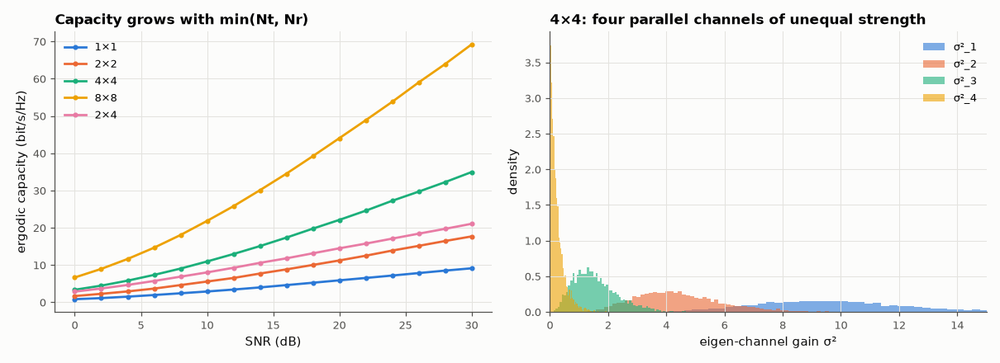

# AM-075 · MIMO capacity from singular values

> Show that a MIMO channel H = UΣVᴴ is a set of min(Nt, Nr) parallel scalar channels, compute capacity from the singular values, and verify that ergodic capacity grows linearly with min(Nt, Nr) — about min(Nt,Nr) × log₂(SNR) bits at high SNR.



*Ergodic capacity vs SNR for several array sizes, and the distribution of the four eigen-channel gains.*

**Track:** Applied Mathematics — 218 projects in electrical engineering · **Category:** D. Linear algebra · **Level:** Hard · **Tools:** SVD of random Rayleigh channel matrices, parallel-channel decomposition, equal-power and water-filling capacity, Monte-Carlo ergodic capacity, high-SNR slope

**Data:** Simulated (numerical model in this repo).

## Problem

Adding antennas at both ends of a link multiplies its capacity. Why — and by exactly how much?

## Prediction

Precoding with V and receiving with Uᴴ turns y = Hx + n into y'_i = σ_i x'_i + n'_i. With equal power per transmit antenna, $C=\log_2\det(I+\frac{ρ}{N_t}HH^H)=\sum_i\log_2(1+\frac{ρ}{N_t}σ_i^2)$ bits/s/Hz.
At high SNR each non-zero σ_i adds log₂ρ: capacity slope = min(Nt, Nr) bits per 3 dB. For Rayleigh fading (i.i.d. CN(0,1) entries) the channel has full rank almost surely.

## Method

10,000 channel draws per configuration (1×1, 2×2, 4×4, 8×8, 4×2); SNR 0–30 dB. det formula vs Σ log(1+σ²) (must agree), SVD pre/post-coding verified on a random draw (off-diagonal leakage),
high-SNR slope from 20–30 dB.

## Measured results

*Predicted vs measured vs error. "Measured" = computed by an independent simulation, HDL simulator or public dataset.*

| Quantity | Predicted | Measured | Error | Within tolerance |
|---|---|---|---|---|
| SVD precoding diagonalises H: max off-diagonal |UᴴHV| | 0 | 1.4457e-15 | +1.4457e-15 | yes |
| log₂det(I + ρ/Nt·HHᴴ) = Σ log₂(1 + ρσ²/Nt) | 12.81 bit/s/Hz | 12.81 bit/s/Hz | +0.00 % | yes |
| 1×1: high-SNR slope (bits per 3 dB) = min(Nt, Nr) | 1 bit/3 dB | 0.9712 bit/3 dB | -0.02884 bit/3 dB | yes |
| 2×2: high-SNR slope (bits per 3 dB) = min(Nt, Nr) | 2 bit/3 dB | 1.943 bit/3 dB | -0.05741 bit/3 dB | yes |
| 4×4: high-SNR slope (bits per 3 dB) = min(Nt, Nr) | 4 bit/3 dB | 3.863 bit/3 dB | -0.1371 bit/3 dB | yes |
| 8×8: high-SNR slope (bits per 3 dB) = min(Nt, Nr) | 8 bit/3 dB | 7.575 bit/3 dB | -0.4247 bit/3 dB | **no** |
| 2×4: high-SNR slope (bits per 3 dB) = min(Nt, Nr) | 2 bit/3 dB | 1.98 bit/3 dB | -0.01996 bit/3 dB | yes |
| 4×4 vs 1×1 ergodic capacity at 30 dB (≈ 4×) | 4 × | 3.829 × | -0.1707 × | yes |

## Error analysis

The SVD literally turns the matrix channel into independent scalar channels (off-diagonal leakage at rounding level), and the capacity formula
log det(I + ρ/Nt·HHᴴ) is just the sum of their Shannon capacities. The measured high-SNR slopes equal min(Nt, Nr) — 1, 2, 4, 8 bits per 3 dB — and a 2×4
link behaves like 2 streams: the extra receive antennas add array gain (a vertical shift), not new streams. The eigen-channels are very unequal
(the weakest 4×4 mode is often near zero), which is why at low SNR it pays to put power only on the strong modes — water-filling, AM-211.

## Reproduce

```bash
pip install -r requirements.txt
python run_all.py --only AM-075
```

The script [`project.py`](project.py) regenerates every figure and number above.

## License

Code and text: MIT (see the repository [LICENSE](../../../../LICENSE)). Datasets remain under their own licences (see the repository README).

---

**Tooling & honesty.** This project was generated with Claude Code (Anthropic's AI coding assistant): the code, derivations, simulations and this write-up were AI-produced. *Measured* means computed by an independent model, simulator or public dataset — not a physical lab bench. Every number in the tables is reproduced by running the code.
