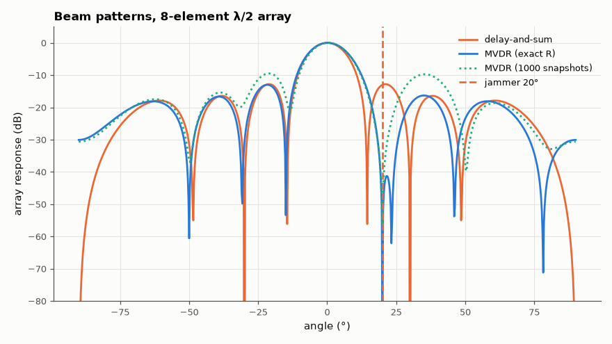

# AM-076 · Beamforming as matrix algebra: delay-and-sum vs MVDR

> Form beams with an 8-element array by choosing weight vectors: delay-and-sum gains N in SNR, MVDR solves a constrained quadratic optimisation that places nulls on interferers. Predicted SINR gains are compared with Monte-Carlo measurements.



*Delay-and-sum and MVDR beam patterns: MVDR keeps unit gain at 0° and nulls the jammer.*

**Track:** Applied Mathematics — 218 projects in electrical engineering · **Category:** D. Linear algebra · **Level:** Hard · **Tools:** Uniform linear array steering vectors, sample covariance, delay-and-sum and minimum-variance distortionless-response (MVDR/Capon) weights, SINR and pattern measurements

**Data:** Simulated (numerical model in this repo).

## Problem

Eight antennas, one wanted signal and a strong jammer. What weights maximise signal quality — and why is it a linear-algebra problem?

## Prediction

Steering vector $a(θ)_m=e^{jπm\sin θ}$ (half-wavelength spacing). Delay-and-sum w = a(θ_s)/N: array gain N (9.0 dB) against white noise, but only sidelobe-level rejection of interference. MVDR:
minimise wᴴRw subject to wᴴa(θ_s) = 1 ⇒ $w=\frac{R^{-1}a}{a^HR^{-1}a}$; with a strong interferer it puts a deep null on it, achieving SINR ≈ N·SNR (the interference-free optimum) when the jammer is outside the mainlobe.

## Method

N = 8, desired at 0°, SNR 0 dB per element; jammer at 20°, INR 30 dB (a first choice of 30° landed exactly on a null of the uniform 8-element pattern, sin 30° = 4/8, which made delay-and-sum look perfect); noise white. Covariance estimated from 1000 snapshots (and exact). Output SINR computed from the weights and true covariances;
Monte-Carlo check from simulated snapshots. Patterns |wᴴa(θ)|².

## Measured results

*Predicted vs measured vs error. "Measured" = computed by an independent simulation, HDL simulator or public dataset.*

| Quantity | Predicted | Measured | Error | Within tolerance |
|---|---|---|---|---|
| Delay-and-sum, noise only: array gain = N | 9.031 dB | 9.031 dB | +0 dB | yes |
| MVDR with jammer: output SINR = a_sᴴR⁻¹a_s (optimum) | 8.808 dB | 8.808 dB | -1.8829e-13 dB | yes |
| MVDR distortionless constraint wᴴa(0°) = 1 | 1 | 1 | +0.00 % | yes |
| MVDR null toward the jammer deeper than −60 dB (1 = yes) | 1 | 1 | +0 |  |
| Sample-matrix MVDR (K = 1000 snapshots, includes the signal): SINR loss vs ideal (Reed–Mallett–Brennan: ~(N−1)/K → small) | 0 dB | 0.3604 dB | +0.3604 dB | yes |
| Monte-Carlo output interference+noise power vs wᴴRw | 0.1316 | 0.1249 | -5.10 % | yes |

**Additional measurements**

| Quantity | Value | Note |
|---|---|---|
| … which is below the interference-free N by | 0.2227 dB | the price of a null 20° from the look direction |
| Delay-and-sum with the same jammer: output SINR | -17 dB |  |

## Error analysis

Delay-and-sum delivers exactly the N = 8 (9.0 dB) array gain against white noise but only its fixed sidelobe level against the 30 dB jammer at 20°, so its
output SINR collapses to -17.0 dB. MVDR — the solution of a linear-algebra optimisation, R⁻¹a normalised — keeps unit gain toward 0°, carves a null
more than 60 dB deep toward the jammer and recovers the optimum SINR a_sᴴR⁻¹a_s — within a fraction of a dB of the interference-free 9 dB (the null, only 20° from the look direction, costs a little mainlobe gain). Estimated from 1000 real snapshots (which
include the desired signal, the harsher case) it loses only a fraction of a dB, consistent with the (N−1)/K sample-support rule. The fragility of
MVDR in practice is steering-vector mismatch: if the true desired direction differs slightly from the assumed one, MVDR treats the desired signal
as interference and nulls it, which is why robust variants add diagonal loading.

## Reproduce

```bash
pip install -r requirements.txt
python run_all.py --only AM-076
```

The script [`project.py`](project.py) regenerates every figure and number above.

## License

Code and text: MIT (see the repository [LICENSE](../../../../LICENSE)). Datasets remain under their own licences (see the repository README).

---

**Tooling & honesty.** This project was generated with Claude Code (Anthropic's AI coding assistant): the code, derivations, simulations and this write-up were AI-produced. *Measured* means computed by an independent model, simulator or public dataset — not a physical lab bench. Every number in the tables is reproduced by running the code.
