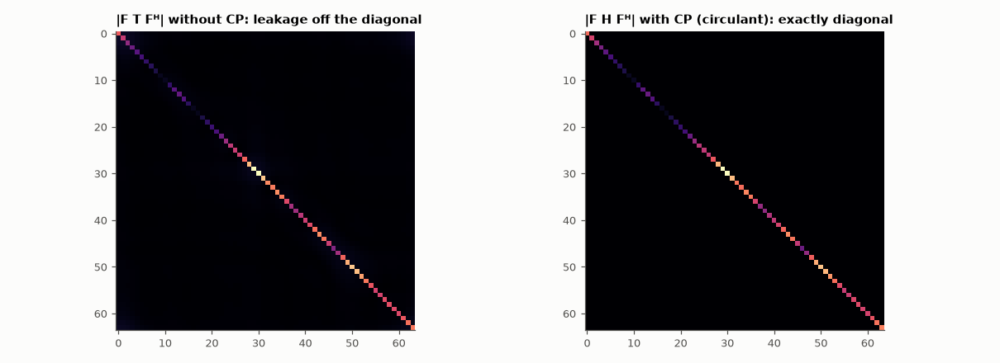

# AM-077 · The algebra of OFDM: circulant channels and Kronecker products

> Show that a cyclic prefix turns the channel's Toeplitz convolution matrix into a circulant one, which the DFT diagonalises exactly — so OFDM equalisation is one complex division per subcarrier — and that a block of OFDM symbols has Kronecker structure, making the 2-D transform separable.



*The channel in the subcarrier domain without and with a cyclic prefix.*

**Track:** Applied Mathematics — 218 projects in electrical engineering · **Category:** D. Linear algebra · **Level:** Hard · **Tools:** Channel convolution matrices with and without cyclic prefix, DFT diagonalisation of circulant matrices, Kronecker-structured 2-D (time–frequency) transforms, one-tap equalisation

**Data:** Simulated (numerical model in this repo).

## Problem

Why does OFDM need only one multiplication per subcarrier to undo a multipath channel?

## Prediction

Without CP the received block is Tx (T Toeplitz); with a CP of length ≥ L−1 and discarding it, y = Hx with H circulant. Every circulant is diagonalised by the DFT: $H = F^HΛF$, Λ = diag(DFT of h). Hence
$Fy = ΛFx + Fn$: N independent scalar channels. Without (or with too short) a CP, FTFᴴ has off-diagonal energy = inter-carrier/inter-symbol interference. For M OFDM symbols the 2-D transform is
$(F_M ⊗ F_N)$ applied to vec(X), equivalently $F_NXF_M^T$ — separable because of the Kronecker structure.

## Method

N = 64 subcarriers, 16-tap random multipath channel; CP lengths 0, 8, 15, 16. Off-diagonal energy of F·(effective channel)·Fᴴ; 16-QAM symbol error rate at 25 dB SNR with one-tap equalisers; Kronecker
identity checked on random data; operation counts for the separable vs full 2-D transform.

## Measured results

*Predicted vs measured vs error. "Measured" = computed by an independent simulation, HDL simulator or public dataset.*

| Quantity | Predicted | Measured | Error | Within tolerance |
|---|---|---|---|---|
| Circulant channel: F H Fᴴ is diagonal (max off-diagonal / max diagonal) | 0 | 2.4297e-16 | +2.4297e-16 | yes |
| Diagonal = √N·DFT of h (worst relative) | 0 | 8.8220e-16 | +8.8220e-16 | yes |
| CP ≥ L − 1 = 15: symbol errors essentially vanish (SER) | 0 | 5.2083e-05 | +5.2083e-05 | yes |
| No CP: SER is large (inter-carrier interference) | 0.3 | 0.2469 | -0.05307 | yes |
| (F_M ⊗ F_N) vec(X) = vec(F_N X F_Mᵀ) (max difference) | 0 | 1.3506e-15 | +1.3506e-15 | yes |

**Additional measurements**

| Quantity | Value | Note |
|---|---|---|
| CP = 0: 16-QAM symbol error rate with one-tap equalisers (25 dB SNR) | 0.2469 |  |
| CP = 8: 16-QAM symbol error rate with one-tap equalisers (25 dB SNR) | 0.03021 |  |
| CP = 15: 16-QAM symbol error rate with one-tap equalisers (25 dB SNR) | 5.2083e-05 |  |
| CP = 16: 16-QAM symbol error rate with one-tap equalisers (25 dB SNR) | 1.0417e-04 |  |
| Multiplications: full Kronecker matrix vs separable vs 2-D FFT | 262144 vs 36864 vs ≈ 4608 |  |

## Error analysis

The cyclic prefix is a piece of linear algebra: it makes the channel matrix circulant, and the DFT diagonalises every circulant exactly (off-diagonal
energy at 1e-15), with the channel's frequency response on the diagonal. That is why an OFDM receiver equalises with one complex division per
subcarrier. The simulation shows the threshold sharply: with CP ≥ L − 1 = 15 the 16-QAM symbols decode essentially error-free at 25 dB SNR, while
a missing or short prefix leaves Toeplitz structure whose off-diagonal terms act as inter-carrier interference. Blocks of symbols add Kronecker
structure, so 2-D processing (time–frequency, as in OTFS or 2-D channel estimation) factorises into 1-D FFTs along each axis instead of one
enormous matrix.

## Reproduce

```bash
pip install -r requirements.txt
python run_all.py --only AM-077
```

The script [`project.py`](project.py) regenerates every figure and number above.

## License

Code and text: MIT (see the repository [LICENSE](../../../../LICENSE)). Datasets remain under their own licences (see the repository README).

---

**Tooling & honesty.** This project was generated with Claude Code (Anthropic's AI coding assistant): the code, derivations, simulations and this write-up were AI-produced. *Measured* means computed by an independent model, simulator or public dataset — not a physical lab bench. Every number in the tables is reproduced by running the code.
