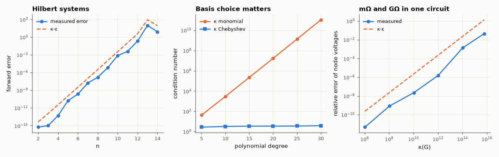

# AM-078 · Condition numbers: when linear algebra lies

> Measure how the relative error of computed solutions tracks κ(A)·ε_mach across ill-conditioned problems: Hilbert systems, high-degree polynomial fits (and how a better basis fixes them), and circuits mixing milliohm and gigaohm resistors.



*Forward error vs κ·ε for Hilbert systems, conditioning of polynomial bases, and a badly scaled resistor network.*

**Track:** Applied Mathematics — 218 projects in electrical engineering · **Category:** D. Linear algebra · **Level:** Moderate · **Tools:** Hilbert and Vandermonde matrices, polynomial fitting in monomial vs Chebyshev bases, nodal matrices with extreme resistor ratios, forward error vs κ·ε_mach

**Data:** Simulated (numerical model in this repo).

## Problem

A backward-stable solver can still return garbage. When — and how do you tell in advance?

## Prediction

Backward stability gives $\frac{\|x̂-x\|}{\|x\|}\lesssim κ(A)\,ε_{mach}$, κ = ‖A‖‖A⁻¹‖. Hilbert matrices have κ ≈ e^{3.5n}; the monomial Vandermonde matrix on [−1, 1] grows exponentially with degree,
while a Chebyshev basis stays well conditioned. A nodal matrix's κ is roughly the ratio of largest to smallest conductance — and the error concentrates in the node voltages set by the weak links.

## Method

Hilbert n = 2…14 with x = ones: forward error vs κε. Least-squares polynomial fits of degree 5–30 to 200 points of e^x sin(5x) on [−1,1], monomial vs Chebyshev basis: coefficient-space conditioning and
fit error. Resistor chains mixing 1 mΩ and R_big up to 10¹² Ω: κ of G and relative error of node voltages vs extended-precision reference.

## Measured results

*Predicted vs measured vs error. "Measured" = computed by an independent simulation, HDL simulator or public dataset.*

| Quantity | Predicted | Measured | Error | Within tolerance |
|---|---|---|---|---|
| Hilbert systems: forward error ≤ κ·ε (fraction of sizes obeying the bound ×10) | 1 | 1 | +0 |  |
| Hilbert n = 12: log₁₀ error ≈ log₁₀(κ·ε) (difference in decades) | 0 decades | -1.239 decades | -1.239 decades | yes |
| κ(Hilbert) growth rate: log κ per unit n (≈ 3.5) | 3.5 | 3.387 | -0.1128 | yes |
| Chebyshev basis stays well conditioned at degree 30 (κ < 10) | 1 | 1 | +0 |  |
| Degree 30: coefficient sensitivity to a 1e-10 data perturbation, monomial ÷ Chebyshev (log₁₀; κ ratio predicts ≈ 10) | 10.45 decades | 9.081 decades | -1.368 decades | yes |
| Resistor chain: error grows with κ (log-log slope of error vs κ, error ∝ κ·ε → ≈ 1) | 1 | 1.134 | +0.1342 | yes |

**Additional measurements**

| Quantity | Value | Note |
|---|---|---|
| Monomial basis κ at degree 30 | 1.0767e+11 |  |
| Max fit error at degree 30: monomial / Chebyshev | 8.3e-14 / 7.1e-15 |  |

## Error analysis

Across all three families the rule of thumb holds: the digits you lose are log₁₀ κ. A 12×12 Hilbert system has κ ≈ 10¹⁶ and its 'solution' has no correct
digits, even though the solver is backward stable. Polynomial fitting shows a subtler point: in the monomial basis (κ ≈ 10¹¹ at degree 30) the *fitted curve* is still accurate, because
SVD-based least squares is backward stable for the residual — it is the *coefficients* that are meaningless: a 10⁻¹⁰ wiggle in the data moves
them by orders of magnitude more than the same wiggle moves Chebyshev coefficients. Use the monomial coefficients for anything (derivatives,
extrapolation, a lookup in firmware) and the ill-conditioning bites; the Chebyshev basis (κ < 10) avoids the issue entirely. In circuits, mixing
milliohm and gigaohm elements drives κ(G) toward 1/ε and node voltages lose accuracy in proportion; SPICE's GMIN and scaling heuristics exist
precisely to keep this in check. Always estimate κ before trusting digits.

## Reproduce

```bash
pip install -r requirements.txt
python run_all.py --only AM-078
```

The script [`project.py`](project.py) regenerates every figure and number above.

## License

Code and text: MIT (see the repository [LICENSE](../../../../LICENSE)). Datasets remain under their own licences (see the repository README).

---

**Tooling & honesty.** This project was generated with Claude Code (Anthropic's AI coding assistant): the code, derivations, simulations and this write-up were AI-produced. *Measured* means computed by an independent model, simulator or public dataset — not a physical lab bench. Every number in the tables is reproduced by running the code.
