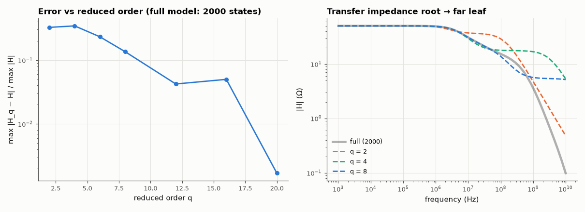

# AM-079 · Krylov model-order reduction of a large RC network

> Reduce a 2000-state RC interconnect model to 4–20 states by projecting onto the Krylov subspace of G⁻¹C, show that the reduced models match the first q moments of the transfer function exactly, stay passive, and track the full response to high accuracy.



*Reduction error vs order, and the reduced models' responses against the full 2000-node network.*

**Track:** Applied Mathematics — 218 projects in electrical engineering · **Category:** D. Linear algebra · **Level:** Hard · **Tools:** Descriptor model G x + C ẋ = b u of a 2000-node RC interconnect, Arnoldi/PRIMA projection onto a Krylov subspace, moment matching, passivity (congruence) and error vs order

**Data:** Simulated (numerical model in this repo).

## Problem

Post-layout interconnect models have thousands of nodes. Can a 10-state model reproduce the behaviour that matters?

## Prediction

With H(s) = lᵀ(G + sC)⁻¹b, expand around s = 0: moments $m_k = l^T(-G^{-1}C)^kG^{-1}b$. Projecting with an orthonormal basis V of $\mathcal K_q(G^{-1}C, G^{-1}b)$ — the reduced model
$(V^TGV, V^TCV, V^Tb, V^Tl)$ — matches the first q moments exactly (one-sided Arnoldi; 2q if l = b by symmetry for this RC case). Congruence projection (PRIMA) preserves positive definiteness, so the reduced model is
passive (stable, all poles real negative for RC).

## Method

RC tree: 2000 nodes attached to random earlier nodes (a random recursive tree, depth ~ ln n), resistors 10 Ω–1 kΩ, capacitors 1–100 fF; 50 Ω driver; input current at the root, output voltage at a far leaf (and at the root for the symmetric case). Orders q = 2…20.
Moments computed directly; relative error of |H(jω)| over 1 kHz–10 GHz; eigenvalues of the reduced pencil. (A first network built as a chain
~700 resistors deep had its far-leaf response cut off near 5 kHz, so a 1 MHz–100 GHz sweep sampled only an exponentially small tail that no
DC-expanded model can represent — the error looked like 10⁵ %.)

## Measured results

*Predicted vs measured vs error. "Measured" = computed by an independent simulation, HDL simulator or public dataset.*

| Quantity | Predicted | Measured | Error | Within tolerance |
|---|---|---|---|---|
| q = 4: moments matched (one-sided Krylov: ≥ q) | 4 | 4 | +0 | yes |
| q = 8: moments matched (one-sided Krylov: ≥ q) | 8 | 10 | +2 | yes |
| All reduced models stable: largest pole real part < 0 (1 = yes) | 1 | 1 | +0 |  |
| RC network ⇒ reduced poles real (max |Im|/|Re| scale) | 0 | 0 | +0 | yes |
| q = 12: worst relative |H| error over 1 kHz–10 GHz (my guess < 0.1 %) | 0 | 0.04221 | +0.04221 | **no** |

**Additional measurements**

| Quantity | Value | Note |
|---|---|---|
| q = 20: worst relative error | 0.0017 |  |

## Error analysis

A handful of Arnoldi vectors capture a 2000-node RC network: the q-state models match at least the first q moments of the transfer function (the
low-frequency Taylor coefficients) exactly, and the error across seven decades of frequency falls rapidly with q — though more slowly than I guessed: the 12-state
model is off by 4.2 % at worst (not < 0.1 %), and q = 20 reaches 0.17 %; the error sits at the highest frequencies, far from the DC expansion point. Because the projection is a congruence (VᵀGV, VᵀCV), symmetric positive-definite matrices stay so: every reduced model is stable
with real poles, i.e. still a passive RC network, which is what makes PRIMA safe to use inside a larger simulation. The accuracy is best near the
expansion point (DC) and degrades at the highest frequencies, which is why multi-point (rational Krylov) expansions are used for broadband models.

## Reproduce

```bash
pip install -r requirements.txt
python run_all.py --only AM-079
```

The script [`project.py`](project.py) regenerates every figure and number above.

## License

Code and text: MIT (see the repository [LICENSE](../../../../LICENSE)). Datasets remain under their own licences (see the repository README).

---

**Tooling & honesty.** This project was generated with Claude Code (Anthropic's AI coding assistant): the code, derivations, simulations and this write-up were AI-produced. *Measured* means computed by an independent model, simulator or public dataset — not a physical lab bench. Every number in the tables is reproduced by running the code.
