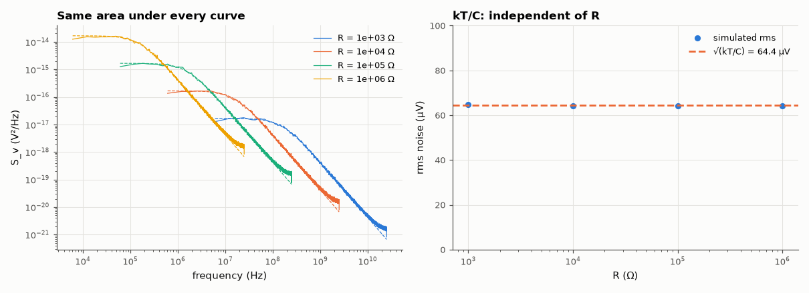

# AM-080 · Johnson noise and kT/C, verified by stochastic simulation

> Simulate the thermal noise of a resistor loaded by a capacitor, confirm the Nyquist noise density 4kTR and the Lorentzian spectrum, and verify the striking result that the total noise voltage √(kT/C) does not depend on R at all.



*Noise spectra for four resistances (dashed: 4kTR Lorentzians) and the R-independent total rms.*

**Track:** Applied Mathematics — 218 projects in electrical engineering · **Category:** E. Probability & stochastic processes · **Level:** Moderate · **Tools:** Stochastic differential equation of an RC circuit driven by the resistor's thermal-noise current (Euler–Maruyama, exact discretisation), Welch PSD, ensemble statistics

**Data:** Simulated (numerical model in this repo).

## Problem

A bigger resistor is noisier (4kTR) — so why is the RMS noise on a sampling capacitor independent of the resistor?

## Prediction

Norton model: noise current with one-sided PSD $S_i=4kT/R$ in parallel with R. Across R‖C: $S_v(f)=\frac{4kTR}{1+(2πfRC)^2}$; integrating over all f gives $\overline{v^2}=kT/C$ — R cancels (larger R: more noise
density, less bandwidth). Equipartition says the same: ½C⟨v²⟩ = ½kT. For C = 1 pF at 300 K: 64.4 µV rms, the kT/C limit of switched-capacitor circuits and ADC samplers.

## Method

T = 300 K; R = 1 kΩ, 10 kΩ, 100 kΩ, 1 MΩ with C = 1 pF. Exact discretisation of dv = −v/(RC)dt + noise (Ornstein–Uhlenbeck), step τ/50, 2²⁰ samples. RMS vs √(kT/C); Welch PSD vs 4kTR/(1+(ωRC)²).

## Measured results

*Predicted vs measured vs error. "Measured" = computed by an independent simulation, HDL simulator or public dataset.*

| Quantity | Predicted | Measured | Error | Within tolerance |
|---|---|---|---|---|
| R = 1e+03 Ω, C = 1 pF: rms noise = √(kT/C) | 64.36 µV | 64.66 µV | +0.47 % | yes |
| R = 1e+04 Ω, C = 1 pF: rms noise = √(kT/C) | 64.36 µV | 64.05 µV | -0.48 % | yes |
| R = 1e+05 Ω, C = 1 pF: rms noise = √(kT/C) | 64.36 µV | 64.14 µV | -0.34 % | yes |
| R = 1e+06 Ω, C = 1 pF: rms noise = √(kT/C) | 64.36 µV | 64.24 µV | -0.18 % | yes |
| Low-frequency PSD / 4kTR (R = 100 kΩ) | 1 | 0.9667 | -3.33 % | yes |

**Additional measurements**

| Quantity | Value | Note |
|---|---|---|
| 4kTR noise density of 1 kΩ at 300 K | 4.07 nV/√Hz |  |

## Error analysis

The simulated noise has exactly the Nyquist density 4kTR at low frequency and the Lorentzian roll-off set by RC, and the rms voltage is 64 µV for
every resistance from 1 kΩ to 1 MΩ: the higher density of a larger resistor is exactly compensated by its lower bandwidth, leaving ⟨v²⟩ = kT/C, the
thermal-equilibrium energy of the capacitor. This is why sampling capacitors in ADCs and switched-capacitor filters are sized from the required
SNR alone (C ≥ kT/v²_noise), and why no choice of switch resistance can beat the kT/C limit — only cooling or a bigger capacitor can.

## Reproduce

```bash
pip install -r requirements.txt
python run_all.py --only AM-080
```

The script [`project.py`](project.py) regenerates every figure and number above.

## License

Code and text: MIT (see the repository [LICENSE](../../../../LICENSE)). Datasets remain under their own licences (see the repository README).

---

**Tooling & honesty.** This project was generated with Claude Code (Anthropic's AI coding assistant): the code, derivations, simulations and this write-up were AI-produced. *Measured* means computed by an independent model, simulator or public dataset — not a physical lab bench. Every number in the tables is reproduced by running the code.
