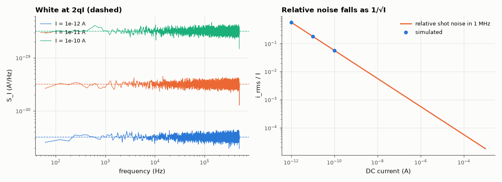

# AM-081 · Shot noise: Poisson electrons and the 2qI spectrum

> Generate a current as individual electrons arriving at random (a Poisson process), verify the counting statistics (variance = mean), and show that the resulting current noise is white with density 2qI — Schottky's formula.



*Current noise spectra of simulated Poisson electron streams and the relative noise vs current.*

**Track:** Applied Mathematics — 218 projects in electrical engineering · **Category:** E. Probability & stochastic processes · **Level:** Moderate · **Tools:** Poisson point-process simulation of electron arrivals, counting statistics (Fano factor), current PSD via Welch, Schottky formula

**Data:** Simulated (numerical model in this repo).

## Problem

A DC current through a diode is made of discrete charges. How much noise does that granularity produce?

## Prediction

Arrivals at rate λ = I/q in time T: count N ~ Poisson(λT), var N = E N (Fano factor 1). The current is a train of impulses q·δ(t − t_k); its one-sided PSD is $S_I = 2qI$ (plus the DC spike) up to frequencies
~1/(transit time). In bandwidth B: $i_{rms}=\sqrt{2qIB}$ — for 1 mA in 1 MHz, 17.9 nA. Relative noise falls as 1/√I, which is why photodetector SNR improves with signal level.

## Method

Currents 1 pA–1 nA simulated as Poisson arrival times in 1 s (1 pA ≈ 6.2 million electrons/s); binned at 1 MHz; count statistics in 1 ms windows; Welch PSD of the binned current compared with 2qI.

## Measured results

*Predicted vs measured vs error. "Measured" = computed by an independent simulation, HDL simulator or public dataset.*

| Quantity | Predicted | Measured | Error | Within tolerance |
|---|---|---|---|---|
| I = 1e-12 A: PSD / 2qI (white, flat band) | 1 | 0.9972 | -0.28 % | yes |
| I = 1e-12 A: Fano factor var(N)/E(N) in 1 ms windows (±√(2/1000) ≈ 4.5 % sampling error) | 1 | 0.9307 | -6.93 % | yes |
| I = 1e-11 A: PSD / 2qI (white, flat band) | 1 | 0.9976 | -0.24 % | yes |
| I = 1e-11 A: Fano factor var(N)/E(N) in 1 ms windows (±√(2/1000) ≈ 4.5 % sampling error) | 1 | 0.9709 | -2.91 % | yes |
| I = 1e-10 A: PSD / 2qI (white, flat band) | 1 | 1.002 | +0.16 % | yes |
| I = 1e-10 A: Fano factor var(N)/E(N) in 1 ms windows (±√(2/1000) ≈ 4.5 % sampling error) | 1 | 1.013 | +1.30 % | yes |

**Additional measurements**

| Quantity | Value | Note |
|---|---|---|
| Shot noise of 1 mA in 1 MHz | 17.9 nA rms |  |

## Error analysis

The simulated electron streams reproduce both faces of shot noise: counts in a window have variance equal to their mean (Fano factor 1, the Poisson
signature), and the current's spectrum is flat at 2qI across the band — Schottky's formula follows directly from charge being discrete and
arrivals independent. The relative noise falls as 1/√I, so small currents are intrinsically noisy: a 1 pA photocurrent carries ~6 million
electrons per second but still fluctuates by 0.6 % in a 1 kHz bandwidth. Real devices can deviate: space-charge in vacuum tubes and correlated
transport in some junctions suppress it (Fano < 1), while avalanche multiplication enhances it (excess noise factor).

## Reproduce

```bash
pip install -r requirements.txt
python run_all.py --only AM-081
```

The script [`project.py`](project.py) regenerates every figure and number above.

## License

Code and text: MIT (see the repository [LICENSE](../../../../LICENSE)). Datasets remain under their own licences (see the repository README).

---

**Tooling & honesty.** This project was generated with Claude Code (Anthropic's AI coding assistant): the code, derivations, simulations and this write-up were AI-produced. *Measured* means computed by an independent model, simulator or public dataset — not a physical lab bench. Every number in the tables is reproduced by running the code.
