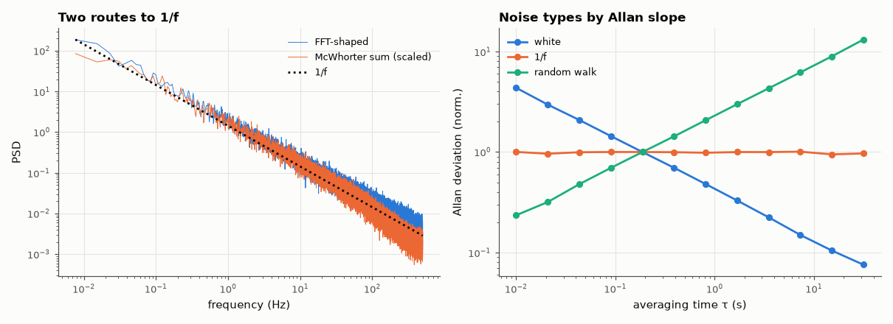

# AM-082 · 1/f flicker noise: synthesis, spectrum and Allan deviation

> Generate 1/f noise two ways, confirm the −10 dB/decade spectrum and its extent, show that the McWhorter superposition of simple trapping processes produces it, and measure the Allan deviation's characteristic flat floor (white noise: slope −½).



*Spectra of two 1/f synthesis methods and Allan-deviation signatures of three noise types.*

**Track:** Applied Mathematics — 218 projects in electrical engineering · **Category:** E. Probability & stochastic processes · **Level:** Hard · **Tools:** Two synthesis methods — FFT spectral shaping and a sum of Lorentzians (McWhorter model, log-uniform time constants) — spectral-slope fits, overlapping Allan deviation

**Data:** Simulated (numerical model in this repo).

## Problem

Flicker noise dominates every amplifier at low frequency, yet no single physical time constant has a 1/f spectrum. Where does it come from?

## Prediction

A single trap gives a Lorentzian $\frac{τ}{1+(ωτ)^2}$. With time constants distributed uniformly in log τ between τ₁ and τ₂ the sum is ∝ 1/f for $1/(2πτ_2) ≪ f ≪ 1/(2πτ_1)$ (McWhorter). For 1/f noise the
Allan deviation σ_A(τ) is constant (flicker floor), for white noise it falls as τ^{−1/2}, for random walk it rises as τ^{+1/2} — the standard way oscillator and sensor noise is classified.

## Method

N = 2²⁰ samples at 1 kHz. (i) FFT method: white Gaussian noise shaped by 1/√f. (ii) 60 Ornstein–Uhlenbeck processes with τ log-uniform over 1 ms…100 s. Spectral slope by log-log fit over 0.1–100 Hz;
Allan deviation for τ = 0.01…100 s, plus white and random-walk references.

## Measured results

*Predicted vs measured vs error. "Measured" = computed by an independent simulation, HDL simulator or public dataset.*

| Quantity | Predicted | Measured | Error | Within tolerance |
|---|---|---|---|---|
| FFT-shaped noise: PSD slope (1/f → −1) | -1 | -0.9991 | +8.8670e-04 | yes |
| Sum of 60 Lorentzians (τ log-uniform 1 ms–100 s): slope over 0.1–10 Hz | -1 | -0.9945 | +0.005491 | yes |
| Allan deviation slope: white noise (−½) | -0.5 | -0.5112 | -0.01118 | yes |
| Allan deviation slope: 1/f noise (0, flicker floor) | 0 | 0.001096 | +0.001096 | yes |
| Allan deviation slope: random walk (+½) | 0.5 | 0.499 | -0.001012 | yes |

**Additional measurements**

| Quantity | Value | Note |
|---|---|---|
| McWhorter spectrum slope above 1/(2πτ_min) = 160 Hz (Lorentzian tail → −2) | -1.144 |  |

## Error analysis

Both constructions give a −10 dB/decade spectrum: spectral shaping by construction, and the McWhorter superposition because Lorentzians with
log-uniformly distributed time constants each contribute equal power per decade — no individual process is 1/f, their ensemble is. Outside the
range of time constants the sum reverts to the Lorentzian shapes (flat below, 1/f² above), which is why real 1/f noise always has corner
frequencies. The Allan deviation cleanly separates the noise types: slope −½ for white, a flat floor for flicker (averaging longer stops helping),
+½ for random walk — the reason averaging a sensor beyond its flicker corner is pointless and why chopper and auto-zero amplifiers exist.

## Reproduce

```bash
pip install -r requirements.txt
python run_all.py --only AM-082
```

The script [`project.py`](project.py) regenerates every figure and number above.

## License

Code and text: MIT (see the repository [LICENSE](../../../../LICENSE)). Datasets remain under their own licences (see the repository README).

---

**Tooling & honesty.** This project was generated with Claude Code (Anthropic's AI coding assistant): the code, derivations, simulations and this write-up were AI-produced. *Measured* means computed by an independent model, simulator or public dataset — not a physical lab bench. Every number in the tables is reproduced by running the code.
