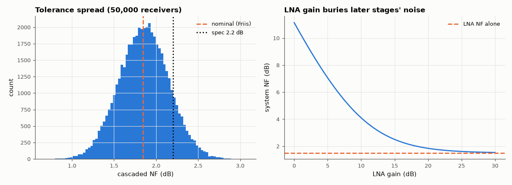

# AM-083 · Receiver noise figure: Friis formula and Monte-Carlo spread

> Predict a receiver's cascaded noise figure with the Friis formula, confirm it by passing sampled noise and signal through a simulated chain, and use Monte-Carlo over gain and noise-figure tolerances to find the spread and the probability of meeting a specification.



*Monte-Carlo spread of the cascaded noise figure, and system NF vs LNA gain.*

**Track:** Applied Mathematics — 218 projects in electrical engineering · **Category:** E. Probability & stochastic processes · **Level:** Moderate · **Tools:** Friis cascade formula, sample-level noise simulation of a three-stage receiver (LNA, mixer, IF amplifier), Monte-Carlo over component tolerances

**Data:** Simulated (numerical model in this repo).

## Problem

Why does the first amplifier dominate a receiver's noise — and how much margin do tolerances eat?

## Prediction

$F = F_1 + \frac{F_2-1}{G_1} + \frac{F_3-1}{G_1G_2}$ (linear ratios). With an LNA (G = 20 dB, NF = 1.5 dB), a lossy mixer (G = −7 dB, NF = 7 dB) and an IF amp (G = 30 dB, NF = 4 dB): F = 1.41 + 4.01/100 + 1.51/(100·0.2) = 1.525 → NF = 1.83 dB.
Swapping the LNA behind the mixer would give NF ≈ 8.5 dB. Tolerances (±1 dB gain, ±0.3 dB NF, Gaussian 1σ) spread the cascaded NF; the first stage's NF dominates the spread.

## Method

Sample-level: input noise at kT0B (normalised to 1), a sine of known SNR; each stage adds its own input-referred noise (F_i − 1)·kT0B then multiplies by √G_i; output SNR measured by projecting on the
sine → NF = SNR_in/SNR_out. 50,000 Monte-Carlo chains with Gaussian tolerances; yield for NF < 2.2 dB.

## Measured results

*Predicted vs measured vs error. "Measured" = computed by an independent simulation, HDL simulator or public dataset.*

| Quantity | Predicted | Measured | Error | Within tolerance |
|---|---|---|---|---|
| Friis cascade NF | 1.83 dB | 1.842 dB | +0.01246 dB | yes |
| Sample-level simulation: NF = SNR_in / SNR_out | 1.842 dB | 1.832 dB | -0.01075 dB | yes |
| Monte-Carlo std ≈ LNA NF tolerance (first stage dominates; 0.3 dB × ∂NF/∂NF₁) | 0.2773 dB | 0.295 dB | +0.01778 dB | yes |

**Additional measurements**

| Quantity | Value | Note |
|---|---|---|
| Same stages with the LNA moved after the mixer | 8.546 dB |  |
| Monte-Carlo NF: mean ± std | 1.86 ± 0.30 dB |  |
| Yield for NF < 2.2 dB | 87.93 % |  |

## Error analysis

The Friis formula and a brute-force simulation — adding each stage's input-referred noise to real samples and measuring SNR degradation — agree on
1.84 dB. The formula's message is in the denominators: behind 20 dB of LNA gain the lossy mixer's 7 dB noise figure contributes almost nothing,
whereas putting the mixer first would ruin the receiver (≈ 8.5 dB). The same structure shows in the Monte-Carlo: the spread of the cascaded NF is
essentially the LNA's own NF tolerance, and later-stage tolerances barely matter, so specifying (and paying for) a tight first stage is what
buys yield. The right-hand plot shows the design rule: LNA gain beyond ~20 dB buys little and costs linearity.

## Reproduce

```bash
pip install -r requirements.txt
python run_all.py --only AM-083
```

The script [`project.py`](project.py) regenerates every figure and number above.

## License

Code and text: MIT (see the repository [LICENSE](../../../../LICENSE)). Datasets remain under their own licences (see the repository README).

---

**Tooling & honesty.** This project was generated with Claude Code (Anthropic's AI coding assistant): the code, derivations, simulations and this write-up were AI-produced. *Measured* means computed by an independent model, simulator or public dataset — not a physical lab bench. Every number in the tables is reproduced by running the code.
