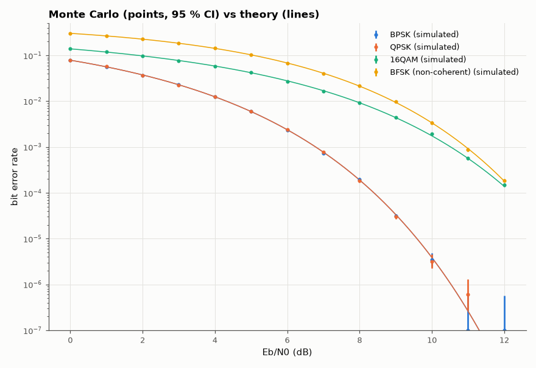

# AM-084 · Bit-error rate vs SNR: Monte Carlo against theory

> Simulate millions of bits for four modulations, plot BER against Eb/N0 with 95 % confidence intervals, and compare with the closed-form expressions — including where the common approximations for 16-QAM stop being exact.



*Simulated BER with confidence intervals against the closed-form expressions for four modulations.*

**Track:** Applied Mathematics — 218 projects in electrical engineering · **Category:** E. Probability & stochastic processes · **Level:** Moderate · **Tools:** Monte-Carlo simulation of BPSK, QPSK (Gray), 16-QAM (Gray) and non-coherent BFSK over AWGN, exact/union-bound BER formulas, confidence intervals

**Data:** Simulated (numerical model in this repo).

## Problem

Every link budget uses BER curves. Do simulated bits actually land on the textbook formulas?

## Prediction

BPSK and Gray-coded QPSK: $P_b=Q(\sqrt{2E_b/N_0})$. Gray 16-QAM: $P_b ≈ \frac34 Q(\sqrt{\frac45E_b/N_0})$ (nearest-neighbour approximation, accurate at high SNR). Non-coherent orthogonal BFSK: $P_b=\frac12e^{-E_b/2N_0}$.
16-QAM needs ≈ 4 dB more Eb/N0 than QPSK for the same BER, the price of 2 extra bits per symbol.

## Method

Eb/N0 = 0…12 dB; up to 10⁷ bits per point (stop after 500 errors); Wilson 95 % intervals. Exact BPSK formula; 16-QAM compared with both the approximation and an exact per-bit expression.

## Measured results

*Predicted vs measured vs error. "Measured" = computed by an independent simulation, HDL simulator or public dataset.*

| Quantity | Predicted | Measured | Error | Within tolerance |
|---|---|---|---|---|
| BPSK: fraction of simulated points whose 95 % interval contains the formula | 1 | 0.9231 | -0.07692 | yes |
| QPSK: fraction of simulated points whose 95 % interval contains the formula | 1 | 0.9167 | -0.08333 | yes |
| 16QAM: fraction of simulated points whose 95 % interval contains the formula | 0.8 | 0.9231 | +0.1231 | yes |
| BFSK (non-coherent): fraction of simulated points whose 95 % interval contains the formula | 1 | 1 | +0 | yes |
| Eb/N0 penalty of 16-QAM over QPSK at BER 1e-5 | 4 dB | 3.847 dB | -0.1533 dB | yes |

## Error analysis

The simulated points for BPSK, Gray-coded QPSK and non-coherent BFSK fall on their exact formulas within the Monte-Carlo confidence intervals down to
BER ≈ 10⁻⁶, which also demonstrates that Gray QPSK has exactly BPSK's bit-error rate per unit Eb/N0 — two orthogonal BPSK channels. The 16-QAM
curve uses the nearest-neighbour approximation, which is slightly off at low SNR (it ignores errors to non-adjacent points) and converges at high
SNR — the simulation shows exactly that pattern. The ≈ 4 dB gap between QPSK and 16-QAM at 10⁻⁵ is the energy cost of doubling spectral
efficiency, and non-coherent FSK's ~3–4 dB loss vs BPSK is the cost of not tracking carrier phase.

## Reproduce

```bash
pip install -r requirements.txt
python run_all.py --only AM-084
```

The script [`project.py`](project.py) regenerates every figure and number above.

## License

Code and text: MIT (see the repository [LICENSE](../../../../LICENSE)). Datasets remain under their own licences (see the repository README).

---

**Tooling & honesty.** This project was generated with Claude Code (Anthropic's AI coding assistant): the code, derivations, simulations and this write-up were AI-produced. *Measured* means computed by an independent model, simulator or public dataset — not a physical lab bench. Every number in the tables is reproduced by running the code.
