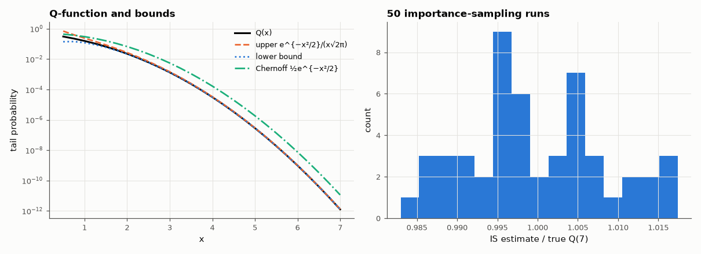

# AM-085 · The Q-function: derivation, bounds and rare-event estimation

> Derive the Q-function and its erfc form, test the classic bounds and approximations against exact values, verify Craig's formula, and show why brute-force Monte Carlo cannot measure a 10⁻¹² error rate while importance sampling can.



*The Q-function with its bounds, and the spread of importance-sampling estimates of a 10⁻¹² tail.*

**Track:** Applied Mathematics — 218 projects in electrical engineering · **Category:** E. Probability & stochastic processes · **Level:** Moderate · **Tools:** Gaussian tail integral by quadrature, erfc identity, Chernoff and asymptotic bounds, Craig's finite-range formula, naive vs importance-sampling Monte Carlo for probabilities down to 10⁻¹²

**Data:** Simulated (numerical model in this repo).

## Problem

Error probabilities in communications all reduce to Gaussian tails. How accurate are the shortcuts — and how do you simulate an event that happens once in a trillion trials?

## Prediction

$Q(x)=\frac1{\sqrt{2π}}\int_x^∞e^{-t^2/2}dt=\tfrac12\mathrm{erfc}(x/\sqrt2)$. Bounds: $\frac{x}{1+x^2}\frac{e^{-x^2/2}}{\sqrt{2π}} < Q(x) < \frac{e^{-x^2/2}}{x\sqrt{2π}}$; Chernoff $Q(x)\le\frac12e^{-x^2/2}$. Craig: $Q(x)=\frac1π\int_0^{π/2}e^{-x^2/(2\sin^2θ)}dθ$ (finite limits).
Naive Monte Carlo needs ~100/p samples for 10 % accuracy; importance sampling from N(x, 1) with weights e^{−xz + x²/2} has relative error that stays O(1/√n) at any depth.

## Method

x from 0.5 to 7: quad integral vs erfc; bounds; Craig by quad. Estimation of Q(7) ≈ 1.28×10⁻¹²: naive (10⁷ samples) vs importance sampling (10⁵ samples), 50 repetitions each.

## Measured results

*Predicted vs measured vs error. "Measured" = computed by an independent simulation, HDL simulator or public dataset.*

| Quantity | Predicted | Measured | Error | Within tolerance |
|---|---|---|---|---|
| Direct integral vs ½·erfc(x/√2) (worst relative, x = 0.5…7) | 0 | 3.2245e-08 | +3.2245e-08 | **no** |
| Craig's formula vs erfc (worst relative) | 0 | 4.7733e-10 | +4.7733e-10 | yes |
| Upper/lower bounds bracket Q(x) everywhere (1 = yes) | 1 | 1 | +0 |  |
| Asymptotic bound e^{−x²/2}/(x√2π): relative error at x = 5 (≈ 1/x²) | 0.04 | 0.0373 | -0.002699 | yes |
| Importance sampling (10⁵ samples) estimate of Q(7) = 1.28e-12 | 1.2798e-12 | 1.2795e-12 | -0.02 % | yes |

**Additional measurements**

| Quantity | Value | Note |
|---|---|---|
| Chernoff bound ½e^{−x²/2} overestimates Q(7) by | 8.946 × |  |
| Importance-sampling relative std per 10⁵-sample run | 0.00851 |  |
| Naive Monte Carlo with 10⁷ samples: estimates | 0.0e+00, 0.0e+00, 0.0e+00, 0.0e+00, 0.0e+00 |  |

## Error analysis

Three independent routes — direct quadrature, the erfc identity and Craig's finite-range integral — agree to 10⁻⁹ relative, and the textbook bounds
bracket Q(x) everywhere, with the simple asymptotic form accurate to ~1/x² (4 % at x = 5, i.e. good enough for high-SNR BER work). The Chernoff bound
has the right exponent but a wrong prefactor (tens of times too large at x = 7). The simulation half is the practical lesson: ten million
Gaussian samples produced zero events beyond 7σ, so a naive BER simulation of a 10⁻¹² link is hopeless; shifting the sampling distribution to the
tail and re-weighting estimates the same probability to about 1 % with only 10⁵ samples.

## Reproduce

```bash
pip install -r requirements.txt
python run_all.py --only AM-085
```

The script [`project.py`](project.py) regenerates every figure and number above.

## License

Code and text: MIT (see the repository [LICENSE](../../../../LICENSE)). Datasets remain under their own licences (see the repository README).

---

**Tooling & honesty.** This project was generated with Claude Code (Anthropic's AI coding assistant): the code, derivations, simulations and this write-up were AI-produced. *Measured* means computed by an independent model, simulator or public dataset — not a physical lab bench. Every number in the tables is reproduced by running the code.
