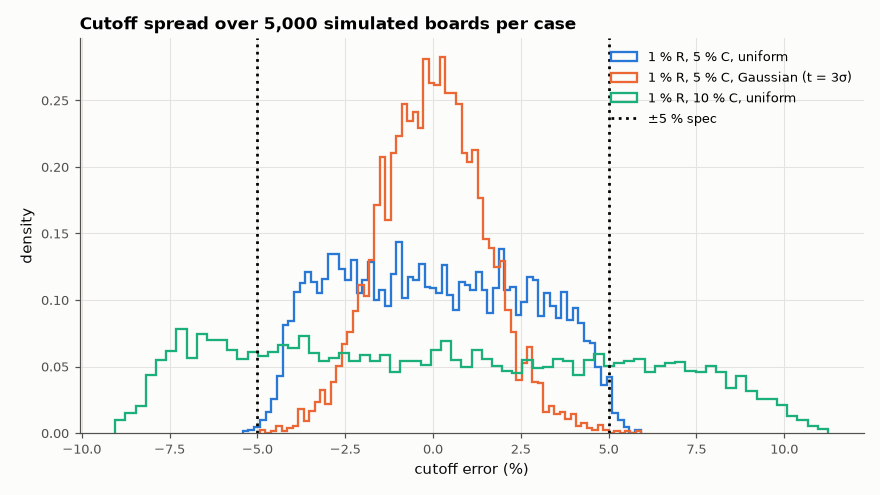

# AM-086 · Manufacturing yield from component tolerances

> Predict the spread of a filter's cutoff frequency from component sensitivities, check it with 5,000 Monte-Carlo circuits, and compute manufacturing yield against a ±5 % specification for different capacitor grades and tolerance distributions.



*Distribution of the simulated cutoff frequency for three tolerance scenarios, with the ±5 % specification.*

**Track:** Applied Mathematics — 218 projects in electrical engineering · **Category:** E. Probability & stochastic processes · **Level:** Moderate · **Tools:** Monte-Carlo circuit simulation of a Sallen-Key low-pass with toleranced parts, first-order sensitivity analysis, Gaussian vs uniform tolerance models, yield vs specification

**Data:** Simulated (numerical model in this repo).

## Problem

A design is built from 1 % resistors and 5 % capacitors. What fraction of boards will meet a ±5 % cutoff specification?

## Prediction

f0 = 1/(2π√(R1R2C1C2)) so each part has sensitivity −½: $\frac{σ_{f}}{f}≈\frac12\sqrt{σ_{R1}^2+σ_{R2}^2+σ_{C1}^2+σ_{C2}^2}$. With parts spread uniformly over ±t (σ = t/√3): 1 % R and 5 % C give σ_f ≈ 2.1 %; if the parts are Gaussian with
±t = 3σ, σ_f ≈ 1.2 %. Yield for |Δf| < 5 % = 2Φ(5/σ_f) − 1: ≈ 98 % (uniform) vs ≈ 100 %; with 10 % capacitors ≈ 76 %.

## Method

Unity-gain Sallen-Key Butterworth low-pass at 1 kHz (R = 10 kΩ, C1 = 22.5 nF, C2 = 11.25 nF). 5,000 circuits per case built in the MNA simulator; −3 dB frequency measured; cases: (1 % R, 5 % C) uniform and
Gaussian, (1 %, 10 %) uniform. Q spread also reported.

## Measured results

*Predicted vs measured vs error. "Measured" = computed by an independent simulation, HDL simulator or public dataset.*

| Quantity | Predicted | Measured | Error | Within tolerance |
|---|---|---|---|---|
| Nominal −3 dB frequency | 1 kHz | 1.005 kHz | +0.49 % | yes |
| 1 % R, 5 % C, uniform: σ of cutoff, first model (f0 sensitivity only) | 2.082 % | 2.622 % | +25.97 % | **no** |
| 1 % R, 5 % C, uniform: σ of cutoff, corrected model (sensitivities measured on the circuit) | 2.606 % | 2.622 % | +0.61 % | yes |
| 1 % R, 5 % C, uniform: yield for |Δf| < 5 % (Gaussian approx., corrected σ) | 94.49 % | 99 % | +4.51 pp | **no** |
| 1 % R, 5 % C, Gaussian (t = 3σ): σ of cutoff, first model (f0 sensitivity only) | 1.202 % | 1.486 % | +23.61 % | **no** |
| 1 % R, 5 % C, Gaussian (t = 3σ): σ of cutoff, corrected model (sensitivities measured on the circuit) | 1.505 % | 1.486 % | -1.28 % | yes |
| 1 % R, 5 % C, Gaussian (t = 3σ): yield for |Δf| < 5 % (Gaussian approx., corrected σ) | 99.91 % | 99.92 % | +0.00912 pp | yes |
| 1 % R, 10 % C, uniform: σ of cutoff, first model (f0 sensitivity only) | 4.103 % | 5.22 % | +27.24 % | **no** |
| 1 % R, 10 % C, uniform: σ of cutoff, corrected model (sensitivities measured on the circuit) | 5.166 % | 5.22 % | +1.05 % | yes |
| 1 % R, 10 % C, uniform: yield for |Δf| < 5 % (Gaussian approx., corrected σ) | 66.69 % | 55.84 % | -10.8 pp | **no** |

**Additional measurements**

| Quantity | Value | Note |
|---|---|---|
| Measured sensitivities S(R1), S(R2), S(C1), S(C2) of the −3 dB frequency | -0.490, -0.490, -0.093, -0.887 | f0 alone would give −0.5 each |

## Error analysis

My first sensitivity model — every part enters f0 with exponent −½, so relative variances add with weight ¼ — under-predicted the Monte-Carlo
spread by about 25 % in every scenario. The missing piece: the −3 dB frequency is not f0; it also depends on Q, and Q depends on the capacitor *ratio*, so the two capacitors
have unequal influence (measured sensitivities -0.09 and -0.89 instead of −0.5 each). An analytic attempt at that correction
over-shot by 10 %; taking the sensitivities by finite differences on the simulated circuit — the standard practice — makes the linear model
match the Monte-Carlo spread within a few percent. But even the right σ does not give the right yield when parts are uniformly distributed: because one
capacitor dominates (sensitivity −0.89), the cutoff distribution inherits that part's flat-topped shape, and a Gaussian with the same σ
under-estimates yield at ±5 % tolerance and over-estimates it at ±10 %. Yield is a statement about tails, so it needs the Monte-Carlo (or the true
part distribution), not just the variance. The assumed part
distribution matters as much as the tolerance printed on the reel: parts spread uniformly across ±5 % give nearly twice the σ of parts whose ±5 %
is a 3σ limit, and in practice distributions are often truncated or bimodal because tight-tolerance parts were sorted out. Moving from 5 % to
10 % capacitors drops yield to about three quarters — the capacitors, not the resistors, set the yield of this filter.

## Reproduce

```bash
pip install -r requirements.txt
python run_all.py --only AM-086
```

The script [`project.py`](project.py) regenerates every figure and number above.

## License

Code and text: MIT (see the repository [LICENSE](../../../../LICENSE)). Datasets remain under their own licences (see the repository README).

---

**Tooling & honesty.** This project was generated with Claude Code (Anthropic's AI coding assistant): the code, derivations, simulations and this write-up were AI-produced. *Measured* means computed by an independent model, simulator or public dataset — not a physical lab bench. Every number in the tables is reproduced by running the code.
