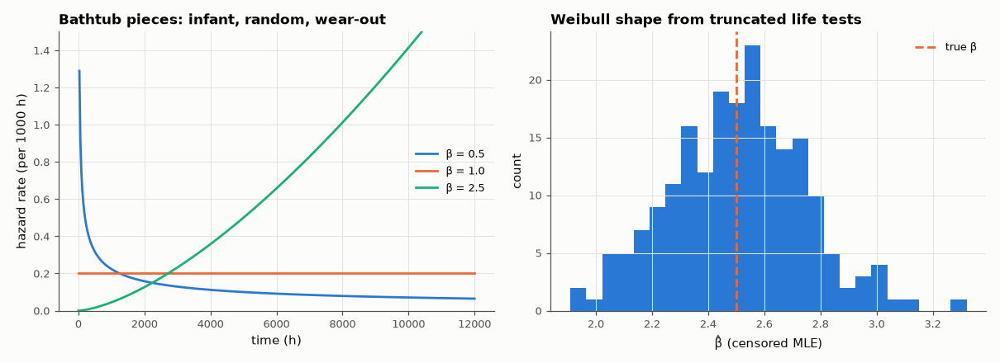

# AM-087 · Reliability: exponential and Weibull failure models, MTBF

> Model component lifetimes, derive the MTBF of series and redundant systems, fit Weibull parameters to test data by maximum likelihood (including censored units), and check every formula by simulating thousands of systems.



*Weibull hazard shapes and the sampling distribution of the censored-data shape estimate.*

**Track:** Applied Mathematics — 218 projects in electrical engineering · **Category:** E. Probability & stochastic processes · **Level:** Moderate · **Tools:** Constant-hazard and Weibull lifetime models, series/parallel system reliability, maximum-likelihood Weibull fitting of simulated failure data, Monte-Carlo MTBF

**Data:** Simulated (numerical model in this repo).

## Problem

A board has 50 parts, each with a million-hour MTBF. How long will the board last — and does redundancy help as much as it seems?

## Prediction

Exponential: R(t) = e^{−λt}, MTBF = 1/λ. Series of n parts: λ_sys = Σλ ⇒ 50 parts at 10⁶ h → 20,000 h. Two identical units in active parallel: MTBF = 3/(2λ) (only 1.5×, not 2×). Weibull: $R(t)=e^{-(t/η)^β}$,
mean ηΓ(1+1/β); β < 1 infant mortality, β = 1 random, β > 1 wear-out. With right-censored data, the MLE maximises Σ_failures log f + Σ_censored log R.

## Method

Monte Carlo: 100,000 simulated systems per configuration. Weibull test: 200 units with β = 2.5, η = 5000 h, test stopped at 4000 h (censoring ~44 % of units); MLE by optimising the censored
log-likelihood; 200 repeated experiments for parameter spread.

## Measured results

*Predicted vs measured vs error. "Measured" = computed by an independent simulation, HDL simulator or public dataset.*

| Quantity | Predicted | Measured | Error | Within tolerance |
|---|---|---|---|---|
| Series of 50 parts (λ = 1e-6/h each): system MTBF = 1/(50λ) | 2e+04 h | 1.999e+04 h | -0.05 % | yes |
| Two units in active parallel: MTBF = 3/(2λ) | 1.5000e+06 h | 1.4974e+06 h | -0.18 % | yes |
| Reliability of the parallel pair at t = 0.1/λ: 1 − (1 − e^{−0.1})² | 0.9909 | 0.991 | +0.01 % | yes |
| Weibull mean life ηΓ(1 + 1/β) | 4436 h | 4440 h | +0.09 % | yes |
| Censored MLE: mean β̂ over 200 test campaigns | 2.5 | 2.51 | +0.40 % | yes |
| Censored MLE: mean η̂ | 5000 h | 5047 h | +0.94 % | yes |

**Additional measurements**

| Quantity | Value | Note |
|---|---|---|
| Spread of β̂ (std) with 200 units, ~44 % censored | 0.2396 |  |

## Error analysis

The simulations confirm the arithmetic that surprises newcomers: fifty parts each rated for a million hours make a board that lasts only 20,000 hours
on average, because failure rates add in series. Redundancy helps less than intuition says — two units in parallel give 1.5×, not 2×, the MTBF,
since once one fails the survivor is on its own — although early-life reliability improves dramatically (R(0.1/λ) from 0.905 to 0.991). The Weibull
fit shows that useful life-test conclusions do not need every unit to fail: maximum likelihood with right-censoring recovers β and η essentially
without bias from a test stopped at 4000 h, which is how wear-out (β > 1) is diagnosed in practice.

## Reproduce

```bash
pip install -r requirements.txt
python run_all.py --only AM-087
```

The script [`project.py`](project.py) regenerates every figure and number above.

## License

Code and text: MIT (see the repository [LICENSE](../../../../LICENSE)). Datasets remain under their own licences (see the repository README).

---

**Tooling & honesty.** This project was generated with Claude Code (Anthropic's AI coding assistant): the code, derivations, simulations and this write-up were AI-produced. *Measured* means computed by an independent model, simulator or public dataset — not a physical lab bench. Every number in the tables is reproduced by running the code.
