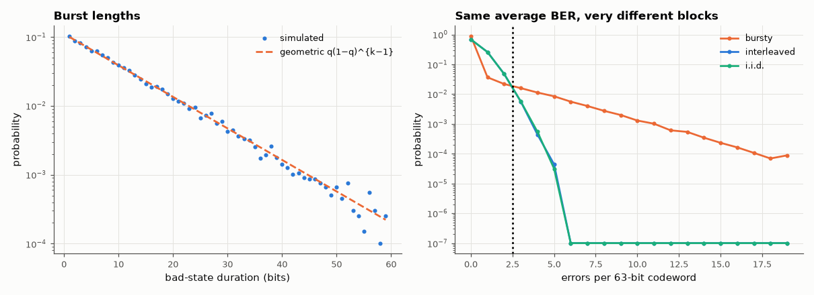

# AM-088 · Bursty errors: a two-state Markov (Gilbert–Elliott) channel

> Model a channel that alternates between good and bad states, predict its average error rate and burst-length distribution from the transition probabilities, and show that a block code that fixes 2 errors fails far more often on bursty errors — until interleaving spreads them out.



*Burst-length distribution of the two-state channel and the number of errors per codeword with and without interleaving.*

**Track:** Applied Mathematics — 218 projects in electrical engineering · **Category:** E. Probability & stochastic processes · **Level:** Hard · **Tools:** Two-state Markov chain simulation, stationary distribution, burst-length statistics, block-error rates with and without interleaving, comparison with an i.i.d. channel of equal average BER

**Data:** Simulated (numerical model in this repo).

## Problem

Fading and interference produce errors in clumps. Why does the average bit-error rate say so little about how a code will perform?

## Prediction

States G/B with P(G→B) = p, P(B→G) = q: stationary π_B = p/(p+q); average BER = π_G e_G + π_B e_B. Sojourn in B is geometric with mean 1/q. For a t-error-correcting block code of length n, block failure = P(>t errors);
on an i.i.d. channel this is a binomial tail, on the bursty channel much larger for the same average BER. Interleaving to depth D ≫ 1/q makes errors within a codeword nearly independent.

## Method

p = 0.002, q = 0.1, e_G = 10⁻⁴, e_B = 0.3 (average BER ≈ 0.6 %). 10⁷ simulated bits. Codewords of n = 63 correcting t = 2 errors (BCH-like); block failure rates: bursty, bursty + interleaving (depth 64), i.i.d. with the same BER.

## Measured results

*Predicted vs measured vs error. "Measured" = computed by an independent simulation, HDL simulator or public dataset.*

| Quantity | Predicted | Measured | Error | Within tolerance |
|---|---|---|---|---|
| Fraction of time in the bad state = p/(p+q) | 0.01961 | 0.01945 | -0.81 % | yes |
| Average BER = π_G e_G + π_B e_B | 0.00598 | 0.005929 | -0.86 % | yes |
| Mean bad-state sojourn = 1/q (geometric) | 10 bits | 9.892 bits | -1.08 % | yes |
| i.i.d. channel: block failure P(>2 errors in 63) vs binomial | 0.006349 | 0.006262 | -1.37 % | yes |
| Interleaving restores near-i.i.d. block performance (ratio interleaved / i.i.d.) | 1 | 0.9749 | -2.51 % | yes |

**Additional measurements**

| Quantity | Value | Note |
|---|---|---|
| Block failure: bursty / bursty+interleaved (D = 64) / i.i.d. | 0.055 / 0.0061 / 0.0063 |  |

## Error analysis

The chain's statistics follow from its two transition probabilities: 1.9 % of the time in the bad state, bursts of geometric length with mean 10
bits, and an average BER of ~0.6 %. That average hides everything that matters for coding: on the bursty channel a 2-error-correcting 63-bit code
fails on 5.5 % of blocks because errors arrive in clumps, while an i.i.d. channel with the same BER breaks only 0.63 %. Interleaving
64 codewords spreads each burst across many codewords and restores almost exactly the i.i.d. behaviour — at the cost of latency, which is the
trade-off every digital broadcast and storage system makes.

## Reproduce

```bash
pip install -r requirements.txt
python run_all.py --only AM-088
```

The script [`project.py`](project.py) regenerates every figure and number above.

## License

Code and text: MIT (see the repository [LICENSE](../../../../LICENSE)). Datasets remain under their own licences (see the repository README).

---

**Tooling & honesty.** This project was generated with Claude Code (Anthropic's AI coding assistant): the code, derivations, simulations and this write-up were AI-produced. *Measured* means computed by an independent model, simulator or public dataset — not a physical lab bench. Every number in the tables is reproduced by running the code.
