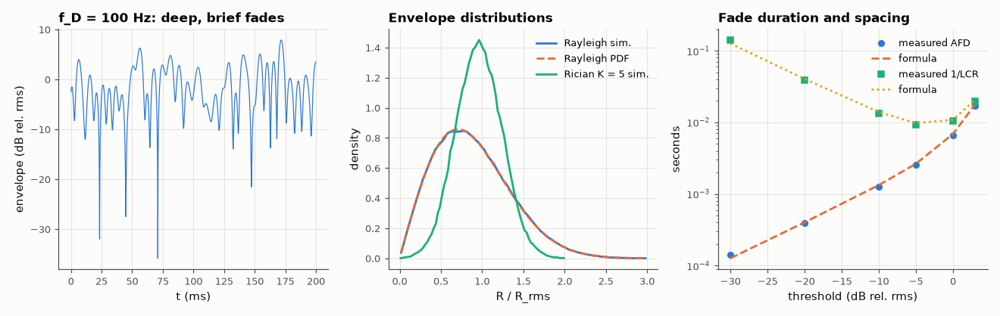

# AM-089 · Rayleigh and Rician fading: distributions, level crossings, fade durations

> Simulate a mobile radio channel as the sum of many scattered paths with Doppler shifts, confirm that the envelope is Rayleigh (Rice with a line-of-sight path), and verify the classical formulas for how often and how long the signal fades.



*A Rayleigh fading envelope, the envelope PDFs, and fade durations/spacings vs threshold.*

**Track:** Applied Mathematics — 218 projects in electrical engineering · **Category:** E. Probability & stochastic processes · **Level:** Hard · **Tools:** Sum-of-sinusoids (Jakes/Clarke) fading simulator, envelope histograms vs Rayleigh and Rice PDFs, Doppler spectrum, level-crossing rate and average fade duration vs closed forms

**Data:** Simulated (numerical model in this repo).

## Problem

A phone moving at 50 km/h sees its signal drop by 20 dB many times per second. How often, for how long — and why those distributions?

## Prediction

Many independent paths ⇒ complex Gaussian (CLT) ⇒ envelope Rayleigh $f(r)=\frac{r}{σ^2}e^{-r^2/2σ^2}$; with a LOS component of power ratio K: Rice $f(r)=\frac{r}{σ^2}e^{-(r^2+s^2)/2σ^2}I_0(rs/σ^2)$. For isotropic
scattering (Clarke), with ρ = R/R_rms: level-crossing rate $N_R=\sqrt{2π}f_Dρe^{-ρ^2}$ and average fade duration $\bar t=\frac{e^{ρ^2}-1}{ρf_D\sqrt{2π}}$. At ρ = −20 dB the channel fades ~0.25 f_D times per second, each fade lasting ~4 % of 1/f_D.

## Method

Sum of 64 sinusoids with random angles of arrival and phases; f_D = 100 Hz; 200 s at 10 kHz. Envelope histogram vs PDFs (Rayleigh; Rician K = 5); LCR and AFD at levels −30…+5 dB rel. rms vs formulas.

## Measured results

*Predicted vs measured vs error. "Measured" = computed by an independent simulation, HDL simulator or public dataset.*

| Quantity | Predicted | Measured | Error | Within tolerance |
|---|---|---|---|---|
| Envelope PDF vs Rayleigh (max |difference|) | 0 | 0.01593 | +0.01593 | yes |
| Rayleigh: fraction of time more than 20 dB below rms = 1 − e^{−0.01} | 0.00995 | 0.01002 | +0.74 % | yes |
| Level -20 dB: level-crossing rate | 24.82 1/s | 25.73 1/s | +3.68 % | yes |
| Level -20 dB: average fade duration | 400.9 µs | 389.6 µs | -2.83 % | yes |
| Level 0 dB: level-crossing rate | 92.21 1/s | 96.36 1/s | +4.49 % | yes |
| Level 0 dB: average fade duration | 6.855 ms | 6.54 ms | -4.60 % | yes |
| Rician (K = 5) envelope PDF vs Rice distribution (max |difference| / peak) | 0 | 0.02662 | +0.02662 | yes |

## Error analysis

Summing 64 Doppler-shifted paths produces an envelope that is Rayleigh to within histogram noise — the central limit theorem at work — and adding a
line-of-sight component turns it into the predicted Rice distribution. The Clarke-model formulas for level-crossing rate and average fade duration
match the simulation: at 100 Hz Doppler (≈ 50 km/h at 2 GHz) the signal drops 20 dB below its rms about 25 times per second, but each fade lasts only
~0.4 ms. That combination — frequent but short fades — is why fast interleaving plus coding works so well in mobile links, and why the fraction of
time in a deep fade (1 % at −20 dB) is the number link designers budget for.

## Reproduce

```bash
pip install -r requirements.txt
python run_all.py --only AM-089
```

The script [`project.py`](project.py) regenerates every figure and number above.

## License

Code and text: MIT (see the repository [LICENSE](../../../../LICENSE)). Datasets remain under their own licences (see the repository README).

---

**Tooling & honesty.** This project was generated with Claude Code (Anthropic's AI coding assistant): the code, derivations, simulations and this write-up were AI-produced. *Measured* means computed by an independent model, simulator or public dataset — not a physical lab bench. Every number in the tables is reproduced by running the code.
