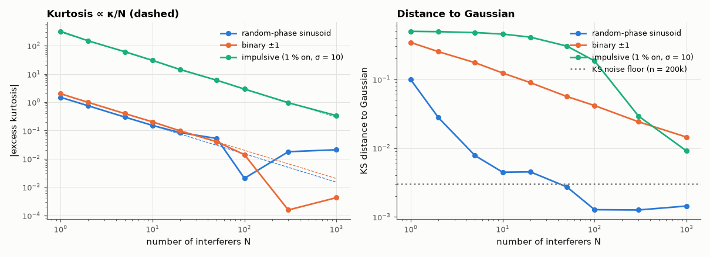

# AM-090 · The central limit theorem in noise: why interference becomes Gaussian

> Add up N independent non-Gaussian interference sources and measure how quickly the sum becomes Gaussian — excess kurtosis falls as 1/N and the maximum CDF error as 1/√N — and show why impulsive noise converges much more slowly.



*Excess kurtosis and KS distance to the Gaussian for sums of three kinds of interferers.*

**Track:** Applied Mathematics — 218 projects in electrical engineering · **Category:** E. Probability & stochastic processes · **Level:** Easy · **Tools:** Sums of N non-Gaussian interferers (uniform-phase sinusoids, impulsive Bernoulli–Gaussian, binary), excess kurtosis vs N, Kolmogorov–Smirnov distance and the Berry–Esseen rate

**Data:** Simulated (numerical model in this repo).

## Problem

Receivers are designed for Gaussian noise even though no individual interferer is Gaussian. When is that justified?

## Prediction

For i.i.d. terms with excess kurtosis κ, the normalised sum has excess kurtosis κ/N. Berry–Esseen: $\sup|F_N-Φ| \le C\frac{ρ}{σ^3\sqrt N}$ (C < 0.48, ρ = E|X|³). A random-phase sinusoid (arcsine law) has κ = −1.5;
impulsive noise (Gaussian present with probability 0.01, variance 100) has κ ≈ 3/0.01 − 3 ≈ 297, so it needs ~100× more terms to look Gaussian.

## Method

N = 1…1000 terms, 200,000 samples per N. Excess kurtosis vs κ/N; KS distance to N(0,1) vs N; Berry–Esseen bound computed for each distribution.

## Measured results

*Predicted vs measured vs error. "Measured" = computed by an independent simulation, HDL simulator or public dataset.*

| Quantity | Predicted | Measured | Error | Within tolerance |
|---|---|---|---|---|
| random-phase sinusoid: excess kurtosis at N = 20 (= κ/N) | -0.075 | -0.08405 | -0.009052 | yes |
| binary ±1: excess kurtosis at N = 20 (= κ/N) | -0.1 | -0.09689 | +0.003105 | yes |
| impulsive (1 % on, σ = 10): excess kurtosis at N = 20 (= κ/N) | 14.85 | 14.31 | -0.5353 | yes |
| Sinusoid sum: KS distance slope vs N (Berry–Esseen order −½ or faster) | -1 | -0.8825 | +0.1175 | yes |

**Additional measurements**

| Quantity | Value | Note |
|---|---|---|
| Terms needed for KS distance < 0.01: sinusoids / impulsive | 5 / 1000 |  |

## Error analysis

The excess kurtosis of the normalised sum follows κ/N exactly for all three sources, and the distance to a Gaussian shrinks as the Berry–Esseen
theorem guarantees. For 'nice' interferers — random-phase carriers or binary data — a dozen terms already look Gaussian to within the resolution of
200,000 samples, which is why summed co-channel interference and thermal noise from many electrons are modelled as Gaussian. Impulsive noise is
the counterexample: its huge kurtosis (~300) means even hundreds of such sources remain visibly non-Gaussian in the tails, and receivers designed
for Gaussian noise (linear matched filters) perform badly there — hence clipping/blanking receivers for automotive and power-line interference.

## Reproduce

```bash
pip install -r requirements.txt
python run_all.py --only AM-090
```

The script [`project.py`](project.py) regenerates every figure and number above.

## License

Code and text: MIT (see the repository [LICENSE](../../../../LICENSE)). Datasets remain under their own licences (see the repository README).

---

**Tooling & honesty.** This project was generated with Claude Code (Anthropic's AI coding assistant): the code, derivations, simulations and this write-up were AI-produced. *Measured* means computed by an independent model, simulator or public dataset — not a physical lab bench. Every number in the tables is reproduced by running the code.
