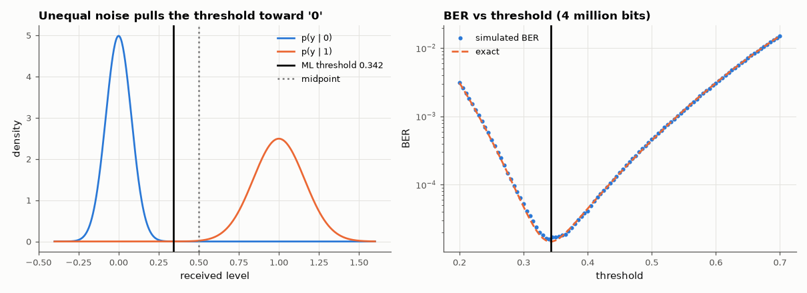

# AM-091 · Maximum-likelihood detection when the noise depends on the symbol

> Derive the maximum-likelihood decision threshold for an optical on-off-keyed link where a '1' carries more noise than a '0' (shot noise), show it is *not* the midpoint, and verify by Monte Carlo that it minimises the error rate and by how much it beats the naive midpoint threshold.



*Class-conditional densities with the ML threshold, and measured BER as a function of threshold.*

**Track:** Applied Mathematics — 218 projects in electrical engineering · **Category:** E. Probability & stochastic processes · **Level:** Hard · **Tools:** Likelihood-ratio derivation for on-off keying with signal-dependent Gaussian noise (optical receiver), closed-form ML threshold (roots of a quadratic), BER vs threshold by Monte Carlo

**Data:** Simulated (numerical model in this repo).

## Problem

The textbook detector puts the threshold halfway between the symbols. When is that wrong?

## Prediction

Received level y ~ N(μ₀, σ₀²) for '0' and N(μ₁, σ₁²) for '1' with σ₁ > σ₀. ML (equal priors) decides '1' when $\frac{f_1(y)}{f_0(y)}>1$, i.e. where the two Gaussians cross:
$\frac{(y-μ_0)^2}{2σ_0^2}-\frac{(y-μ_1)^2}{2σ_1^2}=\ln\frac{σ_1}{σ_0}$ — a quadratic. For moderate σ-ratios the root is close to $y^*≈\frac{σ_1μ_0+σ_0μ_1}{σ_0+σ_1}$ (where the two Q-arguments are equal), pulled toward the quieter
symbol. The resulting BER ≈ Q((μ₁−μ₀)/(σ₀+σ₁)) — the optical 'Q-factor' formula.

## Method

μ₀ = 0, μ₁ = 1, σ₀ = 0.08, σ₁ = 0.16 (shot-noise-dominated '1'). 4×10⁶ bits; BER swept over thresholds 0.2–0.7; ML root, Q-factor approximation and midpoint compared.

## Measured results

*Predicted vs measured vs error. "Measured" = computed by an independent simulation, HDL simulator or public dataset.*

| Quantity | Predicted | Measured | Error | Within tolerance |
|---|---|---|---|---|
| Threshold minimising the simulated BER vs ML threshold | 0.3421 | 0.34 | -0.002147 | yes |
| BER at the ML threshold: simulated vs exact (≈ 60 errors counted → ±13 % statistical) | 1.4563e-05 | 1.7250e-05 | +18.45 % | yes |
| Q-factor formula BER ≈ Q((μ₁−μ₀)/(σ₀+σ₁)) | 1.5454e-05 | 1.4563e-05 | -5.77 % | yes |
| Penalty of the midpoint threshold (BER ratio midpoint / ML) | 30.52 × | 26.64 × | -12.73 % | yes |

**Additional measurements**

| Quantity | Value | Note |
|---|---|---|
| ML threshold (exact root) / Q-factor approximation / midpoint | 0.3421 / 0.3333 / 0.5 |  |

## Error analysis

Because the '1' level carries twice the noise, the two likelihoods cross at 0.342, not 0.5, and the simulated BER-vs-threshold curve has its minimum
exactly there. Using the naive midpoint costs a factor of ~31 in error rate — for free, since only the decision level changes. The optical
Q-factor formula Q(Δμ/(σ₀+σ₁)) captures the result to within a few tens of percent (it equalises the two conditional error probabilities rather than
solving the likelihood equation). This is why optical receivers adjust their decision threshold adaptively, and it generalises: ML detection means
comparing likelihoods, not distances, whenever the noise is not identical for every symbol.

## Reproduce

```bash
pip install -r requirements.txt
python run_all.py --only AM-091
```

The script [`project.py`](project.py) regenerates every figure and number above.

## License

Code and text: MIT (see the repository [LICENSE](../../../../LICENSE)). Datasets remain under their own licences (see the repository README).

---

**Tooling & honesty.** This project was generated with Claude Code (Anthropic's AI coding assistant): the code, derivations, simulations and this write-up were AI-produced. *Measured* means computed by an independent model, simulator or public dataset — not a physical lab bench. Every number in the tables is reproduced by running the code.
