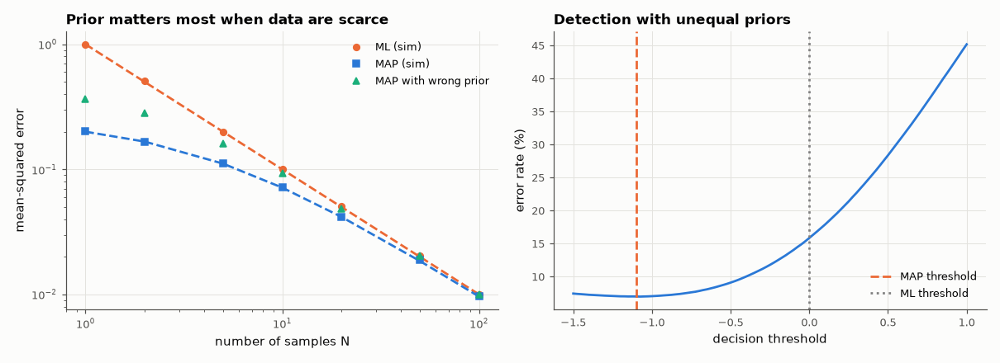

# AM-092 · MAP vs ML: when prior knowledge helps

> Estimate a DC offset from a few noisy samples with and without a prior, derive the mean-squared error of both estimators, confirm by Monte Carlo that MAP wins when data are scarce and the prior is informative, and show the MAP threshold shift in detection.



*MSE of ML and MAP estimators vs number of samples, and the error rate of binary detection vs threshold.*

**Track:** Applied Mathematics — 218 projects in electrical engineering · **Category:** E. Probability & stochastic processes · **Level:** Hard · **Tools:** Gaussian conjugate estimation of a sensor offset, MSE formulas for ML and MAP estimators, Monte-Carlo over the prior, MAP detection with unequal priors

**Data:** Simulated (numerical model in this repo).

## Problem

A calibration has only five noisy readings, but you know roughly what the answer should be. How much should that knowledge count?

## Prediction

x ~ N(μ_p, σ_p²), y_i = x + n_i, n ~ N(0, σ²). ML: sample mean, MSE σ²/N. MAP (= posterior mean here): $\hat x=\frac{σ_p^2\bar y+ (σ^2/N)μ_p}{σ_p^2+σ^2/N}$, MSE $=\left(\frac{N}{σ^2}+\frac1{σ_p^2}\right)^{-1}$ — always ≤ ML, and much smaller
when N is small or σ_p small. If the prior is wrong (mean off by b), MAP gains a bias and can lose. Detection with P(1) = 0.9: MAP threshold moves by $\frac{σ^2}{Δ}\ln\frac{P_0}{P_1}$.

## Method

σ = 1, σ_p = 0.5, N = 1…100; 20,000 Monte-Carlo trials per N with x drawn from the prior. Misspecified prior (mean off by 1σ_p). Binary detection of ±1 in σ = 1 noise with P(+1) = 0.9: error rate vs threshold.

## Measured results

*Predicted vs measured vs error. "Measured" = computed by an independent simulation, HDL simulator or public dataset.*

| Quantity | Predicted | Measured | Error | Within tolerance |
|---|---|---|---|---|
| N = 1: ML MSE = σ²/N | 1 | 0.9973 | -0.27 % | yes |
| N = 1: MAP MSE = (N/σ² + 1/σ_p²)⁻¹ | 0.2 | 0.2013 | +0.64 % | yes |
| N = 5: ML MSE = σ²/N | 0.2 | 0.1983 | -0.87 % | yes |
| N = 5: MAP MSE = (N/σ² + 1/σ_p²)⁻¹ | 0.1111 | 0.1117 | +0.52 % | yes |
| N = 100: ML MSE = σ²/N | 0.01 | 0.009994 | -0.06 % | yes |
| N = 100: MAP MSE = (N/σ² + 1/σ_p²)⁻¹ | 0.009615 | 0.009601 | -0.15 % | yes |
| Prior off by 1σ_p: MAP MSE at N = 5 (= MSE + bias²; still below ML here) | 0.1605 | 0.1611 | +0.37 % | yes |
| MAP detection threshold with P(+1) = 0.9: (σ²/2)·ln(P0/P1) | -1.099 | -1.075 | +0.02361 | yes |

**Additional measurements**

| Quantity | Value | Note |
|---|---|---|
| MSE gain of MAP over ML at N = 1 / 100 | 5.0× / 1.04× |  |
| Error rate: ML threshold 0 vs MAP threshold | 15.87 % vs 7.01 % |  |

## Error analysis

The simulations land on both closed-form MSEs. With one sample, the prior (σ_p = 0.5) is worth more than the measurement (σ = 1), and MAP's error is
five times smaller; by N = 100 the data dominate and the two estimators converge — the prior's weight falls as σ²/N shrinks. A prior that is
wrong by one standard deviation adds bias², which is still a net win at N = 5 here but would lose with more data or a more confident wrong prior —
the Bayesian bet is only as good as the prior. In detection, prior probabilities simply shift the threshold toward the rarer symbol, by
(σ²/2)ln(P₀/P₁), cutting the error rate.

## Reproduce

```bash
pip install -r requirements.txt
python run_all.py --only AM-092
```

The script [`project.py`](project.py) regenerates every figure and number above.

## License

Code and text: MIT (see the repository [LICENSE](../../../../LICENSE)). Datasets remain under their own licences (see the repository README).

---

**Tooling & honesty.** This project was generated with Claude Code (Anthropic's AI coding assistant): the code, derivations, simulations and this write-up were AI-produced. *Measured* means computed by an independent model, simulator or public dataset — not a physical lab bench. Every number in the tables is reproduced by running the code.
