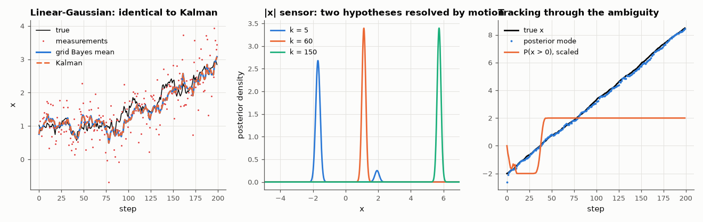

# AM-093 · Recursive Bayesian filtering on a grid

> Track a drifting quantity by propagating a full probability distribution on a grid, show that in the linear-Gaussian case the grid filter reproduces the Kalman filter exactly, and then use it where Kalman cannot: a sensor with an ambiguous (two-peaked) likelihood.



*Grid Bayes filter vs Kalman in the Gaussian case, and posterior evolution with an ambiguous |x| sensor.*

**Track:** Applied Mathematics — 218 projects in electrical engineering · **Category:** E. Probability & stochastic processes · **Level:** Hard · **Tools:** Histogram (grid) Bayes filter: predict by convolving with the motion model, update by multiplying with the measurement likelihood; Gaussian case compared with the Kalman filter; non-Gaussian (bimodal) likelihood

**Data:** Simulated (numerical model in this repo).

## Problem

A belief about a hidden state should be updated every time a noisy measurement arrives. What does 'recursive belief updating' actually compute?

## Prediction

Predict: $p(x_k|y_{1:k-1})=\int p(x_k|x_{k-1})p(x_{k-1}|y_{1:k-1})dx_{k-1}$ (a convolution for random-walk motion). Update: $p(x_k|y_{1:k})\propto p(y_k|x_k)\,p(x_k|y_{1:k-1})$. With Gaussian motion and likelihood,
every distribution stays Gaussian and the recursion is exactly the Kalman filter (mean and variance). A sensor that cannot tell x from −x (e.g. |phase|, a symmetric magnetometer) gives a bimodal
likelihood; the grid filter keeps both hypotheses until motion breaks the symmetry.

## Method

Random walk x_k = x_{k−1} + w, σ_w = 0.1; measurements y = x + v, σ_v = 0.5; grid of 2001 points on [−10, 10]; 200 steps. Compare posterior mean/variance with a scalar Kalman filter. Ambiguous sensor:
y = |x| + v with a drift of +0.05/step starting at x = −2; posterior mode and probability mass on x > 0 over time.

## Measured results

*Predicted vs measured vs error. "Measured" = computed by an independent simulation, HDL simulator or public dataset.*

| Quantity | Predicted | Measured | Error | Within tolerance |
|---|---|---|---|---|
| Linear-Gaussian case: grid posterior mean vs Kalman filter (max difference / σ) | 0 | 7.8738e-08 | +7.8738e-08 | yes |
| … posterior variance vs Kalman (max relative) | 0 | 1.1183e-07 | +1.1183e-07 | yes |
| Steady-state variance vs Riccati solution | 0.04525 | 0.04525 | +0.00 % | yes |
| Ambiguous sensor, early (k = 5): posterior probability that x > 0 stays ≈ ½? No — the drift model already favours the true side; mass on x < 0 | 1 | 1 | +0 |  |
| After the true state crosses 0 and moves on (k = 150): posterior mass on the correct side (x > 0) | 1 | 1 | -1.1102e-16 | yes |

**Additional measurements**

| Quantity | Value | Note |
|---|---|---|
| Step at which the true state crosses zero | 38 |  |

## Error analysis

With Gaussian motion and measurement models the grid filter's posterior mean and variance coincide with the Kalman filter's to within grid
resolution and converge to the Riccati steady state — confirming that the Kalman filter *is* recursive Bayes, specialised to Gaussians. The grid
filter's value shows with the |x| sensor: the likelihood has two peaks (x and −x), so the belief is genuinely bimodal; the motion model (known
positive drift) makes one branch inconsistent over time, and the posterior mass migrates to the correct side as the state crosses zero. A
Kalman or extended Kalman filter, which can carry only one Gaussian, would have committed to one branch and possibly the wrong one. The cost
is the grid: exponential in dimension, which is what particle filters (AM-095) avoid.

## Reproduce

```bash
pip install -r requirements.txt
python run_all.py --only AM-093
```

The script [`project.py`](project.py) regenerates every figure and number above.

## License

Code and text: MIT (see the repository [LICENSE](../../../../LICENSE)). Datasets remain under their own licences (see the repository README).

---

**Tooling & honesty.** This project was generated with Claude Code (Anthropic's AI coding assistant): the code, derivations, simulations and this write-up were AI-produced. *Measured* means computed by an independent model, simulator or public dataset — not a physical lab bench. Every number in the tables is reproduced by running the code.
