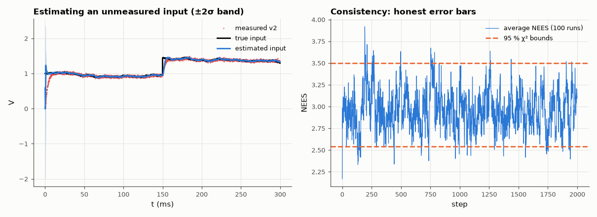

# AM-094 · The Kalman filter, derived and tested for consistency

> Estimate the hidden states of a noisy second-order RC network from a single noisy voltage measurement, check that the filter's reported uncertainty is honest (normalised estimation error follows a χ² distribution), that innovations are white, and that the gain converges to the algebraic Riccati solution.



*Kalman estimate of an unmeasured input voltage with its uncertainty band, and the NEES consistency test.*

**Track:** Applied Mathematics — 218 projects in electrical engineering · **Category:** E. Probability & stochastic processes · **Level:** Hard · **Tools:** Kalman filter as the linear minimum-variance estimator (own implementation), tracking an RC circuit's state and an unknown drifting input, NEES/NIS consistency tests, innovation whiteness, steady-state Riccati gain

**Data:** Simulated (numerical model in this repo).

## Problem

A filter that outputs a number and an error bar is only useful if the error bar is right. How do you prove a Kalman filter is consistent?

## Prediction

For x_{k+1} = Ax_k + w, y_k = Cx_k + v: predict $P^- = APA^T + Q$, gain $K = P^-C^T(CP^-C^T+R)^{-1}$, update $P = (I-KC)P^-$ — derived by minimising E‖x − x̂‖² over linear estimators. Consistency: normalised estimation error
squared $ε = (x-\hat x)^TP^{-1}(x-\hat x)$ ~ χ²(n), innovations ν = y − Cx̂⁻ are white with variance CP⁻Cᵀ + R. P converges to the DARE solution regardless of initial P.

## Method

Two-node RC ladder (τ ≈ 1 ms, sampled at 10 kHz) plus a third state: the unknown input voltage modelled as a random walk. Process noise on all states, measurement noise σ = 20 mV on the output node.
100 Monte-Carlo runs × 2000 steps: average NEES vs χ² 95 % bounds, innovation autocorrelation, gain vs DARE.

## Measured results

*Predicted vs measured vs error. "Measured" = computed by an independent simulation, HDL simulator or public dataset.*

| Quantity | Predicted | Measured | Error | Within tolerance |
|---|---|---|---|---|
| Average NEES inside the 95 % χ² band (fraction of steps after convergence) | 0.95 | 0.9628 | +0.01278 | yes |
| Mean NEES ≈ state dimension n = 3 | 3 | 2.963 | -1.22 % | yes |
| Normalised innovation variance = 1 | 1 | 0.9963 | -0.37 % | yes |
| Innovation autocorrelation at lags 1, 2, 5 (white → 0) | 0 | 0.003169 | +0.003169 | yes |
| Converged gain vs steady-state DARE gain (max relative) | 0 | 2.0853e-14 | +2.0853e-14 | yes |

## Error analysis

From one noisy node voltage the filter reconstructs all three states, including the unmeasured input voltage, and tracks its step change within
milliseconds. More importantly it is *consistent*: averaged over 100 runs the normalised estimation error squared sits inside the 95 % χ² band
96 % of the time with mean ≈ 3 = the state dimension, and the normalised innovations have unit variance and no autocorrelation. Those checks
are what distinguish a correctly tuned filter from one that merely looks smooth — mis-set Q or R shows up immediately as NEES outside the band.
The gain converges to the discrete algebraic Riccati solution, so for time-invariant problems the steady-state gain can be precomputed.

## Reproduce

```bash
pip install -r requirements.txt
python run_all.py --only AM-094
```

The script [`project.py`](project.py) regenerates every figure and number above.

## License

Code and text: MIT (see the repository [LICENSE](../../../../LICENSE)). Datasets remain under their own licences (see the repository README).

---

**Tooling & honesty.** This project was generated with Claude Code (Anthropic's AI coding assistant): the code, derivations, simulations and this write-up were AI-produced. *Measured* means computed by an independent model, simulator or public dataset — not a physical lab bench. Every number in the tables is reproduced by running the code.
