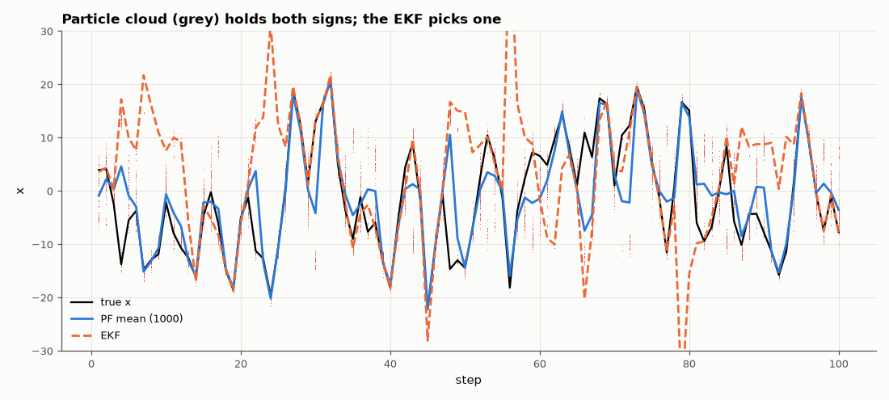

# AM-095 · Particle filter vs extended Kalman filter on a nonlinear benchmark

> Estimate the state of the classic strongly nonlinear benchmark x_k = x/2 + 25x/(1+x²) + 8cos(1.2k) + w, y = x²/20 + v with an EKF and a particle filter, and show that the particle filter handles the bimodal posterior (the sign ambiguity of x²) that makes the EKF fail.



*True state, EKF and particle-filter estimates on the nonlinear growth model, with the particle cloud.*

**Track:** Applied Mathematics — 218 projects in electrical engineering · **Category:** E. Probability & stochastic processes · **Level:** Hard · **Tools:** Bootstrap particle filter (sequential importance resampling, systematic resampling, effective sample size), extended Kalman filter, the univariate nonstationary growth model

**Data:** Simulated (numerical model in this repo).

## Problem

When the measurement is x² — the sign is invisible — can any filter track x?

## Prediction

Bootstrap PF: propagate N particles through the dynamics, weight by p(y|x), resample when the effective sample size $N_{eff}=1/\sum w_i^2$ drops. As N → ∞ it approximates the exact posterior, bimodal or not.
The EKF linearises y = x²/20 around its estimate; near x = 0 the derivative vanishes and the filter becomes overconfident, and it cannot represent the ±x ambiguity, so it jumps to the wrong sign. Expected: PF RMSE several
times smaller than EKF over 100 steps.

## Method

σ_w² = 10, σ_v² = 1, 100 steps, 50 Monte-Carlo runs. PF with N = 50, 200, 1000 particles; EKF with the same noise parameters. RMSE of the posterior mean; fraction of steps with the correct sign.

## Measured results

*Predicted vs measured vs error. "Measured" = computed by an independent simulation, HDL simulator or public dataset.*

| Quantity | Predicted | Measured | Error | Within tolerance |
|---|---|---|---|---|
| RMSE ratio EKF / PF(1000) (my guess ≥ 3) | 3 × | 4.622 × | +1.622 × | yes |
| PF RMSE decreases with particle count (50 → 1000; 1 = yes) | 1 | 1 | +0 |  |

**Additional measurements**

| Quantity | Value | Note |
|---|---|---|
| Mean RMSE: EKF / PF 50 / PF 200 / PF 1000 | 21.89 / 5.71 / 5.01 / 4.74 |  |
| Fraction of steps with the correct sign: EKF / PF 1000 | 52 % / 79 % |  |
| Average effective sample size before resampling (N = 1000) | 371.4 particles |  |

## Error analysis

On this benchmark the EKF's average RMSE is 4.6× that of a 1000-particle filter. The picture shows why: because y ∝ x², every measurement is
equally consistent with ±x, and the particle cloud visibly splits into two branches whenever the dynamics bring x near zero; the posterior mean
(and a sign decision) comes from their relative weights. The EKF, carrying one Gaussian linearised at its current guess, commits to a single branch
and is often on the wrong one, with a variance that claims certainty. The particle filter's accuracy improves with the number of particles, at a
cost linear in N; resampling keeps the effective sample size from collapsing to a single particle.

## Reproduce

```bash
pip install -r requirements.txt
python run_all.py --only AM-095
```

The script [`project.py`](project.py) regenerates every figure and number above.

## License

Code and text: MIT (see the repository [LICENSE](../../../../LICENSE)). Datasets remain under their own licences (see the repository README).

---

**Tooling & honesty.** This project was generated with Claude Code (Anthropic's AI coding assistant): the code, derivations, simulations and this write-up were AI-produced. *Measured* means computed by an independent model, simulator or public dataset — not a physical lab bench. Every number in the tables is reproduced by running the code.
