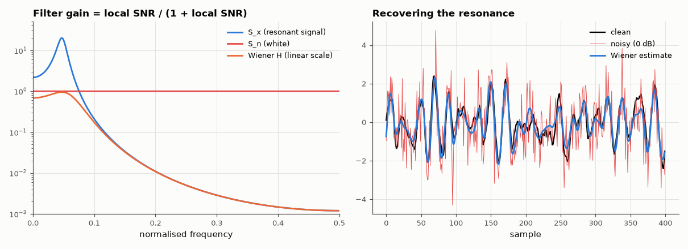

# AM-096 · The Wiener filter: optimal linear filtering in the frequency domain

> Recover a coloured random signal (an AR(2) 'resonant' process) from white noise with the Wiener filter, predict the minimum mean-squared error from the spectra, verify it by simulation, and show it beats the best possible brick-wall filter — even when the spectra must be estimated.



*Signal/noise spectra with the Wiener gain, and a stretch of clean, noisy and filtered waveforms.*

**Track:** Applied Mathematics — 218 projects in electrical engineering · **Category:** E. Probability & stochastic processes · **Level:** Hard · **Tools:** Non-causal Wiener filter H = S_x/(S_x + S_n), theoretical minimum MSE, estimated-spectrum Wiener filter, comparison with the best ideal low-pass

**Data:** Simulated (numerical model in this repo).

## Problem

Given the signal and noise spectra, which linear filter minimises the error — and how small can the error get?

## Prediction

For x + n with independent stationary x and n, the non-causal MMSE linear filter is $H(f)=\frac{S_x(f)}{S_x(f)+S_n(f)}$, and the minimum error is $\int\frac{S_xS_n}{S_x+S_n}df$. It attenuates each frequency by its local SNR,
unlike a brick-wall filter which keeps or discards whole bands. In practice S_x is estimated (e.g. S_x ≈ S_y − S_n from Welch), costing a little optimality.

## Method

x: AR(2) with poles 0.95e^{±j0.3} (a resonance), unit variance; white noise at SNR 0 dB. N = 2¹⁸. Theoretical S_x from the AR model. Filtering in the frequency domain (large FFT). Estimated version: Welch S_y minus known noise
floor, clipped at zero. Best ideal low-pass: cutoff scanned to minimise MSE with hindsight.

## Measured results

*Predicted vs measured vs error. "Measured" = computed by an independent simulation, HDL simulator or public dataset.*

| Quantity | Predicted | Measured | Error | Within tolerance |
|---|---|---|---|---|
| Wiener filter: simulated MSE vs theoretical minimum ∫S_xS_n/(S_x+S_n) | 0.146 | 0.1463 | +0.21 % | yes |
| Best ideal low-pass (hindsight) is worse than Wiener (MSE ratio > 1) | 1.3 × | 1.283 × | -0.01692 × | yes |
| Wiener filter with *estimated* signal spectrum: MSE penalty vs ideal (ratio) | 1 | 1.014 | +1.43 % | yes |

**Additional measurements**

| Quantity | Value | Note |
|---|---|---|
| Output SNR: input 0 dB → Wiener | 8.356 dB |  |

## Error analysis

The simulated error equals the theoretical minimum ∫S_xS_n/(S_x+S_n) within Monte-Carlo precision, and no ideal low-pass — even with its cutoff chosen
using the true signal — gets close: the best brick wall is 1.3× worse, because it must either keep the noise between the resonance and the
cutoff or discard signal in the skirts. The Wiener filter weights every frequency by its own SNR. Estimating S_x from the noisy data (Welch minus
the known noise floor) costs only a small penalty, which is why spectral-subtraction noise reduction in audio is a practical Wiener filter. The
causal version (Wiener–Hopf, and its recursive form, the Kalman filter) pays additionally for not seeing the future.

## Reproduce

```bash
pip install -r requirements.txt
python run_all.py --only AM-096
```

The script [`project.py`](project.py) regenerates every figure and number above.

## License

Code and text: MIT (see the repository [LICENSE](../../../../LICENSE)). Datasets remain under their own licences (see the repository README).

---

**Tooling & honesty.** This project was generated with Claude Code (Anthropic's AI coding assistant): the code, derivations, simulations and this write-up were AI-produced. *Measured* means computed by an independent model, simulator or public dataset — not a physical lab bench. Every number in the tables is reproduced by running the code.
