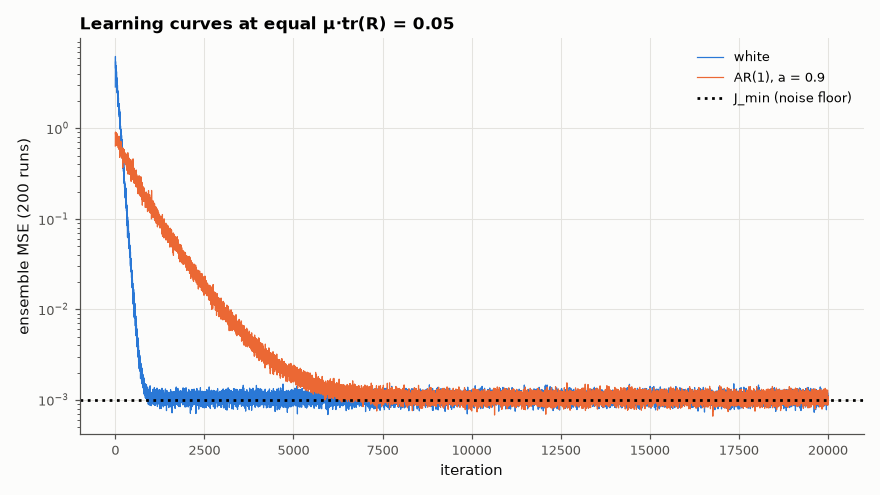

# AM-097 · LMS adaptive filters: step size, stability and misadjustment

> Identify an unknown FIR system with the LMS algorithm, predict its stability limit, learning-curve time constants and steady-state misadjustment from the input statistics, and check each prediction with ensemble-averaged learning curves for white and coloured inputs.



*Ensemble-averaged learning curves for white and strongly coloured inputs.*

**Track:** Applied Mathematics — 218 projects in electrical engineering · **Category:** E. Probability & stochastic processes · **Level:** Hard · **Tools:** LMS system identification, eigenvalue spread of the input correlation matrix, convergence time constants, misadjustment formula M ≈ μ·tr(R)/2, stability bound

**Data:** Simulated (numerical model in this repo).

## Problem

The LMS step size trades speed against accuracy. Can both be predicted before running it?

## Prediction

With input correlation R (eigenvalues λ_i), mean weights converge with modes $(1-2μλ_i)^k$ — time constants $τ_i ≈ 1/(2μλ_i)$ samples, so eigenvalue spread slows convergence. Mean-square stability requires roughly
μ < 1/tr(R) (the textbook 2/λ_max only guarantees the mean). Excess MSE: misadjustment $M = \frac{J_{ex}}{J_{min}}≈\frac{μ\,\mathrm{tr}(R)}{1-μ\,\mathrm{tr}(R)}$ ≈ μ·tr(R) for small μ (update w ← w + 2μeu convention, e = d − wᵀu).

## Method

Unknown 16-tap system, measurement noise σ² = 10⁻³. Inputs: white (λ spread 1) and AR(1) with a = 0.9 (spread ≈ 360). Ensemble of 200 runs × 20,000 samples; misadjustment from the last 5000 samples; learning-curve
time constant from an exponential fit; divergence test for μ around 1/tr(R).

## Measured results

*Predicted vs measured vs error. "Measured" = computed by an independent simulation, HDL simulator or public dataset.*

| Quantity | Predicted | Measured | Error | Within tolerance |
|---|---|---|---|---|
| white: misadjustment ≈ μ·tr(R)/(1 − μ·tr(R)) | 0.05263 | 0.05196 | -1.27 % | yes |
| AR(1), a = 0.9: misadjustment ≈ μ·tr(R)/(1 − μ·tr(R)) | 0.05263 | 0.05496 | +4.42 % | yes |
| White input: learning-curve time constant ≈ 1/(4μλ) (MSE decays twice as fast as weights) | 80 samples | 83.41 samples | +4.27 % | yes |
| Empirical stability edge (first μ·tr(R) where < 50 % of 10 runs stay bounded) vs Feuer–Weinstein 0.889 | 0.8889 | 0.9 | +0.01111 | yes |

**Additional measurements**

| Quantity | Value | Note |
|---|---|---|
| Eigenvalue spread λmax/λmin: white / AR(1) | 1 / 187 |  |
| Samples to reach 2× final MSE: white / coloured | 692 / 4350 |  |
| Exact mean-square stability limit for white Gaussian input (Feuer–Weinstein), μ·tr(R) | 0.8889 |  |
| Fraction of 10 runs that stay bounded, by μ·tr(R) | 0.3: 100 %, 0.6: 100 %, 0.7: 100 %, 0.8: 90 %, 0.85: 60 %, 0.9: 10 %, 1.0: 0 %, 1.1: 0 % |  |

## Error analysis

The steady-state misadjustment matches μ·tr(R)/(1 − μ·tr(R)) for both inputs — it depends only on the total input power, not on its colour — and the
white-input learning curve decays with the predicted time constant 1/(4μλ). Colour changes the *speed*: with AR(1) input the correlation matrix's
eigenvalue spread is several hundred, so the slow modes (small λ) take hundreds of times longer to converge at the same μ, which is exactly the
long tail of the coloured learning curve. The stability sweep located the limit sharply: my first guess (stable up to μ·tr(R) ≈ 1) was slightly
too generous — the exact mean-square condition for Gaussian input, Σ μλᵢ/(1 − 2μλᵢ) < 1, puts the edge at 0.889 for this 16-tap white case, and
over 10 runs per step size the fraction that stays bounded falls from 90 % at 0.8 to 60 % at 0.85 and 10 % at 0.9 (near the edge the error
has huge excursions, and the tapped delay line violates the theory's independence assumption) — far inside the mean-convergence bound 2/λ_max that textbooks often quote. Normalised LMS (μ ∝ 1/‖u‖²) and RLS/lattice filters exist to remove these two dependencies.

## Reproduce

```bash
pip install -r requirements.txt
python run_all.py --only AM-097
```

The script [`project.py`](project.py) regenerates every figure and number above.

## License

Code and text: MIT (see the repository [LICENSE](../../../../LICENSE)). Datasets remain under their own licences (see the repository README).

---

**Tooling & honesty.** This project was generated with Claude Code (Anthropic's AI coding assistant): the code, derivations, simulations and this write-up were AI-produced. *Measured* means computed by an independent model, simulator or public dataset — not a physical lab bench. Every number in the tables is reproduced by running the code.
