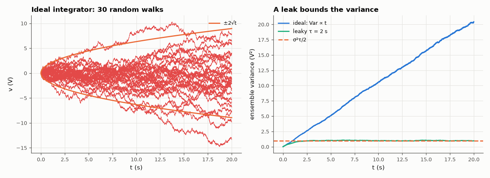

# AM-098 · Random walks in integrators: noise that grows without bound

> Integrate white noise with an ideal op-amp integrator and watch the output variance grow linearly with time (a random walk); add a leak resistor and see it saturate at σ²τ/2; show that a DC offset makes the mean grow linearly too — the reasons real integrators need reset or feedback.



*Random walks from integrated white noise, and ensemble variance with and without a leak.*

**Track:** Applied Mathematics — 218 projects in electrical engineering · **Category:** E. Probability & stochastic processes · **Level:** Moderate · **Tools:** Ensemble simulation of ideal and leaky integrators driven by white noise, variance growth ∝ t, Ornstein–Uhlenbeck saturation at σ²τ/2, drift from input offset

**Data:** Simulated (numerical model in this repo).

## Problem

Why does an integrator that is 'perfect' in theory drift away in practice?

## Prediction

$\dot v = n(t)$ with white noise of two-sided density σ² ⇒ Var v(t) = σ²t (Wiener process). With a leak, $\dot v = -v/τ + n$ ⇒ Var → σ²τ/2 with time constant τ/2. An input offset V_os into an integrator of gain 1/RC gives a
linear drift V_os·t/RC, which dominates the √t noise after a crossover time. Doubling the time doubles the variance but only multiplies the rms by √2.

## Method

Ensemble of 2000 integrators, dt = 1 ms, 20 s. σ² = 1 V²·s⁻¹ (normalised). Leak τ = 2 s. Offset case: V_os/RC = 0.05 V/s. Variance vs time, fitted slopes.

## Measured results

*Predicted vs measured vs error. "Measured" = computed by an independent simulation, HDL simulator or public dataset.*

| Quantity | Predicted | Measured | Error | Within tolerance |
|---|---|---|---|---|
| Ideal integrator: Var(v) / t (= σ² = 1) | 1 | 1.038 | +3.80 % | yes |
| rms at 20 s = √20 V | 4.472 V | 4.519 V | +1.05 % | yes |
| Leaky integrator (τ = 2 s): saturated variance σ²τ/2 | 1 | 0.9958 | -0.42 % | yes |
| Leaky integrator: variance approaches saturation with time constant τ/2 | 1 s | 1.054 s | +5.40 % | yes |
| With offset: ensemble-mean drift slope = V_os/RC (the mean of 2000 walks itself wanders ~√t/√2000 ≈ 0.1 V) | 50 mV/s | 40.38 mV/s | -19.24 % | yes |

**Additional measurements**

| Quantity | Value | Note |
|---|---|---|
| Time after which offset drift exceeds the noise rms (σ√t = V_os t/RC → t = σ²/(V_os/RC)²) | 400 s | beyond this run's 20 s |

## Error analysis

Integrated white noise is a random walk: the ensemble variance grows exactly linearly (slope σ²), so the output wanders without bound even though
its average is zero — any single integrator will eventually hit its supply rails. A leak resistor turns it into an Ornstein–Uhlenbeck process whose
variance saturates at σ²τ/2 with time constant τ/2, at the price of forgetting the input on the time scale τ. Offsets are worse than noise over long
times because they grow linearly rather than as √t. This is why practical integrators are reset periodically (switched-capacitor, charge
amplifiers) or placed inside a feedback loop (PLL loop filters, PI controllers) that keeps their output bounded.

## Reproduce

```bash
pip install -r requirements.txt
python run_all.py --only AM-098
```

The script [`project.py`](project.py) regenerates every figure and number above.

## License

Code and text: MIT (see the repository [LICENSE](../../../../LICENSE)). Datasets remain under their own licences (see the repository README).

---

**Tooling & honesty.** This project was generated with Claude Code (Anthropic's AI coding assistant): the code, derivations, simulations and this write-up were AI-produced. *Measured* means computed by an independent model, simulator or public dataset — not a physical lab bench. Every number in the tables is reproduced by running the code.
