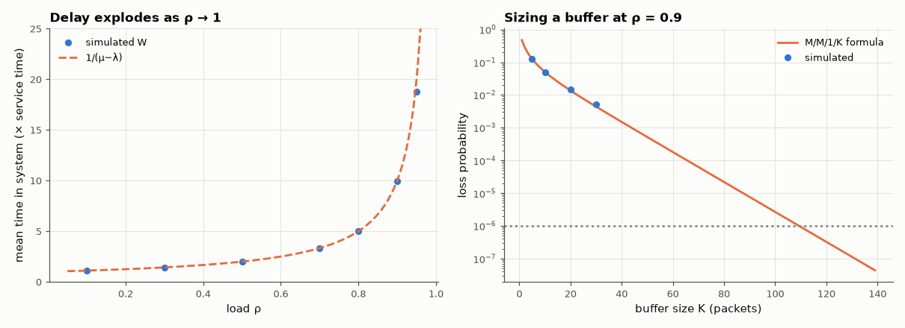

# AM-099 · Queueing theory for packet buffers: M/M/1 and Little's law

> Simulate a router buffer, verify the M/M/1 predictions for queue length, waiting time and their blow-up as load approaches 1, confirm Little's law, size a finite buffer for a target loss rate, and show how deterministic packet lengths halve the waiting time.



*Mean delay vs load for an M/M/1 queue, and packet loss vs buffer size.*

**Track:** Applied Mathematics — 218 projects in electrical engineering · **Category:** E. Probability & stochastic processes · **Level:** Moderate · **Tools:** Event-driven simulation of a single-server queue (Poisson arrivals, exponential service), M/M/1 formulas, Little's law, finite buffers and loss probability (M/M/1/K), a deterministic-service comparison (M/D/1)

**Data:** Simulated (numerical model in this repo).

## Problem

A link is 90 % utilised. How long do packets wait, and how large must the buffer be to lose fewer than one in a million?

## Prediction

M/M/1 with load ρ = λ/μ: mean number in system L = ρ/(1−ρ), mean time W = 1/(μ−λ); Little's law L = λW (for any stable queue). Finite buffer K (M/M/1/K): loss $P_K=\frac{(1-ρ)ρ^K}{1-ρ^{K+1}}$ ⇒ K ≈ ln(10⁻⁶)/ln ρ ≈ 131 at ρ = 0.9. M/D/1
(constant service): waiting time in queue $W_q=\frac{ρ}{2μ(1-ρ)}$, half the M/M/1 value — variability, not load alone, creates delay.

## Method

Lindley recursion for waiting times, 10⁶ packets per load, ρ = 0.1…0.95; time-average number in system from the sample path; finite-buffer simulation for K = 10…40 at ρ = 0.9 (losses counted directly where
measurable) and the formula extrapolated to 10⁻⁶.

## Measured results

*Predicted vs measured vs error. "Measured" = computed by an independent simulation, HDL simulator or public dataset.*

| Quantity | Predicted | Measured | Error | Within tolerance |
|---|---|---|---|---|
| ρ = 0.3: mean time in system 1/(μ−λ) | 1.429 | 1.431 | +0.14 % | yes |
| ρ = 0.3: Little's law — time-average number = λ·W | 0.4292 | 0.4297 | +0.13 % | yes |
| ρ = 0.9: mean time in system 1/(μ−λ) | 10 | 9.909 | -0.91 % | yes |
| ρ = 0.9: Little's law — time-average number = λ·W | 8.918 | 8.913 | -0.06 % | yes |
| ρ = 0.95: mean number in system ρ/(1−ρ) (slow convergence near saturation) | 19 | 17.86 | -6.03 % | yes |
| M/D/1 at ρ = 0.9: queueing delay = ρ/(2μ(1−ρ)) (half of M/M/1) | 4.5 | 4.503 | +0.07 % | yes |
| M/M/1/K, ρ = 0.9, K = 10: loss probability | 0.05081 | 0.05008 | -1.44 % | yes |
| M/M/1/K, ρ = 0.9, K = 20: loss probability | 0.01365 | 0.01447 | +5.98 % | yes |

**Additional measurements**

| Quantity | Value | Note |
|---|---|---|
| Buffer needed for loss < 10⁻⁶ at ρ = 0.9 (formula) | 110 packets |  |

## Error analysis

The simulated queue reproduces the M/M/1 results and makes the non-linearity tangible: at 50 % load a packet spends 2 service times in the system, at
90 % 10, at 95 % 20 — the last doubling of utilisation is paid for in delay. Little's law holds exactly, as it must for any stable system. Buffer
sizing follows the geometric tail: loss falls by a factor ρ per extra slot, so at ρ = 0.9 about 110 packets of buffering are needed for 10⁻⁶ loss.
The M/D/1 comparison shows that variability, not only load, creates queues: constant-length packets wait half as long. Real traffic is burstier
than Poisson, which makes the M/M/1 numbers optimistic — the main reason operators keep links well below full load.

## Reproduce

```bash
pip install -r requirements.txt
python run_all.py --only AM-099
```

The script [`project.py`](project.py) regenerates every figure and number above.

## License

Code and text: MIT (see the repository [LICENSE](../../../../LICENSE)). Datasets remain under their own licences (see the repository README).

---

**Tooling & honesty.** This project was generated with Claude Code (Anthropic's AI coding assistant): the code, derivations, simulations and this write-up were AI-produced. *Measured* means computed by an independent model, simulator or public dataset — not a physical lab bench. Every number in the tables is reproduced by running the code.
