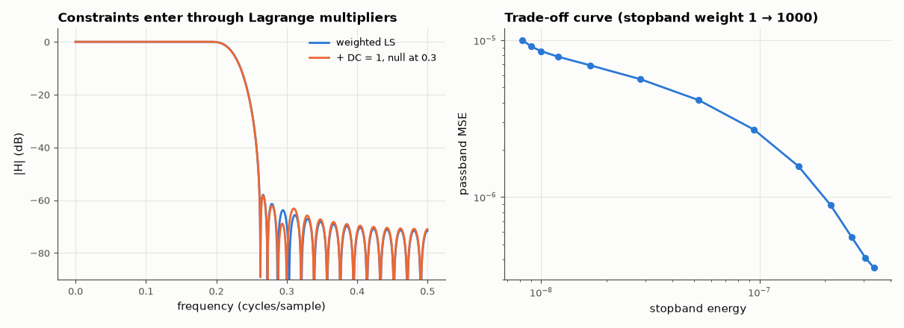

# AM-100 · Filter design as constrained optimisation

> Formulate linear-phase FIR design as an explicit optimisation — minimise weighted squared error over pass- and stop-bands subject to exact constraints (unit DC gain, a forced null) — solve it in closed form via the KKT equations, and verify against SciPy and against the constraint values.



*Weighted-LS and constrained FIR responses, and the pass/stop trade-off curve.*

**Track:** Applied Mathematics — 218 projects in electrical engineering · **Category:** F. Optimisation · **Level:** Hard · **Tools:** Weighted least-squares FIR design written as normal equations (own), equality-constrained LS via KKT system, comparison with scipy.signal.firls, trade-off curve by weight sweep

**Data:** Simulated (numerical model in this repo).

## Problem

'Design a low-pass filter' is vague. What exactly is being minimised, and how do hard requirements enter?

## Prediction

Type-I amplitude A(ω) = Σ a_k cos kω is linear in a. Weighted LS: minimise $\int W(ω)(A(ω)-D(ω))^2dω ≈ \|W^{1/2}(Ca-d)\|^2$ ⇒ normal equations $C^TWCa = C^TWd$. Equality constraints Ea = f (e.g. A(0) = 1, A(ω_n) = 0) via
Lagrange multipliers: $\begin{bmatrix}C^TWC & E^T\\E&0\end{bmatrix}\begin{bmatrix}a\\λ\end{bmatrix}=\begin{bmatrix}C^TWd\\f\end{bmatrix}$. Raising the stopband weight trades passband error for stopband energy along a convex curve.

## Method

N = 51 taps (L = 25), passband 0–0.2, stopband 0.26–0.5 (cycles/sample), dense grid of 2000 points. Unconstrained WLS vs scipy.signal.firls; constrained version with A(0) = 1 exactly and a null at 0.3; weight sweep 1…1000.

## Measured results

*Predicted vs measured vs error. "Measured" = computed by an independent simulation, HDL simulator or public dataset.*

| Quantity | Predicted | Measured | Error | Within tolerance |
|---|---|---|---|---|
| Own weighted LS vs scipy.signal.firls (max |Δh|; firls integrates exactly, own uses a dense grid) | 0 | 6.3358e-04 | +6.3358e-04 | yes |
| Constrained design: DC gain exactly 1 | 1 | 1 | +0.00 % | yes |
| Constrained design: exact null at 0.3 cycles/sample | 0 | 5.3220e-17 | +5.3220e-17 | yes |
| Weight sweep traces a monotone trade-off (passband error ↑ as stopband energy ↓; 1 = yes) | 1 | 1 | +0 |  |

**Additional measurements**

| Quantity | Value | Note |
|---|---|---|
| Constraint cost: pass/stop MSE unconstrained vs constrained | 1.57e-06/1.51e-07 vs 1.68e-06/1.54e-07 |  |

## Error analysis

Written as an optimisation, FIR design is just weighted least squares: the self-built normal equations reproduce SciPy's firls (to the small
difference between a dense grid and exact band integrals). Hard requirements become linear equality constraints solved in the same KKT system:
the constrained filter has DC gain exactly 1 and an exact zero at 0.3 cycles/sample, paid for by a slightly higher squared error elsewhere. The
weight sweep traces the Pareto curve between passband error and stopband energy — there is no 'best' filter without a stated trade-off, which is
exactly what the weights (or, in AM-104, a minimax objective) encode.

## Reproduce

```bash
pip install -r requirements.txt
python run_all.py --only AM-100
```

The script [`project.py`](project.py) regenerates every figure and number above.

## License

Code and text: MIT (see the repository [LICENSE](../../../../LICENSE)). Datasets remain under their own licences (see the repository README).

---

**Tooling & honesty.** This project was generated with Claude Code (Anthropic's AI coding assistant): the code, derivations, simulations and this write-up were AI-produced. *Measured* means computed by an independent model, simulator or public dataset — not a physical lab bench. Every number in the tables is reproduced by running the code.
