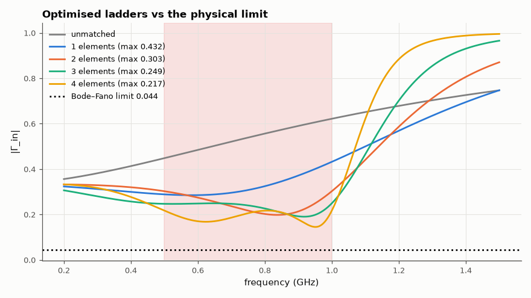

# AM-101 · Broadband impedance matching by optimisation, against the Bode–Fano limit

> Match a parallel RC load (an antenna/photodiode-like load) to 50 Ω over an octave, minimising the worst reflection with 1–4 element ladders, and compare the achieved in-band |Γ| with the Bode–Fano limit that no lossless network can beat.



*Reflection of the RC load unmatched and with optimised 1–4 element ladders, against the Bode–Fano limit.*

**Track:** Applied Mathematics — 218 projects in electrical engineering · **Category:** F. Optimisation · **Level:** Hard · **Tools:** Ladder matching networks (1–4 elements) optimised for minimax reflection over a band (differential evolution + Nelder–Mead), ABCD evaluation, Bode–Fano integral bound

**Data:** Simulated (numerical model in this repo).

## Problem

How good can a match be over a wide band — and is the limit set by cleverness or by physics?

## Prediction

For a load R‖C, any lossless matching network obeys the Bode–Fano bound $\int_0^∞\ln\frac1{|Γ(ω)|}dω \le \frac{π}{RC}$. With |Γ| constant = Γ_m over a band Δω and 1 elsewhere, the best possible is
$Γ_m = e^{-π/(RC\,Δω)}$. Real ladders approach this as the number of elements grows (an infinite network would reach it). Here R = 100 Ω, C = 3.2 pF, band 0.5–1 GHz: RCΔω = 1.005 ⇒ Γ_m ≥ 0.044.

## Method

Load 100 Ω ‖ 3.2 pF; source 50 Ω. Ladders alternating series L / shunt C from the load side, 1–4 elements, values on a log scale; objective max |Γ_in| over 201 frequencies in 0.5–1 GHz; global search (differential evolution) then Nelder–Mead polish.

## Measured results

*Predicted vs measured vs error. "Measured" = computed by an independent simulation, HDL simulator or public dataset.*

| Quantity | Predicted | Measured | Error | Within tolerance |
|---|---|---|---|---|
| Every optimised design respects Bode–Fano (worst |Γ| ≥ limit; 1 = yes) | 1 | 1 | +0 |  |
| Improvement is monotone in the number of elements (1 = yes) | 1 | 1 | +0 |  |
| Bode–Fano integral of the 4-element design ≤ π/(RC) | 9.8175e+09 rad/s | 9.4725e+09 rad/s | -3.4501e+08 rad/s | yes |

**Additional measurements**

| Quantity | Value | Note |
|---|---|---|
| Bode–Fano limit on the in-band |Γ| (flat over 0.5–1 GHz) | 0.04394 |  |
| Unmatched load: worst |Γ| in band | 0.6218 |  |
| 1-element ladder: worst in-band |Γ| | 0.432 | 6.35 nH |
| 2-element ladder: worst in-band |Γ| | 0.3026 | 11.4 nH, 2.19 pF |
| 3-element ladder: worst in-band |Γ| | 0.2493 | 13.8 nH, 4.22 pF, 6.15 nH |
| 4-element ladder: worst in-band |Γ| | 0.2172 | 14.9 nH, 5.19 pF, 11.8 nH, 2.62 pF |

## Error analysis

Optimisation drives the worst in-band reflection down with every added element, but each design stays above the Bode–Fano limit Γ ≥ 0.044 — and the
4-element network's reflection integral stays below π/RC as the theorem requires. Diminishing returns are visible: the first two elements do most of
the work, later ones buy smaller improvements, because the remaining 'reflection budget' is fixed by the load's RC product, not by the network. This
is the practical meaning of Bode–Fano: if a wide-band match to a capacitive load is needed, no amount of optimiser effort helps once near the
limit — reduce C or narrow the band. The global search matters: in a first run the 4-element search stalled in a degenerate minimum (one
element shrank to 0.0006 nH) and did *worse* than 3 elements; restarting the global search several times and adding a warm start from the
previous optimum restored the expected monotone improvement — minimax matching landscapes are riddled with poor local minima.

## Reproduce

```bash
pip install -r requirements.txt
python run_all.py --only AM-101
```

The script [`project.py`](project.py) regenerates every figure and number above.

## License

Code and text: MIT (see the repository [LICENSE](../../../../LICENSE)). Datasets remain under their own licences (see the repository README).

---

**Tooling & honesty.** This project was generated with Claude Code (Anthropic's AI coding assistant): the code, derivations, simulations and this write-up were AI-produced. *Measured* means computed by an independent model, simulator or public dataset — not a physical lab bench. Every number in the tables is reproduced by running the code.
